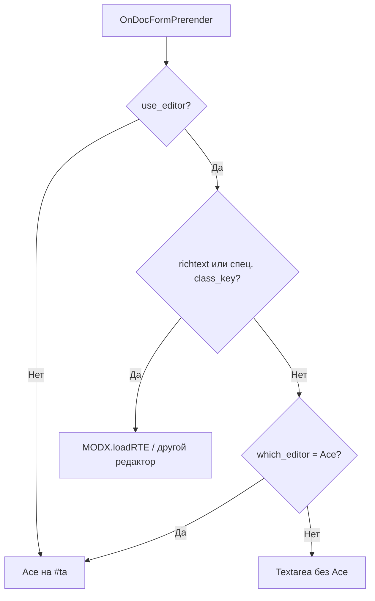

# Интеграция

Где Ace подключается, как уживается с RTE, mime-типы и Tab-сниппеты.

Плагин **Ace** слушает события менеджера: формы элементов, файлов, ресурса, вкладка кэша обзора ресурса, регистрация RTE и список TV input.

## Где работает редактор

| Контекст | Событие / поле | Mime по умолчанию |
| --- | --- | --- |
| Сниппет | `OnSnipFormPrerender` → `modx-snippet-snippet` | PHP |
| Плагин | `OnPluginFormPrerender` | PHP |
| Шаблон | `OnTempFormPrerender` | `ace.html_elements_mime` или авто |
| Чанк | `OnChunkFormPrerender` | HTML/Fenom/Twig; у static по расширению файла |
| Файл | `OnFileCreateFormPrerender` / `OnFileEditFormPrerender` | по расширению |
| Ресурс (content) | `OnDocFormPrerender` → `#ta` | content type / html mime |
| Обзор ресурса → кэш | `OnManagerPageBeforeRender` → `modx-rdata-buffer` | html mime |
| TV | тип ввода **Ace** | из свойств TV |

Если `which_element_editor` ≠ `Ace`, плагин **не** инициализирует редактор на формах элементов (кроме регистрации имени RTE).

## Ресурсы и RTE



Правила (1.9.10+):

1. `use_editor` и `which_editor` читаются с учётом **контекста** ресурса.
2. При `use_editor = Да` и richtext (или Static/SymLink/WebLink/XMLRPC) Ace **не** трогает `#ta`.
3. При `use_editor = Да` и `which_editor` ≠ Ace Ace **не** подменяет `#ta` у non-richtext ресурсов: остаётся обычный textarea (раньше Ace перехватывал поле).

Типичные схемы:

| Схема | Настройки |
| --- | --- |
| Код в ресурсах через Ace | `use_editor = Нет` или `which_editor = Ace` |
| TinyMCE для статей, textarea для «кодовых» страниц | `use_editor = Да`, `which_editor = TinyMCE` (или другой RTE), richtext только у нужных ресурсов |
| Ace как единственный «редактор» контента | `which_editor = Ace`, `use_editor = Да` |

## Mime и подсветка MODX / Fenom

Подсветка тегов MODX включается только для HTML-подобных mime:

- `text/html`
- `text/x-smarty` (Fenom / Smarty)
- `text/x-twig`

Для CSS/SCSS/LESS/static-чанков с расширением `.css` mixed-mode MODX **не** включается: комментарии `//` и `/* */` подсвечиваются как CSS.

Автовыбор `ace.html_elements_mime`, если настройка пуста:

| Условие | Mime |
| --- | --- |
| Есть `twiggy_class` | `text/x-twig` |
| Включён `pdotools_fenom_parser` | `text/x-smarty` |
| Иначе | `text/html` |

Явно задайте `ace.html_elements_mime = text/x-smarty`, если Fenom в чанках нужен всегда.

## Tab-сниппеты

Формат настройки `ace.snippets` (Ace snippets):

```text
snippet getr
    [[!getResources? &parents=`${1}` &limit=`${2:10}` &tpl=`${3}`]]
```

В определении Ace нужна настоящая табуляция после имени сниппета (**Alt+09** в настройке), не пробелы. В примере выше отступ показан пробелами из‑за markdown. Развёртывание в редакторе: имя + **Tab**.

Набор по умолчанию (если `ace.snippets` пуст при install/upgrade): `getr`, `getResources`, `pdoResources`, `pdoMenu`, `chunk`, `snippet`, `tv`, `formit` и др. Эталон файла: `assets/components/ace/snippets/modx.default.snippets`.

Свои сокращения добавляйте в системную настройку, не правьте файл в assets (при обновлении пакета файл может перезаписаться).

## Автодополнение

**Ctrl+Space** (или Cmd+Space): сниппеты, свойства, поля ресурса, PHP-функции и др. через процессоры `completions/*`.

## TV типа Ace

1. Создайте TV → тип ввода **Ace**
2. В свойствах TV при необходимости укажите mime/режим (как в форме TV Ace)
3. Выведите TV на шаблон ресурса

## Черновики

При `ace.draft_restore = Да` текст поля пишется в localStorage. После случайной перезагрузки Ace предлагает восстановить или отменить. Черновик сбрасывается после успешного сохранения формы / `MODx.onSaveEditor`. Срок хранения: 7 дней.

## Связанные разделы

- [Системные настройки](settings)
- [Горячие клавиши](hotkeys)
- [Решение проблем](troubleshooting)
