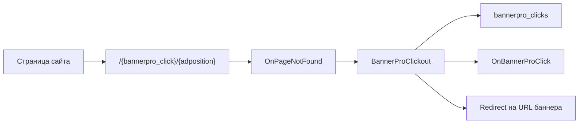

# BannerPro

**BannerPro** выводит баннеры по позициям через сниппет `BannerPro`, считает клики по URL `/{bannerpro_click}/{adposition}` и по желанию фиксирует показы через `impression.js`. Админка работает на Vue 3 и PrimeVue через пакет **VueTools**.

Namespace настроек: **`bannerpro`**. Основные таблицы: `bannerpro_ads`, `bannerpro_positions`, `bannerpro_ads_positions`, `bannerpro_clicks`, `bannerpro_impressions`.

С чего начать: [Быстрый старт](quick-start).

## Требования

| Компонент | Версия | Роль |
| --- | --- | --- |
| MODX Revolution | 3.0+ | Платформа |
| PHP | 8.2+ | Runtime |
| pdoTools | 2.1+ | Выборка и рендер сниппета `BannerPro` |
| VueTools | актуальная | Vue 3 и PrimeVue в админке |
| MiniShop3 | опционально | Привязка баннера к товару и атрибуция заказа |

## Возможности

- **Позиции**: создавайте слоты `sidebar`, `header`, `shop-product-sidebar` и выводите их по имени или ID.
- **Типы баннеров**: используйте изображение или HTML-код. HTML-баннер с URL компонент оборачивает в ссылку клика.
- **Ротация**: сортируйте по `RAND()`, `idx` или `weighted`. Вес задайте на связи баннер + позиция.
- **Учёт кликов**: плагин `BannerProClickout` перехватывает `OnPageNotFound`, пишет клик и делает redirect на URL баннера.
- **Учёт показов**: настройка `bannerpro_track_impressions` подключает `impression.js` и pixel URL.
- **Статистика**: вкладка админки показывает клики, показы, CTR, заказы MiniShop3 и рефереры.
- **REST API**: read-only endpoint `assets/components/bannerpro/api.php` отдаёт баннеры, позиции и статистику.

## Минимальный путь

1. Установите **BannerPro**, **pdoTools** и **VueTools**.
1. Откройте **Компоненты → BannerPro → Позиции** и создайте позицию `sidebar`.
1. Создайте баннер, задайте URL, изображение или HTML и привяжите его к позиции.
1. В шаблоне сайта вызовите сниппет:

::: code-group

```fenom
{'!BannerPro' | snippet : [
  'positionName' => 'sidebar',
  'tpl' => 'byAd',
  'limit' => 1
]}
```

```modx
[[!BannerPro?
  &positionName=`sidebar`
  &tpl=`byAd`
  &limit=`1`
]]
```

:::

1. Откройте страницу и проверьте ссылку `bannerclick/{adposition}`.

## Поток клика



## Быстрые ссылки

| Нужно | Документ |
| --- | --- |
| Установить и вывести первый баннер | [Быстрый старт](quick-start) |
| Проверить все ключи `bannerpro_*` | [Системные настройки](settings) |
| Настроить баннеры и позиции | [Админка](manager) |
| Разобрать кэш, ротацию, клики и показы | [Интеграция](integration) |
| Посмотреть параметры сниппета | [Сниппет BannerPro](snippets/BannerPro) |
| Выводить баннеры в MiniShop3 | [MiniShop3](minishop3) |
| Отправлять события в GA4, Matomo или Метрику | [Внешняя аналитика](analytics) |
| Подключить REST API | [REST API](development/rest-api) |
| Найти причину пустого вывода | [FAQ](faq) |

## Документация по разделам

- [Быстрый старт](quick-start): позиция, баннер, вызов сниппета, проверка клика.
- [Системные настройки](settings): кэш, клики, показы, аналитика, REST API, ACL.
- [Админка](manager): вкладки, поля баннера, права доступа, статистика.
- [Интеграция](integration): чанки, ротация, лимиты, retention, debug.
- [Сниппеты](snippets/index): обзор и ссылка на параметры `BannerPro`.
- [MiniShop3](minishop3): `productId`, `product_*`, cookie `bannerpro_click_id`.
- [Для разработчика](development/events): события MODX и connector actions.
