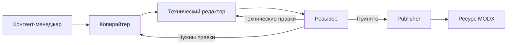

# ContentFlow

ContentFlow управляет подготовкой материалов и их публикацией в MODX 3. Компонент
хранит карту тем, запускает обработку по расписанию или вручную, проверяет темы на
дубли, создаёт ресурсы MODX и ведёт журнал каждого этапа.

Документация относится к версии **1.0.0-pl**.

Компонент рассчитан на информационные разделы, блоги, базы знаний и другие проекты,
где материалы регулярно создаются по заранее заданным правилам.

## Возможности

- автоматические и ручные задачи;
- распределение тем по конечным категориям MODX;
- ручное принятие и отклонение тем;
- проверка точных и смысловых дублей;
- неизменяемая конфигурация каждого запуска;
- отдельные роли для планирования, написания, редактирования, проверки и публикации;
- создание опубликованных ресурсов или черновиков;
- генерация главного и дополнительных изображений;
- внутренняя перелинковка, рекламные ссылки, офферы и рекламные вставки;
- Telegram- и Email-уведомления;
- подробный журнал с привязкой к задаче, запуску и теме;
- фоновая обработка через cron.

## Схема работы

В ручной задаче темы задаёт пользователь, поэтому этап Контент-менеджера
пропускается. В умеренном режиме Технический редактор подключается только после
возврата материала Ревьюером.

## Что оплачивается отдельно

ContentFlow использует API-ключи владельца сайта. Запросы к текстовым,
Embeddings- и графическим моделям оплачиваются их поставщикам и не входят в
стоимость лицензии компонента.

## С чего начать

1. Проверьте [системные требования](requirements).
2. [Установите компонент](installation).
3. Выполните [первоначальную настройку](quick-start).
4. После ручной проверки подключите [cron](cron).
