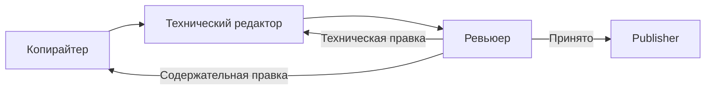
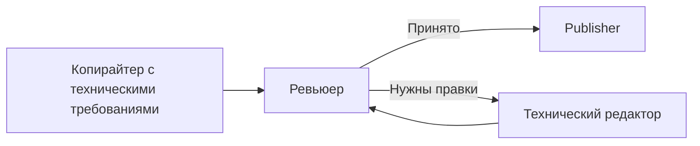

# Запуски и pipeline

## Создание запуска

Запуск может быть:

- ручным;
- плановым;
- созданным после принятия тем.

У одной задачи не может одновременно выполняться несколько обычных запусков.
Разные задачи могут обрабатываться параллельно отдельными worker-процессами.

При создании запуска сохраняются:

- конфигурация задачи;
- настройки контекста;
- модели, версии, параметры и промпты агентов;
- параметры dedup;
- упорядоченный список тем.

API-ключи в снимок не копируются. Во время выполнения они читаются из
актуальной конфигурации модели.

## Автоматическое планирование тем

Если в автоматической задаче закончились доступные темы, Content Manager:

1. получает список подходящих категорий и количество материалов в них;
2. одним запросом распределяет запас тем;
3. отдельным запросом создаёт темы для каждой категории из распределения;
4. сохраняет темы в карту контента;
5. запускает dedup;
6. сразу планирует принятые темы либо оставляет их на ручное принятие.

Число запросов зависит от количества категорий, которым выделены темы. При
восьми задействованных категориях обычно выполняется один запрос распределения
и до восьми запросов генерации.

## Текстовый pipeline

### Максимальный режим

Если Ревьюер возвращает материал Копирайтеру, тот обязан вернуть полную новую
версию всех полей. После этого статья снова проходит Технического редактора.

### Умеренный режим

Умеренный режим уменьшает количество обычных вызовов Технического редактора. При
возврате Ревьюера редактор получает исходный материал, замечание, инструкцию
задачи и исследовательский пакет.

## Проверка длины

До обращения к Ревьюеру ContentFlow проверяет заданные диапазоны. Для Title,
Description и Introtext применяется допуск 10% в обе стороны. Для Content
действует нижняя граница 90% от целевого объёма без жёсткого максимума.

Проверяется чистый текст без HTML-разметки. Если поле не попадает в допустимое
значение, статья возвращается на исправление с фактической длиной в журнале.

## Циклы исправлений

Ревьюер может запросить до трёх исправлений. Каждое направление записывается в
журнал вместе с целевым этапом и краткой причиной. После третьего исправления
выполняется финальная проверка. Если она снова не пройдена, статья завершается с
ошибкой.

Повтор запроса к API из-за временной сетевой ошибки и цикл исправления Ревьюера
— разные механизмы. Число сетевых попыток задаётся глобальной настройкой.

## Publisher

Publisher сначала создаёт неопубликованный ресурс и заполняет его поля. Затем
обрабатывает изображения и только после успешной финализации публикует ресурс,
если это предусмотрено задачей.

Такой порядок сохраняет результат при сбое графической модели. Ресурс остаётся
черновиком, а в карте контента доступен отдельный повтор Publisher.

Перед завершением Publisher проверяет, что в Content не осталось полных или
повреждённых маркеров `contentflow:image`.

## Состояния запуска

- **В очереди**;
- **Выполняется**;
- **Завершён**;
- **Завершён с ошибками**;
- **Ошибка**;
- **Отменён**.

«Завершён с ошибками» означает, что часть тем обработана успешно, а отдельные
материалы требуют внимания. Подробности находятся в карте контента и журнале.

## Остановка

Запуск в очереди можно отменить. Работающий запуск можно остановить через меню
действий задачи. Worker проверяет блокировку между этапами; уже выполняющийся
внешний API-запрос мгновенно прервать невозможно.

Прерванный текстовый pipeline не продолжается с середины. Тема без созданного
ресурса при следующем запуске начинает подготовку заново. Созданный черновик
сохраняется для отдельного решения по Publisher.
