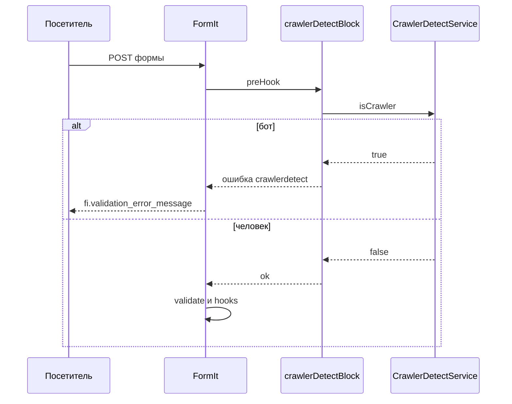

# Интеграция

## Защита форм от спама

### Как это работает

1. Пользователь отправляет форму.
2. FormIt вызывает preHook `crawlerDetectBlock` **до** валидации и отправки.
3. Если `isCrawler` считает запрос ботом (заголовки JayBizzle, не только User-Agent), форма не обрабатывается. Показывается сообщение из настройки.
4. Если человек, форма обрабатывается как обычно.



[crawlerDetectBlock](snippets/crawlerDetectBlock)

Сервис в PHP: `$modx->services->get('CrawlerDetect\\CrawlerDetectService')`. Методы: `isCrawler($ua = null)` и `getMatches()`. Без класса в vendor метод возвращает `false` без записи в журнал.

### Обычная форма (FormIt)

Добавьте `crawlerDetectBlock` в `&preHooks` FormIt. Другие preHooks перечислите через запятую.

::: code-group

```modx
&preHooks=`crawlerDetectBlock,другойХук`
```

```fenom
'preHooks' => 'crawlerDetectBlock,другойХук'
```

:::

### AJAX-форма (FetchIt)

FetchIt обрабатывает формы через FormIt на сервере.

1. В конфигурации FetchIt укажите URL или страницу, где вызывается FormIt.
2. В вызов FormIt на этой странице добавьте ``&preHooks=`crawlerDetectBlock` ``.
3. При блокировке ботом FetchIt получит ответ с ошибкой и покажет сообщение из настройки `crawlerdetect_block_message`.

### AJAX-форма (SendIt)

SendIt обрабатывает формы через FormIt. Параметры задаются в пресетах (файл из настройки **si_path_to_presets**).

1. Откройте свою копию файла пресетов. Не правьте стандартный `core/components/sendit/presets/sendit.inc.php`: при обновлении SendIt он перезаписывается.
2. Добавьте в нужный пресет `preHooks` с `crawlerDetectBlock`.
3. При блокировке ботом SendIt вернёт ошибку и покажет сообщение из настроек CrawlerDetect.

**Пример пресета:**

```php
return [
  'contact' => [
    'preHooks' => 'crawlerDetectBlock',
    'hooks' => 'email,FormItSaveForm',
    'validate' => 'name:required,email:email:required',
    'emailTo' => 'manager@site.ru',
    'emailSubject' => 'Обратная связь',
    // ...
  ],
];
```

Если `preHooks` уже есть, перечислите через запятую: `'preHooks' => 'crawlerDetectBlock,другойХук'`.

## Скрытие контента от ботов

Сниппет **isCrawler** возвращает `"1"` (бот) или `"0"` (не бот). Вызывайте без кэша.

### Виджет только для людей

::: code-group

```modx
[[!isCrawler:eq=`0`:then=`[[$chatWidget]]`]]
```

```fenom
{if $modx->runSnippet('isCrawler', []) == '0'}
  {$modx->getChunk('chatWidget')}
{/if}
```

:::

### Аналитика только для людей

::: code-group

```modx
[[!isCrawler:eq=`0`:then=`[[$googleAnalytics]]`]]
```

```fenom
{if $modx->runSnippet('isCrawler', []) == '0'}
  {$modx->getChunk('googleAnalytics')}
{/if}
```

:::

[isCrawler](snippets/isCrawler)

## Типовые сценарии

### Контактная форма

Добавьте `crawlerDetectBlock` в preHooks FormIt. См. [Быстрый старт](quick-start).

### Несколько форм на сайте

В каждом вызове FormIt добавьте `crawlerDetectBlock` в `&preHooks`.

### Счётчик «N человек на сайте»

Вызывайте сниппет счётчика, только если посетитель не бот:

::: code-group

```modx
[[!isCrawler:eq=`0`:then=`[[!yourVisitorCounterSnippet]]`]]
```

```fenom
{if $modx->runSnippet('isCrawler', []) == '0'}
  {$modx->runSnippet('yourVisitorCounterSnippet', [])}
{/if}
```

:::

### Форма «Заказать звонок» (FetchIt)

Те же шаги, что у [AJAX-формы (FetchIt)](#ajax-форма-fetchit).

### E-commerce — «Смотрят этот товар»

Не учитывать ботов в счётчике просмотров товара:

::: code-group

```modx
[[!isCrawler:eq=`0`:then=`[[!msProductViews? &id=`[[*id]]`]]`]]
```

```fenom
{if $modx->runSnippet('isCrawler', []) == '0'}
  {$modx->runSnippet('msProductViews', ['id' => $productId])}
{/if}
```

:::
