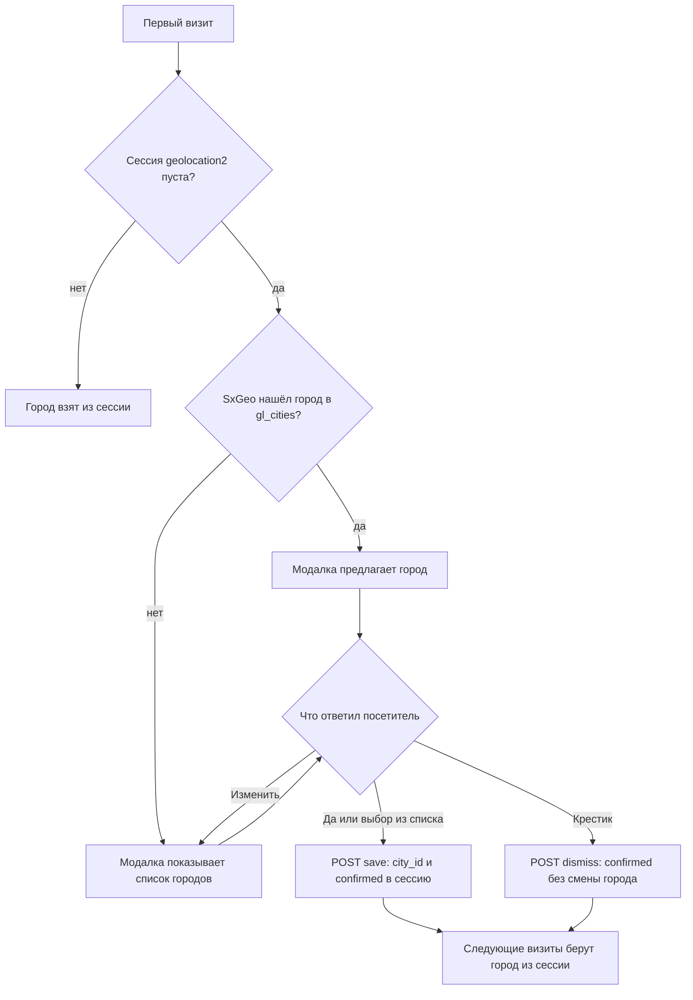

# Быстрый старт

## 1. Настройки

В **Система → Настройки системы → geolocation2** задайте:

| Ключ | Рекомендация для старта |
|------|-------------------------|
| `geolocation2_detect_method` | `sxgeo` — определение по IP при первом визите |
| `geolocation2_debug` | `0` на проде, `1` при отладке |

Подробнее: [Системные настройки](settings).

## 2. Шаблон сайта

В `<head>` или перед `</body>` подключите инициализацию (CSS/JS и Bootstrap 5, если ещё нет на странице):

::: code-group

```fenom
{'!GeoLocation2Initialize' | snippet}
```

```modx
[[!GeoLocation2Initialize]]
```

:::

Параметры `loadBootstrap`, `loadCss`, `loadJs` — в [GeoLocation2Initialize](snippets/GeoLocation2Initialize).

## 3. Модалка и текущий город

В шапке или футере:

::: code-group

```fenom
{'!GeoLocation2Current' | snippet : [
  'tpl' => 'tpl.GeoLocation2.current'
]}
{'!GeoLocation2Modal' | snippet}
```

```modx
[[!GeoLocation2Current? &tpl=`tpl.GeoLocation2.current`]]
[[!GeoLocation2Modal]]
```

:::

Чанк `tpl.GeoLocation2.current` поставляется с пакетом и показывает имя текущего города. Кнопка открывает модалку по классу `gl2-open-modal` — такой класс стоит добавить в свой чанк.

## 4. Как это работает



## 5. Проверка

1. Откройте сайт в режиме инкогнито.
2. Должна появиться модалка с предложением города (SxGeo) или списком городов.
3. После выбора город сохраняется в `$_SESSION['geolocation2']`.
4. Запрос `GET /assets/components/geolocation2/action.php?action=state` (с заголовком `X-Requested-With`) возвращает JSON с `state`, `confirmed` и полями сессии.

## 6. Данные по городу

Если заполнили `gl_data` в менеджере:

::: code-group

```fenom
{'!GeoLocation2Data' | snippet : [
  'forCurrent' => 1,
  'tpl' => 'tpl.GeoLocation2.data.current'
]}
```

```modx
[[!GeoLocation2Data? &forCurrent=`1` &tpl=`tpl.GeoLocation2.data.current`]]
```

:::

Дальше: [Интеграция](integration), [Web API](api-action), [FAQ](faq).
