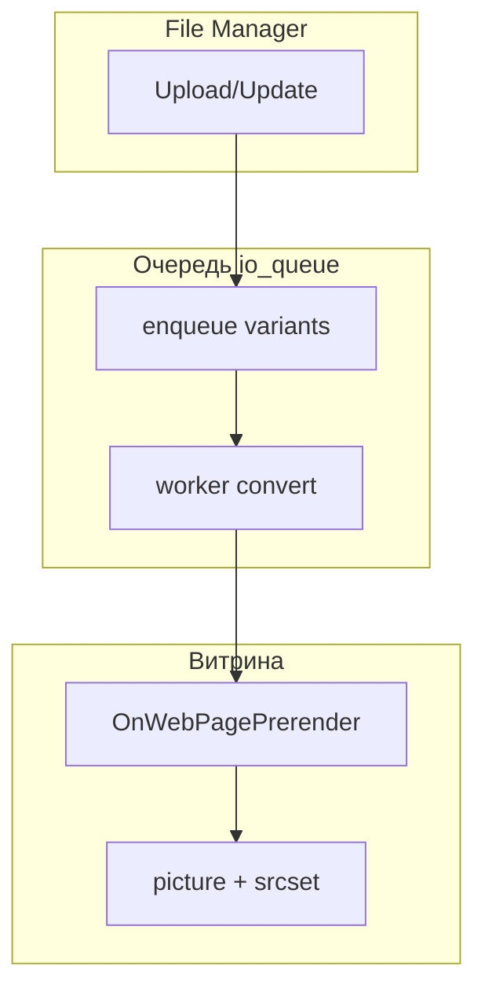

# ImageOptimizer

**ImageOptimizer** конвертирует растровые изображения в WebP и AVIF, генерирует responsive-варианты по breakpoints и на `OnWebPagePrerender` оборачивает локальные `` в `<picture>` с `srcset`. Чанки менять не нужно.

С чего начать: [Быстрый старт](quick-start).

## Возможности

- **Статические варианты:** файлы `{basename}.{width}.webp` рядом с оригиналом в media source
- **Очередь:** таблица `imageoptimizer_queue`, обработка из админки, CLI или cron
- **Авто-inject:** `<picture>` + WebP/AVIF `srcset` на выходе HTML-страницы
- **Upload hook:** постановка в очередь при загрузке в File Manager
- **Vue-админка:** очередь, настройки, проверка энкодеров на сервере

## Системные требования

| Требование | Версия |
| --- | --- |
| MODX Revolution | 3.0+ |
| PHP | 8.2+ |
| GD или Imagick | с поддержкой WebP |
| pdoTools | актуальная (зависимость transport) |
| [VueTools](/components/vuetools/) | ≥ 1.1.2-pl (админка) |

Расширения PHP: `fileinfo`, `gd` или `imagick`. AVIF опционально: `avifenc` или Imagick с AVIF.

## Зависимости

- **[pdoTools](/components/pdotools/):** обязательна при установке transport
- **[VueTools](/components/vuetools/):** Vue 3 + PrimeVue для менеджерского интерфейса

### Опционально

- **[MiniShop3](/components/minishop3/):** типичная витрина; отдельного кода MS3 в пакете нет, inject работает на любом HTML

## Установка

1. [Подключите репозиторий ModStore](https://modstore.pro/info/connection).
2. Установите **pdoTools** и **VueTools**, если их ещё нет на сайте.
3. **Extras → Installer** → найдите **ImageOptimizer** → **Download** → **Install**.
4. Убедитесь, что плагин **ImageOptimizer** включён.
5. **Настройки → Очистить кэш**.

После install resolver создаёт namespace `imageoptimizer`, таблицу очереди, права доступа, пункт меню **Компоненты → ImageOptimizer** и системные настройки `imageoptimizer_*`.

::: details Сборка transport из исходников
Для разработчиков пакета: [README на GitHub](https://github.com/Ibochkarev/ImageOptimizer#сборка) (`npm run build:mgr`, `php _build/build.php`).
:::

## Минимальный путь после установки

1. Откройте **Компоненты → ImageOptimizer** → вкладка **Server**: хотя бы один WebP-энкодер «Доступен».
2. Добавьте cron или обрабатывайте очередь вручную — [Быстрый старт](quick-start).
3. Загрузите JPEG в File Manager или сделайте rebuild каталога.
4. Нажмите **Обработать очередь**, дождитесь статуса `done`.
5. Откройте страницу с `` и проверьте `<picture>` в исходном коде.

## Быстрые ссылки

| Нужно | Документ |
| --- | --- |
| Первый запуск и cron | [Быстрый старт](quick-start) |
| Все ключи `imageoptimizer_*` | [Системные настройки](settings) |
| Авто-inject, skip, data-атрибуты | [Авто-inject и picture](frontend) |
| Thumb3x, MS3, VueTools | [Совместимость](compatibility) |
| Очередь и кнопки в менеджере | [Админка](manager) |
| Bulk и crontab | [CLI и cron](cli) |
| Типовые вопросы | [FAQ](faq) |
| Диагностика | [Решение проблем](troubleshooting) |

## Архитектура

Плагин **ImageOptimizer** слушает события File Manager (`OnFileManagerUpload`, `OnFileManagerFileCreate`, `OnFileManagerFileUpdate`, `OnFileManagerFileRemove`), `OnWebPagePrerender`, `OnSiteRefresh`, `OnCacheUpdate`.

Сниппетов в пакете нет. Вся интеграция на витрине: авто-inject или ручные пути к вариантам на диске.

## Термины

| Термин | Описание |
| --- | --- |
| **Вариант** | Файл WebP/AVIF с заданной шириной; width=0 = full-size, например `hero.jpg.webp` |
| **Breakpoint** | Целевая ширина из `imageoptimizer_breakpoints`, например `768` → `photo.768.webp` |
| **Очередь** | Строки в `imageoptimizer_queue`: path, format, width, status |
| **Inject** | Подмена `` на `<picture>` в HTML перед отдачей страницы |
| **Worker** | `imageoptimizer_process_queue`: конвертация pending-задач (cron, CLI, кнопка в админке) |

## Репозиторий

Исходники и dev-документация: [github.com/Ibochkarev/ImageOptimizer](https://github.com/Ibochkarev/ImageOptimizer). Баги и предложения: [Issues](https://github.com/Ibochkarev/ImageOptimizer/issues).
