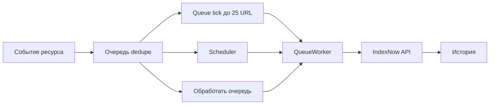
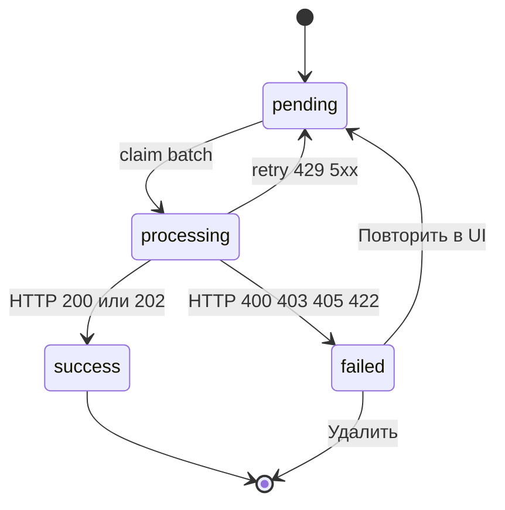

# Очередь и отправка

## Поток

Таблицы: `modx_indexnow_queue`, `modx_indexnow_history` (с учётом префикса таблиц сайта).

## Queue tick (основной фон)

Плагин подписан на `OnWebPageComplete` (фронт) и `OnManagerPageAfterRender` (менеджер). При включённом IndexNow и `indexnow_queue_enabled = Да` после постановки URL в очередь вызывается `scheduleQueueTick()`: один раз на запрос, через `register_shutdown_function`.

Один tick:

- берёт lock в кэше MODX (`indexnow_queue_tick`, TTL **55** секунд), чтобы параллельные запросы не дублировали worker;
- обрабатывает не больше **25** due-URL (`QUEUE_TICK_BATCH_MAX`), даже если `indexnow_batch_size` больше;
- при установленном Scheduler вызывает `ensureScheduledRun()` как запасной cron.

Scheduler не обязателен для фона. Tick закрывает типичный сценарий после сохранения ресурса или просмотра страницы менеджера.

## Какие события ловит плагин

| Событие | Поведение |
| --- | --- |
| `OnDocFormSave` | Опубликованный ресурс → `update`. Снятый с публикации → `delete`. |
| `OnResourcePublish` | Как сохранение опубликованного → `update`. |
| `OnResourceUnPublish` | → `delete`. |
| `OnBeforeDocFormDelete` | Запоминает URL до удаления. |
| `OnDocFormDelete` | Ставит в очередь `delete` по запомненному URL. |
| `OnWebPageComplete` | Планирует queue tick после ответа фронта. |
| `OnManagerPageAfterRender` | Планирует queue tick после ответа менеджера. |

В очередь update попадают опубликованные, не удалённые ресурсы, для которых собран абсолютный URL. `localhost`, private/reserved IP и `metadata.google.internal` в host не проходят проверку URL.

Если `publishedon` в будущем, запись ждёт: `available_at = publishedon`.

## Deduplication

Открытые строки (`pending` / `processing`) уникальны по паре `host + url`.

Повторное сохранение той же страницы не плодит дубликаты. Обновляются `action`, `available_at` и служебные поля.

Побеждает последнее событие. Пример: снятие с публикации дало `delete`, повторная публикация переписывает ту же строку на `update`.

## Worker

Один проход:

1. Вернуть «зависшие» `processing` старше 15 минут в `pending`.
2. Взять `pending`, у которых `available_at <= сейчас`, лимитом `indexnow_batch_size` (или меньше при tick).
3. Сгруппировать по `host`.
4. Отправить POST batch на endpoint по каждой группе host.
5. Записать историю и обновить очередь.

Если ключ невалиден или `indexnow_endpoint` не проходит проверку, worker **выходит без отправки** (сообщение в лог MODX). Очередь растёт, строк в истории нет.

## HTTP-коды

| Код | Поведение |
| --- | --- |
| `200`, `202` | Успех. Строка уходит из очереди, в истории `success`. |
| `429`, `5xx`, сеть / timeout | Временная ошибка. Retry через `indexnow_retry_delay`, пока не кончатся `indexnow_max_attempts`. |
| `400`, `403`, `405`, `422` | Постоянная ошибка. Статус `failed`, автоматический retry не крутит бесконечно. |
| Прочие 4xx (например `401`, `404`, `410`) | Тоже **сразу** `failed`, без серии retry (не входят во «временные»). |

Успешный ответ IndexNow значит «уведомление принято», не «страница уже в поиске». То же в [документации Яндекса](https://yandex.ru/support/webmaster/ru/indexing-options/index-now).

## Retry IndexNow и retry Scheduler

- `attempts` / `available_at` в очереди: про доставку URL на endpoint.
- Retry у задачи Scheduler: отдельно, только если упало выполнение самой задачи.

## Ручная обработка

- **Обработать очередь** на вкладке Статус: немедленный полный проход worker с лимитом `indexnow_batch_size`.
- Queue tick и Scheduler подбирают due-URL без действий в UI.
