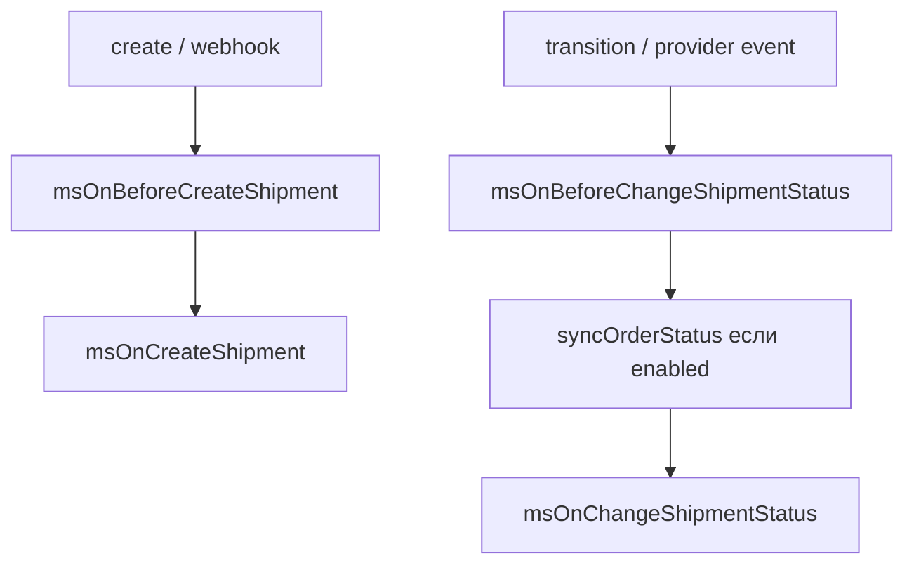
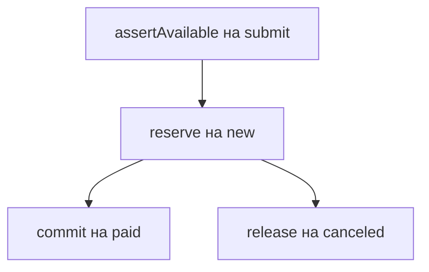
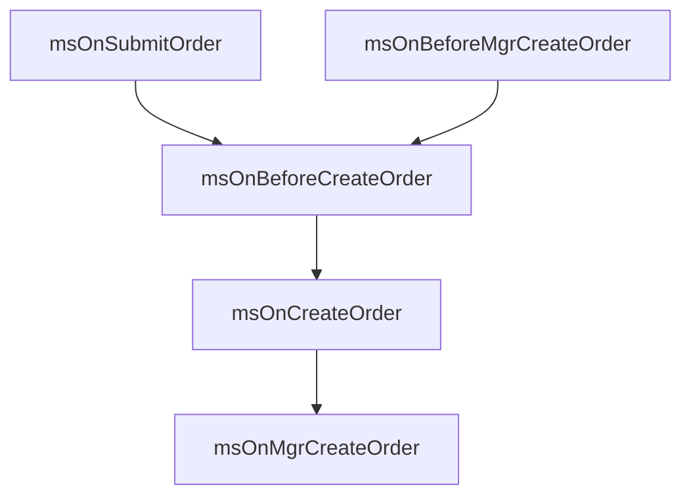

# События и плагины

MiniShop3 работает на системе событий MODX. Плагин вмешивается в обработку корзины, заказов, товаров и покупателей без правки исходного кода.

## Начало работы

- [Работа с плагинами](events/plugins-guide) — как получить параметры, прервать операцию, модифицировать данные, передать данные между плагинами

## События по категориям

### Корзина

| Событие | Описание |
| --- | --- |
| [msOnBeforeGetCart](events/cart#msonbeforegetcart) | Перед получением корзины |
| [msOnGetCart](events/cart#msongetcart) | После получения корзины |
| [msOnBeforeAddToCart](events/cart#msonbeforeaddtocart) | Перед добавлением товара |
| [msOnAddToCart](events/cart#msonaddtocart) | После добавления товара |
| [msOnBeforeChangeInCart](events/cart#msonbeforechangeincart) | Перед изменением количества |
| [msOnChangeInCart](events/cart#msonchangeincart) | После изменения количества |
| [msOnBeforeChangeOptionsInCart](events/cart#msonbeforechangeoptionsincart) | Перед изменением опций |
| [msOnChangeOptionInCart](events/cart#msonchangeoptionincart) | После изменения опций |
| [msOnBeforeRemoveFromCart](events/cart#msonbeforeremovefromcart) | Перед удалением товара |
| [msOnRemoveFromCart](events/cart#msonremovefromcart) | После удаления товара |
| [msOnBeforeEmptyCart](events/cart#msonbeforeemptycart) | Перед очисткой корзины |
| [msOnEmptyCart](events/cart#msonemptycart) | После очистки корзины |
| [msOnGetStatusCart](events/cart#msongetstatuscart) | Получение статуса корзины |

### Заказ

| Событие | Описание |
| --- | --- |
| [msOnBeforeAddToOrder](events/order#msonbeforeaddtoorder) | Перед добавлением поля в заказ |
| [msOnAddToOrder](events/order#msonaddtoorder) | После добавления поля |
| [msOnBeforeValidateOrderValue](events/order#msonbeforevalidateordervalue) | Перед валидацией поля |
| [msOnValidateOrderValue](events/order#msonvalidateordervalue) | После валидации поля |
| [msOnErrorValidateOrderValue](events/order#msonerrorvalidateordervalue) | Ошибка валидации |
| [msOnBeforeRemoveFromOrder](events/order#msonbeforeremovefromorder) | Перед удалением поля |
| [msOnRemoveFromOrder](events/order#msonremovefromorder) | После удаления поля |
| [msOnBeforeEmptyOrder](events/order#msonbeforeemptyorder) | Перед очисткой черновика заказа |
| [msOnEmptyOrder](events/order#msonemptyorder) | После очистки черновика |
| [msOnSubmitOrder](events/order#msonsubmitorder) | Отправка заказа (витрина) |
| [msOnBeforeMgrCreateOrder](events/order#msonbeforemgrcreateorder) | Перед финализацией из админки |
| [msOnMgrCreateOrder](events/order#msonmgrcreateorder) | После финализации из админки |
| [msOnBeforeCreateOrder](events/order#msonbeforecreateorder) | Перед созданием заказа |
| [msOnCreateOrder](events/order#msoncreateorder) | После создания заказа |

### Стоимость

| Событие | Описание |
| --- | --- |
| [msOnBeforeGetCartCost](events/cost#msonbeforegetcartcost) | Перед расчётом стоимости корзины |
| [msOnGetCartCost](events/cost#msongetcartcost) | После расчёта стоимости корзины |
| [msOnBeforeGetDeliveryCost](events/cost#msonbeforegetdeliverycost) | Перед расчётом стоимости доставки |
| [msOnGetDeliveryCost](events/cost#msongetdeliverycost) | После расчёта стоимости доставки |
| [msOnBeforeGetPaymentCost](events/cost#msonbeforegetpaymentcost) | Перед расчётом комиссии оплаты |
| [msOnGetPaymentCost](events/cost#msongetpaymentcost) | После расчёта комиссии оплаты |
| [msOnBeforeGetOrderCost](events/cost#msonbeforegetordercost) | Перед итогом заказа (корзина + доставка + оплата) |
| [msOnGetOrderCost](events/cost#msongetordercost) | После итога: можно править `cost` / `cart_cost` / `delivery_cost` / `payment_cost` |

### Статус заказа

| Событие | Описание |
| --- | --- |
| [msOnBeforeChangeOrderStatus](events/status#msonbeforechangeorderstatus) | Перед сменой статуса |
| [msOnChangeOrderStatus](events/status#msonchangeorderstatus) | После смены статуса |

### Покупатель

| Событие | Описание |
| --- | --- |
| [msOnBeforeGetOrderCustomer](events/customer#msonbeforegetordercustomer) | Перед получением покупателя |
| [msOnGetOrderCustomer](events/customer#msongetordercustomer) | После получения покупателя |
| [msOnBeforeGetOrderUser](events/customer#msonbeforegetorderuser) | Перед разрешением `modUser` при сабмите |
| [msOnGetOrderUser](events/customer#msongetorderuser) | После разрешения `modUser` |
| [msOnBeforeAddToCustomer](events/customer#msonbeforeaddtocustomer) | Перед добавлением поля |
| [msOnAddToCustomer](events/customer#msonaddtocustomer) | После добавления поля |
| [msOnBeforeValidateCustomerValue](events/customer#msonbeforevalidatecustomervalue) | Перед валидацией поля |
| [msOnValidateCustomerValue](events/customer#msonvalidatecustomervalue) | После валидации поля |
| [msOnErrorValidateCustomerValue](events/customer#msonerrorvalidatecustomervalue) | Ошибка валидации |
| [msOnBeforeCreateCustomer](events/customer#msonbeforecreatecustomer) | Перед созданием покупателя |
| [msOnCreateCustomer](events/customer#msoncreatecustomer) | После создания покупателя |
| [msOnBeforeUpdateCustomer](events/customer#msonbeforeupdatecustomer) | Перед обновлением покупателя (процессор; ни админка, ни Web API его пока не вызывают) |
| [msOnUpdateCustomer](events/customer#msonupdatecustomer) | После обновления покупателя (процессор; ни админка, ни Web API его пока не вызывают) |
| [msOnBeforeAddCustomerAddress](events/customer#msonbeforeaddcustomeraddress) | Перед добавлением адреса |
| [msOnAddCustomerAddress](events/customer#msonaddcustomeraddress) | После добавления адреса |

### Товары (каталог)

| Событие | Описание |
| --- | --- |
| [msOnGetProductPrice](events/product#msongetproductprice) | Модификация цены товара |
| [msOnGetProductWeight](events/product#msongetproductweight) | Модификация веса товара |
| [msOnGetProductFields](events/product#msongetproductfields) | Модификация полей товара |
| [msOnGetPublicSeo](events/product#msongetpublicseo) | После сборки публичных SEO (`PublicSeoService`, `ms3_public_seo_tv_map`) |

### Сниппет msProducts

События для интеграции внешних пакетов (ms3Variants, msBrands и другие) без правки кода ядра.

| Событие | Описание |
| --- | --- |
| [msOnProductsLoad](events/msproducts#msonproductsload) | После загрузки списка товаров (bulk loading) |
| [msOnProductPrepare](events/msproducts#msonproductprepare) | Подготовка данных каждого товара |

::: tip Параметр usePackages
Для активации загрузки данных укажите пакет в параметре сниппета: `&usePackages='ms3Variants,msBrands'`
:::

### Товары в заказе

| Событие | Описание |
| --- | --- |
| [msOnBeforeCreateOrderProduct](events/order-product#msonbeforecreateorderproduct) | Перед добавлением товара в заказ |
| [msOnCreateOrderProduct](events/order-product#msoncreateorderproduct) | После добавления товара |
| [msOnBeforeUpdateOrderProduct](events/order-product#msonbeforeupdateorderproduct) | Перед обновлением товара |
| [msOnUpdateOrderProduct](events/order-product#msonupdateorderproduct) | После обновления товара |
| [msOnBeforeRemoveOrderProduct](events/order-product#msonbeforeremoveorderproduct) | Перед удалением товара |
| [msOnRemoveOrderProduct](events/order-product#msonremoveorderproduct) | После удаления товара |

### Модель заказа (xPDO)

| Событие | Описание |
| --- | --- |
| [msOnBeforeSaveOrder](events/order-model#msonbeforesaveorder) | Перед сохранением (xPDO) |
| [msOnSaveOrder](events/order-model#msonsaveorder) | После сохранения (xPDO) |
| [msOnBeforeRemoveOrder](events/order-model#msonbeforeremoveorder) | Перед удалением (xPDO) |
| [msOnRemoveOrder](events/order-model#msonremoveorder) | После удаления (xPDO) |
| [msOnBeforeUpdateOrder](events/order-model#msonbeforeupdateorder) | Зарезервировано — не вызывается ([#844](https://github.com/modx-pro/MiniShop3/issues/844)) |
| [msOnUpdateOrder](events/order-model#msonupdateorder) | Зарезервировано — не вызывается ([#844](https://github.com/modx-pro/MiniShop3/issues/844)) |

### Уведомления

| Событие | Описание |
| --- | --- |
| [msOnBeforeSendNotification](events/notifications#msonbeforesendnotification) | Перед отправкой уведомления |
| [msOnAfterSendNotification](events/notifications#msonaftersendnotification) | После отправки уведомления |
| [msOnRegisterNotificationChannels](events/notifications#msonregisternotificationchannels) | Регистрация каналов |

### Производители

| Событие | Описание |
| --- | --- |
| [msOnBeforeVendorCreate](events/vendor#msonbeforevendorcreate) | Перед созданием производителя |
| [msOnVendorCreate](events/vendor#msonvendorcreate) | После создания |
| [msOnBeforeVendorUpdate](events/vendor#msonbeforevendorupdate) | Перед обновлением |
| [msOnVendorUpdate](events/vendor#msonvendorupdate) | После обновления |
| [msOnBeforeVendorDelete](events/vendor#msonbeforevendordelete) | Перед удалением |
| [msOnVendorDelete](events/vendor#msonvendordelete) | После удаления |

Все шесть событий производителя вызывают только прежние процессоры `Settings/Vendor/*`. CRUD в админке идёт через Manager API, а он их не вызывает — подробности в [событиях производителя](events/vendor) и [issue #847](https://github.com/modx-pro/MiniShop3/issues/847).

### Импорт

| Событие | Описание |
| --- | --- |
| [msOnBeforeImport](events/import#msonbeforeimport) | Перед началом импорта |
| [msOnAfterImport](events/import#msonafterimport) | После завершения импорта |
| [msOnImportRow](events/import#msonimportrow) | При обработке строки |

### Админка

| Событие | Описание |
| --- | --- |
| [msOnManagerCustomCssJs](events/manager#msonmanagercustomcssjs) | Загрузка скриптов и стилей |

### Отгрузки (shipment)

Логика — `ShipmentLifecycleService` (`ms3_shipment_lifecycle`), таблицы — `ms3_shipments` и `ms3_shipment_events`. Создание отгрузки и `setTracking` работают и при `ms3_shipment_enabled=0`, а вебхук доставки в этом случае отвечает 404. Before-события прерываются через `success=false` в ответе `invokeEvent`.

| Событие | Параметры | Когда |
| --- | --- | --- |
| `msOnBeforeCreateShipment` / `msOnCreateShipment` | before: `order_id`, `delivery_id`; after: `shipment` (запись) | `create()` |
| `msOnBeforeChangeShipmentStatus` / `msOnChangeShipmentStatus` | before: `shipment`, `status`; after: `shipment` | `transition()` / вебхук службы доставки |
| `msOnBeforeUpdateShipmentTracking` / `msOnUpdateShipmentTracking` | before: `shipment`, `tracking_number`; after: `shipment` | `setTracking()` / вебхук при смене трек-номера |

Статусы отгрузки: `preparing`, `shipped`, `in_transit`, `delivered`, `cancelled`, `returned`, `failed` (`ShipmentStatus`).

### Остатки (inventory)

При `ms3_inventory_enabled=1` работает `ProductStockInventory` (`ms3_inventory`), контракт — `InventoryServiceInterface`. Параметры событий: `key` (`InventoryKey`), `qty`, `ctx` (`InventoryContext`: `orderId`, `origin`). Before-событие с `success=false` приводит к `InventoryException` (`ms3_err_inventory_cancelled`). `$notify=false` у reserve и release пропускает пару событий — компенсация идёт внутри SQL-транзакции.

| Событие | Когда в статусах заказа |
| --- | --- |
| `msOnBeforeInventoryReserve` / `msOnInventoryReserve` | Резерв на `ms3_status_new` (и перед commit, если заказ сразу переходит в paid) |
| `msOnBeforeInventoryCommit` / `msOnInventoryCommit` | Commit на `ms3_status_paid` (повторно остаток не уменьшает) |
| `msOnBeforeInventoryRelease` / `msOnInventoryRelease` | Release на `ms3_status_canceled` до commit. Также при сбое `payment send()` |

## Изменения относительно miniShop2

| miniShop2 | MiniShop3 | Изменения |
| --- | --- | --- |
| `product` | `msProduct` | Переименован параметр |
| `msOnGetOrderCost` | Остался + 3 частичных | Рядом: `msOnGetCartCost`, `msOnGetDeliveryCost`, `msOnGetPaymentCost`. Итог по-прежнему правите в `msOnGetOrderCost` |
| — | `controller` | Параметр во многих событиях контроллеров |
| — | `msOnBeforeEmptyOrder` / `msOnEmptyOrder` | Очистка черновика |
| — | `msOnBeforeMgrCreateOrder` / `msOnMgrCreateOrder` | Финализация из админки |
| — | `msOnBeforeGetOrderUser` / `msOnGetOrderUser` | `modUser` при сабмите |
| — | `msOnBeforeValidateCustomerValue` | Новое событие |
| — | `msOnCreateCustomer` | Новое событие |
| — | `msOnAddCustomerAddress` | Новое событие |
| — | `msOnBeforeSendNotification` | Новое событие |
| — | `msOnImportRow` | Новое событие |
| — | `msOnProductsLoad` | Интеграция внешних пакетов |
| — | `msOnProductPrepare` | Интеграция внешних пакетов |
| — | `msOnGetPublicSeo` | Публичные SEO Web API |
| — | `msOn*Shipment*` | Lifecycle отгрузки |
| — | `msOn*Inventory*` | Резерв/commit/release остатков |

### Цепочки вызовов (куда смотреть в коде)

| Действие | События по порядку |
| --- | --- |
| Очистка черновика (`order/clean`) | `msOnBeforeEmptyOrder` → reset полей → `msOnEmptyOrder` |
| Итог на витрине | cart/delivery/payment cost → `msOnBeforeGetOrderCost` → compose → `msOnGetOrderCost` (можно вернуть все 4 суммы) |
| Отправка заказа на витрине | `msOnSubmitOrder` → … → `msOnBeforeCreateOrder` → `msOnCreateOrder` |
| Финализация в админке | `msOnBeforeMgrCreateOrder` → `msOnBeforeCreateOrder` → `msOnCreateOrder` → `msOnMgrCreateOrder` |

Все имена выше зарегистрированы в MODX; список регистрации — `_build/elements/events.php`.
