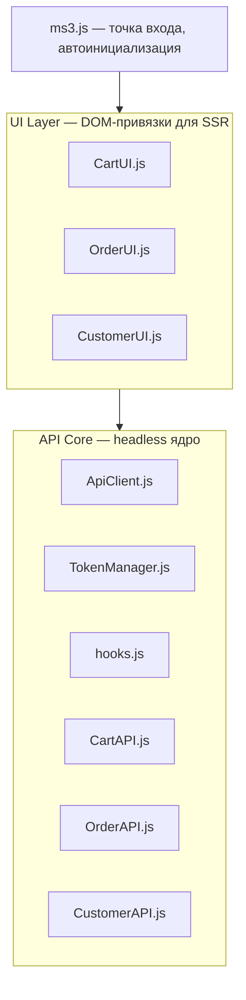

# JavaScript API

Headless API для программного взаимодействия с MiniShop3 без привязки к DOM.

## Архитектура

MiniShop3 использует двухуровневую архитектуру:



### API Core (Headless)

Независимое ядро без привязки к DOM:

- **ApiClient.js** — HTTP-клиент для запросов к серверу
- **TokenManager.js** — управление токенами авторизации
- **CartAPI.js** — методы работы с корзиной
- **OrderAPI.js** — методы работы с заказом
- **CustomerAPI.js** — методы работы с покупателем
- **hooks.js** — система хуков для расширения

### UI Layer (SSR)

DOM-привязки для работы с серверной разметкой:

- **CartUI.js** — обработчики форм корзины, рендеринг
- **OrderUI.js** — обработчики форм заказа
- **CustomerUI.js** — обработчики форм покупателя
- **ProductCardUI.js** — переключение состояний карточек товаров

## Подключение

### Полное (по умолчанию)

Плагин MiniShop3 автоматически подключает все скрипты. Управление через системную настройку `ms3_frontend_assets`.

### Минимальное (только Headless)

Для SPA-приложений (Vue, React, Svelte) подключите только ядро:

```html
<script src="/assets/components/minishop3/js/web/modules/hooks.js"></script>
<script src="/assets/components/minishop3/js/web/core/TokenManager.js"></script>
<script src="/assets/components/minishop3/js/web/core/ApiClient.js"></script>
<script src="/assets/components/minishop3/js/web/core/CartAPI.js"></script>
<script src="/assets/components/minishop3/js/web/core/OrderAPI.js"></script>
<script src="/assets/components/minishop3/js/web/core/CustomerAPI.js"></script>
```

### Инициализация вручную

```javascript
// Конфигурация
const config = {
  actionUrl: '/assets/components/minishop3/api.php',
  tokenName: 'ms3_token'
}

// Инициализация ядра
const tokenManager = new TokenManager(config)
const apiClient = new ApiClient({ baseUrl: config.actionUrl, tokenManager })
tokenManager.setApiClient(apiClient)

// Получение токена
await tokenManager.ensureToken()

// API модули
const cart = new CartAPI(apiClient)
const order = new OrderAPI(apiClient)
const customer = new CustomerAPI(apiClient)

// Готово к использованию
const response = await cart.add(123, 2, { color: 'red' })
```

## Глобальные объекты

При стандартном подключении доступны:

| Объект | Описание |
| --- | --- |
| `window.ms3` | Главный объект со всеми модулями |
| `window.ms3Hooks` | Система хуков |
| `window.ms3Message` | Уведомления (если подключён UI) |
| `window.ms3Config` | Конфигурация с сервера |

::: warning `ms3Config` можно отключить настройкой
При `ms3_register_global_config = false` объект на страницу не выводится. Но регистрация сниппетов корзины печатается всегда и обращается к нему без проверки, поэтому в консоли появится `ReferenceError: ms3Config is not defined`, а перерисовка корзины и виджета итогов перестанет работать.

По умолчанию настройка включена. Выключать её стоит, только если конфиг выводится своим кодом.
:::

```javascript
// Использование через глобальный объект
await ms3.cartAPI.add(123, 1)
await ms3.orderAPI.submit()
await ms3.customerAPI.updateProfile({ email: 'new@example.com' })
```

## CartAPI

API для работы с корзиной.

### Методы

#### get()

Получить содержимое корзины.

```javascript
const response = await ms3.cartAPI.get()

// response:
{
  success: true,
  message: "ms3_cart_get_success",
  data: {
    cart: {
      // Объект, где ключ — product_key
      "ms43ce202fd27c84c28230cc771328e37f": {
        id: 10,
        product_id: 152248,
        order_id: 7,
        product_key: "ms43ce202fd27c84c28230cc771328e37f",
        name: "Название товара",
        count: 2,
        price: 148343,
        weight: 2.508,
        cost: 296686,
        options: [],
        properties: {
          old_price: 0,
          discount_price: 0,
          discount_cost: 0
        }
      }
    },
    status: {
      total_count: 9,
      total_cost: 1094850,
      total_weight: 35.62,
      total_discount: 19241,
      total_positions: 3
    }
  }
}
```

#### add(id, count, options, render)

Добавить товар в корзину.

| Параметр | Тип | Описание |
| --- | --- | --- |
| `id` | number | ID товара (обязательный) |
| `count` | number | Количество (по умолчанию 1) |
| `options` | object | Опции товара (цвет, размер и т.д.) |
| `render` | array | Токены для SSR (см. ниже) |

```javascript
// Простое добавление
await ms3.cartAPI.add(123)

// С количеством
await ms3.cartAPI.add(123, 3)

// С опциями
await ms3.cartAPI.add(123, 1, { color: 'red', size: 'L' })
```

:::tip SSR (Server-Side Rendering)
Параметр `render` позволяет получить готовый HTML с сервера. Токены должны быть зарегистрированы на сервере через `TokenService`. Если токены настроены, HTML возвращается в `response.data.render`. Это продвинутая функция для оптимизации — в большинстве случаев не требуется.
:::

**Формат ответа:**

```javascript
{
  success: true,
  message: "Товар добавлен в корзину",
  data: {
    cart: {...},           // Позиции корзины, ключ — product_key
    status: {...},         // Итоги
    render: {              // HTML (если запрошен)
      "ms3_a1b2c3...": "<div>...</div>"   // ключ — токен вызова сниппета
    }
  }
}
```

#### change(productKey, count, render)

Изменить количество товара.

| Параметр | Тип | Описание |
| --- | --- | --- |
| `productKey` | string | Уникальный ключ товара в корзине |
| `count` | number | Новое количество |
| `render` | array | Токены для рендеринга |

```javascript
await ms3.cartAPI.change('ms5d41d8cd98f00b204e9800998ecf8427e', 5)
```

:::tip product_key
Каждый товар в корзине имеет уникальный `product_key`. Один товар с разными опциями — разные ключи.
:::

#### remove(productKey, render)

Удалить товар из корзины.

```javascript
await ms3.cartAPI.remove('ms5d41d8cd98f00b204e9800998ecf8427e')
```

#### clean(render)

Очистить корзину.

```javascript
await ms3.cartAPI.clean()
```

::: warning Только API-вызов
`cartAPI.clean()` — это headless метод, он только отправляет запрос к серверу. Мини-корзина, счётчики и карточки товаров **не обновятся** автоматически. Для полного обновления UI используйте `ms3.cartUI.handleClean()` — он вызовет API, отрендерит HTML и выбросит событие `ms3:cart:updated`. Подробнее — в разделе [Frontend JavaScript](frontend-js#cartui).
:::

## OrderAPI

API для работы с заказом.

### Методы

#### get()

Получить текущий заказ (данные из сессии).

```javascript
const response = await ms3.orderAPI.get()

// response.data.order (фрагмент):
{
  delivery_id: 1,
  payment_id: 2,
  order_comment: "Позвонить перед доставкой",
  address_first_name: "Иван",
  address_last_name: "Иванов",
  address_email: "ivan@example.com",
  address_phone: "+79991234567",
  address_comment: ""
}
```

#### add(key, value)

Сохранить поле заказа.

```javascript
await ms3.orderAPI.add('first_name', 'Иван')
await ms3.orderAPI.add('email', 'ivan@example.com')
await ms3.orderAPI.add('phone', '+79991234567')
await ms3.orderAPI.add('delivery_id', 1)
await ms3.orderAPI.add('payment_id', 2)
await ms3.orderAPI.add('order_comment', 'Позвонить перед доставкой')
// комментарий к адресу: await ms3.orderAPI.add('comment', '…')
```

:::info Автосохранение
Каждый вызов `add()` сохраняет значение на сервере. Данные не теряются при перезагрузке страницы.
:::

#### remove(key)

Удалить поле заказа.

```javascript
await ms3.orderAPI.remove('order_comment')
```

#### clean()

Очистить все данные заказа.

```javascript
await ms3.orderAPI.clean()
```

#### submit()

Оформить заказ.

```javascript
const response = await ms3.orderAPI.submit()

if (response.success) {
  // response.data:
  {
    order_id: 42,
    redirect: "/shop/order-success?msorder=42"
  }

  window.location.href = response.data.redirect
} else {
  // response:
  {
    success: false,
    message: "Заполните обязательные поля",
    data: {
      errors: ["first_name", "email", "phone"]
    }
  }
}
```

#### getCost()

Получить расчёт стоимости заказа.

```javascript
const response = await ms3.orderAPI.getCost()

// response:
{
  success: true,
  message: "Стоимость рассчитана",
  data: {
    cost: 0,
    cart_cost: 0,
    delivery_cost: 0,
    payment_cost: 0,
    total_count: 0,
    total_cost: 0,
    total_weight: 0,
    total_discount: 0,
    total_positions: 0
  }
}
```

## CustomerAPI

API для работы с данными авторизованного покупателя.

:::warning Требуется авторизация
Большинство методов CustomerAPI требует авторизации. Исключения — вход, регистрация и сброс пароля: они и нужны тому, кто ещё не вошёл. Данные заказа гостя сохраняются через `OrderAPI.add()`.
:::

### Методы

#### updateProfile(data)

Обновить профиль авторизованного пользователя.

```javascript
await ms3.customerAPI.updateProfile({
  first_name: 'Иван',
  last_name: 'Иванов',
  email: 'ivan@example.com',
  phone: '+79991234567'
})
```

#### createAddress(data)

Создать новый адрес.

```javascript
await ms3.customerAPI.createAddress({
  name: 'Домашний',
  city: 'Москва',
  street: 'Тверская',
  building: '1',
  room: '10',
  index: '123456'
})
```

#### updateAddress(id, data)

Обновить существующий адрес.

```javascript
await ms3.customerAPI.updateAddress(5, {
  city: 'Санкт-Петербург',
  street: 'Невский проспект'
})
```

#### deleteAddress(id)

Удалить адрес.

```javascript
await ms3.customerAPI.deleteAddress(5)
```

## Система хуков

Хуки позволяют расширять поведение без изменения исходного кода.

### Регистрация хука

```javascript
ms3Hooks.addHook('hookName', async (context) => {
  // context — данные операции
  // context.cancel = true — отменить операцию
})
```

### Доступные хуки

#### Корзина

| Хук | Контекст | Описание |
| --- | --- | --- |
| `beforeAddCart` | `{ id, count, options }` | Перед добавлением товара |
| `afterAddCart` | `{ id, count, options, response }` | После добавления товара |
| `beforeChangeCart` | `{ productKey, count }` | Перед изменением количества |
| `afterChangeCart` | `{ productKey, count, response }` | После изменения количества |
| `beforeRemoveCart` | `{ productKey }` | Перед удалением товара |
| `afterRemoveCart` | `{ productKey, response }` | После удаления товара |
| `beforeCleanCart` | `{}` | Перед очисткой корзины |
| `afterCleanCart` | `{ response }` | После очистки корзины |
| `beforeChangeOptionCart` | `{ productKey, options }` | Перед сменой опции позиции |
| `afterChangeOptionCart` | `{ productKey, options, response }` | После смены опции |
| `beforeQuantityChange` | `{ productKey, count, form }` | Перед изменением количества кнопками «+» и «−» |
| `afterQuantityChange` | `{ productKey, count, response }` | После изменения количества |

#### Заказ

| Хук | Контекст | Описание |
| --- | --- | --- |
| `beforeAddOrder` | `{ key, value }` | Перед сохранением поля |
| `afterAddOrder` | `{ key, value, response }` | После сохранения поля |
| `beforeSubmitOrder` | `{}` | Перед оформлением |
| `afterSubmitOrder` | `{ response }` | После оформления |
| `beforeCleanOrder` | `{}` | Перед очисткой |
| `afterCleanOrder` | `{ response }` | После очистки |
| `afterUpdateOrderCosts` | `{ cost, cart_cost, delivery_cost }` | После пересчёта стоимости заказа |

#### Покупатель

| Хук | Контекст | Описание |
| --- | --- | --- |
| `beforeAddCustomer` | `{ key, value }` | Перед сохранением данных |
| `afterAddCustomer` | `{ key, value, response }` | После сохранения данных |
| `beforeUpdateProfile` | `{ data }` | Перед обновлением профиля |
| `afterUpdateProfile` | `{ data, response }` | После обновления профиля |
| `beforeCreateAddress` | `{ data }` | Перед созданием адреса |
| `afterCreateAddress` | `{ data, response }` | После создания адреса |
| `beforeUpdateAddress` | `{ addressId, data }` | Перед правкой адреса |
| `afterUpdateAddress` | `{ addressId, data, response }` | После правки адреса |
| `beforeDeleteAddress` | `{ addressId }` | Перед удалением адреса |
| `afterDeleteAddress` | `{ addressId, response }` | После удаления адреса |
| `beforeSetDefaultAddress` | `{ addressId }` | Перед выбором адреса по умолчанию |
| `afterSetDefaultAddress` | `{ addressId, response }` | После выбора адреса по умолчанию |
| `beforeChangeAddressCustomer` | `{ addressId }` | Перед сменой адреса в форме заказа |
| `afterChangeAddressCustomer` | `{ addressId, response }` | После смены адреса в форме заказа |
| `beforeCancelOrder` | `{ orderId }` | Перед отменой заказа покупателем |
| `afterCancelOrder` | `{ orderId, response }` | После отмены заказа |
| `beforeResendVerificationEmail` | `{ button }` | Перед повторной отправкой письма с подтверждением |
| `afterResendVerificationEmail` | `{ button, response }` | После отправки письма |

#### Вход и регистрация

| Хук | Контекст | Описание |
| --- | --- | --- |
| `beforeLogin` | `{ email }` | Перед входом |
| `afterLogin` | `{ email, response }` | После входа |
| `beforeRegister` | `{ email }` | Перед регистрацией |
| `afterRegister` | `{ email, response }` | После регистрации |

#### Любая форма

| Хук | Контекст | Описание |
| --- | --- | --- |
| `beforeFormSubmit` | `{ entity, method, formData }` | Перед отправкой любой формы MiniShop3 |
| `afterFormSubmit` | `{ entity, method, formData }` | После отправки |

Эта пара срабатывает на все формы — корзины, заказа и покупателя — и получает `formData` целиком. Если нужны введённые значения, подписывайтесь сюда: специализированные хуки вроде `beforeSubmitOrder` данных формы не получают.

### Примеры хуков

**Валидация перед добавлением:**

```javascript
ms3Hooks.addHook('beforeAddCart', async (ctx) => {
  if (!ctx.options.size) {
    alert('Выберите размер!')
    ctx.cancel = true
  }
})
```

**Аналитика:**

```javascript
ms3Hooks.addHook('afterAddCart', async (ctx) => {
  if (!ctx.response.success) return

  gtag('event', 'add_to_cart', {
    currency: 'RUB',
    value: ctx.response.data.status.total_cost,
    items: [{ item_id: ctx.id, quantity: ctx.count }]
  })
})

ms3Hooks.addHook('afterSubmitOrder', async (ctx) => {
  if (!ctx.response.success) return

  gtag('event', 'purchase', {
    transaction_id: ctx.response.data.order_id,
    value: ctx.response.data.total_cost
  })
})
```

**Подтверждение очистки:**

```javascript
ms3Hooks.addHook('beforeCleanCart', async (ctx) => {
  if (!confirm('Очистить корзину?')) {
    ctx.cancel = true
  }
})
```

## События DOM

### Список событий

| Событие | Описание | detail |
| --- | --- | --- |
| `ms3:ready` | ms3 инициализирован | — |
| `ms3:cart:updated` | Корзина обновлена | `{ cart, items, status }`, при перерисовке добавляется `render`. Иногда приходит пустым — см. ниже |

### Подписка

```javascript
document.addEventListener('ms3:ready', () => {
  console.log('MiniShop3 готов')
})

document.addEventListener('ms3:cart:updated', (e) => {
  const { cart, items, status } = e.detail ?? {}
  if (!status) {
    return
  }

  // Обновить счётчик в шапке
  document.querySelector('.cart-count').textContent = status.total_count
  document.querySelector('.cart-total').textContent = status.total_cost + ' руб.'
})
```

::: warning Событие приходит и без данных
Очистка формы заказа шлёт его пустым — `detail` будет `null`. Форма очистки есть в поставляемом чанке `ms3_order.tpl`, так что путь живой: обработчик, читающий поля сразу, упадёт с `TypeError` ([#802](https://github.com/modx-pro/MiniShop3/issues/802)).

Проверяйте `detail` перед обращением к полям — во всех примерах ниже это сделано.
:::

## Использование в SPA

### Vue 3

```javascript
// composables/useCart.js
import { ref, onMounted } from 'vue'

export function useCart() {
  const cart = ref([])
  const status = ref({ total_count: 0, total_cost: 0 })
  const loading = ref(false)

  async function loadCart() {
    loading.value = true
    const response = await ms3.cartAPI.get()
    if (response.success) {
      cart.value = response.data.cart
      status.value = response.data.status
    }
    loading.value = false
  }

  async function addToCart(id, count = 1, options = {}) {
    loading.value = true
    const response = await ms3.cartAPI.add(id, count, options)
    if (response.success) {
      cart.value = response.data.cart
      status.value = response.data.status
    }
    loading.value = false
    return response
  }

  async function removeFromCart(productKey) {
    const response = await ms3.cartAPI.remove(productKey)
    if (response.success) {
      cart.value = response.data.cart
      status.value = response.data.status
    }
    return response
  }

  async function changeQuantity(productKey, count) {
    const response = await ms3.cartAPI.change(productKey, count)
    if (response.success) {
      cart.value = response.data.cart
      status.value = response.data.status
    }
    return response
  }

  async function clearCart() {
    const response = await ms3.cartAPI.clean()
    if (response.success) {
      cart.value = []
      status.value = { total_count: 0, total_cost: 0 }
    }
    return response
  }

  onMounted(() => {
    loadCart()

    // Подписка на внешние обновления
    document.addEventListener('ms3:cart:updated', (e) => {
      if (!e.detail) {
        return
      }
      cart.value = e.detail.cart
      status.value = e.detail.status
    })
  })

  return {
    cart,
    status,
    loading,
    addToCart,
    removeFromCart,
    changeQuantity,
    clearCart,
    loadCart
  }
}
```

**Использование в компоненте:**

```vue
<script setup>
import { useCart } from '@/composables/useCart'

const { cart, status, loading, addToCart, removeFromCart } = useCart()
</script>

<template>
  <div class="cart">
    <div v-if="loading">Загрузка...</div>

    <div v-for="item in cart" :key="item.product_key" class="cart-item">
      <span>{{ item.name }}</span>
      <span>{{ item.count }} x {{ item.price }} руб.</span>
      <button @click="removeFromCart(item.product_key)">Удалить</button>
    </div>

    <div class="cart-total">
      Итого: {{ status.total_cost }} руб.
    </div>
  </div>
</template>
```

### React

```javascript
// hooks/useCart.js
import { useState, useEffect, useCallback } from 'react'

export function useCart() {
  const [cart, setCart] = useState([])
  const [status, setStatus] = useState({ total_count: 0, total_cost: 0 })
  const [loading, setLoading] = useState(false)

  const loadCart = useCallback(async () => {
    setLoading(true)
    const response = await window.ms3.cartAPI.get()
    if (response.success) {
      setCart(response.data.cart)
      setStatus(response.data.status)
    }
    setLoading(false)
  }, [])

  const addToCart = useCallback(async (id, count = 1, options = {}) => {
    setLoading(true)
    const response = await window.ms3.cartAPI.add(id, count, options)
    if (response.success) {
      setCart(response.data.cart)
      setStatus(response.data.status)
    }
    setLoading(false)
    return response
  }, [])

  const removeFromCart = useCallback(async (productKey) => {
    const response = await window.ms3.cartAPI.remove(productKey)
    if (response.success) {
      setCart(response.data.cart)
      setStatus(response.data.status)
    }
    return response
  }, [])

  useEffect(() => {
    loadCart()

    const handleCartUpdate = (e) => {
      if (!e.detail) {
        return
      }
      setCart(e.detail.cart)
      setStatus(e.detail.status)
    }

    document.addEventListener('ms3:cart:updated', handleCartUpdate)
    return () => document.removeEventListener('ms3:cart:updated', handleCartUpdate)
  }, [loadCart])

  return { cart, status, loading, addToCart, removeFromCart, loadCart }
}
```

### Vanilla JavaScript

```javascript
class CartManager {
  constructor() {
    this.cart = []
    this.status = { total_count: 0, total_cost: 0 }
    this.listeners = []
  }

  async init() {
    await this.load()

    document.addEventListener('ms3:cart:updated', (e) => {
      if (!e.detail) {
        return
      }
      this.cart = e.detail.cart
      this.status = e.detail.status
      this.notify()
    })
  }

  async load() {
    const response = await ms3.cartAPI.get()
    if (response.success) {
      this.cart = response.data.cart
      this.status = response.data.status
      this.notify()
    }
  }

  async add(id, count = 1, options = {}) {
    const response = await ms3.cartAPI.add(id, count, options)
    if (response.success) {
      this.cart = response.data.cart
      this.status = response.data.status
      this.notify()
    }
    return response
  }

  subscribe(callback) {
    this.listeners.push(callback)
    return () => {
      this.listeners = this.listeners.filter(l => l !== callback)
    }
  }

  notify() {
    this.listeners.forEach(cb => cb(this.cart, this.status))
  }
}

// Использование
const cartManager = new CartManager()
await cartManager.init()

cartManager.subscribe((cart, status) => {
  document.querySelector('.cart-count').textContent = status.total_count
})

document.querySelector('.add-to-cart').addEventListener('click', () => {
  cartManager.add(123, 1, { size: 'L' })
})
```

## Формат ответов

Все методы возвращают Promise с объектом:

```javascript
{
  success: true,           // Успех операции
  message: "Текст",        // Сообщение (опционально)
  data: {                  // Данные (при success: true)
    cart: {...},
    status: {...},
    render: {...}
  }
}
```

**При ошибке:**

```javascript
{
  success: false,
  message: "Описание ошибки",
  data: {
    errors: ["field1", "field2"]  // Поля с ошибками
  }
}
```

## Токены и авторизация

MiniShop3 использует токены для идентификации сессии корзины.

### Как работает

1. При первом запросе клиент получает токен (`GET /api/v1/customer/token/get`, либо он выдаётся сам при первом обращении к корзине)
2. С 1.6 для браузера основной способ это httpOnly cookie `ms3_token`, не `localStorage`
3. Клиент шлёт запросы с `credentials: 'same-origin'` — cookie уходит сама. Для обращений с другого домена есть `Authorization: Bearer`
4. Ротация на login / `token/refresh`

Подробнее: [Авторизация Web API](/components/minishop3/development/web-api/auth), [Frontend JavaScript](/components/minishop3/development/frontend-js).

### Ручное управление

```javascript
// Получить токен с сервера, если его ещё нет
await ms3.tokenManager.ensureToken()

// Запросить новый принудительно
await ms3.tokenManager.fetchNewToken()
```

Оба метода обращаются к `/api/v1/customer/token/get`, а сервер ставит cookie в ответе.

::: warning Прочитать токен из браузера нельзя
`getToken()` и `getTokenData()` всегда возвращают `null`, а `setToken()` ничего не делает. Это не ошибка: с версии 1.6 токен хранится в httpOnly cookie, и JavaScript к ней доступа не имеет — в этом и смысл такой куки.

`removeToken()` тоже не удаляет текущий токен: он лишь подчищает остатки в `localStorage` от прежних версий. Сбросить сессию корзины из браузера нельзя, это делает сервер.
:::

## Связанные страницы

- [Frontend JavaScript](frontend-js) — полная документация включая UI
- [REST API](api) — описание серверных endpoints
- [События](events) — PHP события компонента
