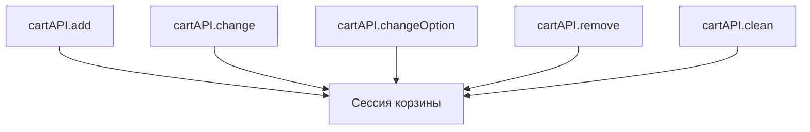

# Корзина

Параметры вызова, плейсхолдеры и структура данных — в справочнике сниппета [msCart](/components/minishop3/snippets/mscart).

<!--  -->

[](https://file.modx.pro/files/3/f/b/3fb27bc4fb74bcbbfad003ba2165498c.png)

## Готовые чанки

### tpl.msCart — полная корзина

[](https://file.modx.pro/files/d/0/f/d0f58a2c70961d54036548714c0239c5.png)

Табличный вывод: изображение, название со ссылкой, выбор опций, кнопки «+» и «−», удаление позиции, итоговая строка.

```fenom
{'!msCart' | snippet : [
    'tpl' => 'tpl.msCart',
    'includeThumbs' => 'small'
]}
```

### tpl.msMiniCart — компактная корзина

[](https://file.modx.pro/files/b/e/3/be30d2bee57c7d32dad132bc3e4727cc.png)

Компактный список товаров и кнопка перехода на страницу корзины — для шапки сайта или боковой колонки.

```fenom
{'!msCart' | snippet : [
    'tpl' => 'tpl.msMiniCart',
    'includeThumbs' => 'small'
]}
```

::: info Своё оформление
Скопируйте стандартный чанк под другим именем и укажите его в параметре `tpl`. Стандартные чанки свёрстаны на Bootstrap 5, но вёрстку можно адаптировать под любой CSS-фреймворк.
:::

## Демо-шаблон страницы корзины

```
core/components/minishop3/elements/templates/cart.tpl
```

Шаблон показывает рекомендуемую структуру страницы:

- вызов `msCart` с параметром `selector` — для автообновления;
- кнопки «Продолжить покупки» и «Оформить заказ» — JavaScript скрывает их, когда корзина пуста;
- хлебные крошки, заголовок с описанием из `introtext`, блок преимуществ, стили и адаптивность.

[](https://file.modx.pro/files/0/9/9/0994afcf57549c2c6ace871886a8c3aa.png)

### Использование

1. Создайте шаблон в MODX (Элементы → Шаблоны).
2. Скопируйте в него содержимое `cart.tpl` или укажите путь к файлу.
3. Назначьте шаблон странице корзины.

::: tip Наследование
Демо-шаблон использует наследование Fenom (`{extends 'file:templates/base.tpl'}`). Убедитесь, что базовый шаблон существует, или замените на свою структуру.
:::

### Настройка

| Ключ | Что задаёт |
| --- | --- |
| Системная настройка `ms3_order_page_id` | ID страницы оформления заказа — адрес кнопки «Оформить заказ» |
| Лексикон `ms3_frontend_continue_shopping` | Текст кнопки «Продолжить покупки» |
| Лексикон `ms3_frontend_checkout` | Текст кнопки «Оформить заказ» |

## Формы и действия

Скрипт перехватывает отправку формы, помеченной классом `ms3_form` или атрибутом `data-ms3-form`, и читает из неё скрытое поле `ms3_action`. Достаточно любой из двух пометок; штатные чанки ставят обе сразу. Кнопка с атрибутами вместо формы не работает.

Допустимые значения `ms3_action`:

| Значение | Что делает | Обязательные поля |
| --- | --- | --- |
| `cart/add` | Добавить товар | `id`, `count` |
| `cart/change` | Изменить количество | `product_key`, `count` |
| `cart/changeOption` | Сменить опцию у позиции | `product_key`, `options[...]` |
| `cart/remove` | Удалить позицию | `product_key` |
| `cart/clean` | Очистить корзину | — |

Позиция адресуется полем `product_key`, а не идентификатором товара: у одного товара с разными опциями ключи будут разные.

::: warning Значение `ms3_action` и адрес Web API пишутся по-разному
`cart/changeOption` — значение поля формы, его читает JavaScript. `POST /api/v1/cart/change-option` — адрес того же действия в Web API. Это два разных имени одного действия, а не опечатка: в форме camelCase, в адресе через дефис.
:::

```fenom
{* Добавление товара *}
<form method="post" class="ms3_form">
    <input type="hidden" name="id" value="{$id}">
    <input type="hidden" name="count" value="1">
    <input type="hidden" name="ms3_action" value="cart/add">
    <button type="submit">В корзину</button>
</form>

{* Изменение количества *}
<form method="post" class="ms3_form">
    <input type="hidden" name="product_key" value="{$product.product_key}">
    <input type="hidden" name="ms3_action" value="cart/change">
    <input type="number" name="count" value="{$product.count}" min="0">
    <button type="submit">Обновить</button>
</form>

{* Смена опции: каждая опция отдельным полем options[...] *}
<form method="post" class="ms3_form">
    <input type="hidden" name="product_key" value="{$product.product_key}">
    <input type="hidden" name="ms3_action" value="cart/changeOption">
    <select name="options[size]">
        <option value="M">M</option>
        <option value="L">L</option>
    </select>
</form>
```

Удаление позиции и очистка корзины устроены так же: форма с тем же классом, нужное значение `ms3_action` и поля из таблицы.

::: tip Количество ноль удаляет позицию
В форме изменения количества стоит `min="0"`: отправка нуля убирает товар из корзины. Если такое поведение не нужно, поставьте `min="1"`.
:::

### Смена опций

Если у позиции есть опции (размер, цвет), смена комбинации идёт через `POST /api/v1/cart/change-option`. В теле — `product_key` и `options`; без `product_key` ответ будет `400`.

На сервере `CartMutationHandler` пересчитывает ключ позиции и вызывает два события: `msOnBeforeChangeOptionsInCart` до смены и `msOnChangeOptionInCart` после.

::: warning Имена событий различаются не только приставкой
У первого события «Options» во множественном числе, у второго «Option» в единственном. Плагин, повешенный на несуществующее имя, молча не сработает.
:::

Из JavaScript — `ms3.cartAPI.changeOption(productKey, options)`.



## Поля товара в разметке

Полный перечень — в справочнике: [плейсхолдеры msCart](/components/minishop3/snippets/mscart#плейсхолдеры-в-чанке).

### Опции позиции

Выбранные опции приходят двумя способами. Массивом:

```fenom
{if $product.options?}
    {foreach $product.options as $name => $value}
        <span>{$name}: {$value}</span>
    {/foreach}
{/if}
```

И отдельными полями с приставкой `option_`:

```fenom
{if $product.option_size?}
    <span>Размер: {$product.option_size}</span>
{/if}
```

### Поля с точкой в имени

Поля производителя приходят плоскими ключами `vendor.name`, `vendor.logo` — это не вложенный массив. Обращайтесь через квадратные скобки:

```fenom
{if $product['vendor.name']?}
    <p>Производитель: {$product['vendor.name']}</p>
{/if}
```

::: warning Точечная запись здесь не работает
`{$product.vendor.name}` Fenom поймёт как обращение к вложенному массиву `vendor`, которого нет, — и выведет пустоту без ошибки.
:::

### Превью изображений

Имя поля совпадает с именем размера, переданного в `includeThumbs`. При `'includeThumbs' => 'small,medium'` в чанке появятся `{$product.small}` и `{$product.medium}`.

```fenom
{if $product.small?}
    
{/if}
```

::: tip Поле thumb — это другое
`{$product.thumb}` есть всегда: это колонка товара, а не результат `includeThumbs`. Если задать `includeThumbs => 'small'` и ждать поле `thumb`, оно окажется заполнено не тем, что вы просили.
:::

## Несколько корзин на странице

Корзин на одной странице может быть сколько угодно, у каждой свой чанк. С блоком разметки вызов связывает параметр `selector` — CSS-селектор обёртки, содержимое которой перерисовывается после каждой операции с корзиной.

```fenom
{* Мини-корзина в шапке сайта *}
<div id="header-mini-cart">
    {'!msCart' | snippet : [
        'tpl' => 'tpl.msMiniCart',
        'selector' => '#header-mini-cart',
        'includeThumbs' => 'small'
    ]}
</div>

{* Основная корзина на странице *}
<div id="main-cart">
    {'!msCart' | snippet : [
        'tpl' => 'tpl.msCart',
        'selector' => '#main-cart',
        'includeThumbs' => 'medium'
    ]}
</div>
```

::: tip Как это работает
Вызов с `selector` регистрирует в JavaScript пару «токен → селектор». После действия покупателя сервер перерисовывает HTML для каждого зарегистрированного токена и возвращает его на клиент, а скрипт подставляет результат в нужный элемент.
:::

::: warning Без `selector` две корзины перестают обновляться
Когда `selector` не задан, скрипт ищет блок для перерисовки по запасному списку: `#ms3oc-cart-live`, `#msb-test-cart`, `#msCart`, `[data-ms-cart]`, `.msCart`. Результат подставляется, только если подошёл ровно один элемент. Две корзины — два совпадения, и не обновляется ни одна: сообщения об этом нет, HTML с сервера приходит и никуда не записывается.

Задавайте `selector` каждому вызову, если корзина на странице не одна. Кнопки «+» и «−» без `selector` не перерисовывают корзину вообще, даже когда блок единственный.
:::

## Скрипты корзины

| Файл | Назначение |
| --- | --- |
| `js/web/ms3.js` | Главный объект `ms3`, инициализация всех модулей |
| `js/web/core/CartAPI.js` | API-клиент для операций с корзиной (add, remove, change, clean) |
| `js/web/ui/CartUI.js` | Добавление, удаление, очистка, смена опций, перерисовка блоков |
| `js/web/ui/QuantityUI.js` | Кнопки «+» и «−», поле количества |
| `js/web/core/TokenManager.js` | Управление токеном авторизации корзины |
| `js/web/core/ApiClient.js` | HTTP-клиент для запросов к серверу |

Полная карта модулей — на странице [Frontend JavaScript](/components/minishop3/development/frontend-js).

### Подключение скриптов

Скрипты подключает плагин MiniShop3 на событии `OnLoadWebDocument` — то есть **на каждой странице сайта**, а не только там, где вызваны сниппеты корзины.

Набор файлов задаётся системной настройкой `ms3_frontend_assets`: это список из 18 адресов, стили и скрипты вперемешку, порядок важен. Туда же добавляют свои файлы, если нужно.

::: warning Одного файла не существует
Собранного `ms3.min.js` в поставке нет: единый сжатый файл собирается только для админки. Скрипты фронтенда грузятся по отдельности — `ms3.js` рассчитывает, что остальные уже подключены, и в одиночку не заработает.
:::

### Событие `ms3:ready`

Срабатывает после инициализации MiniShop3.

```javascript
document.addEventListener('ms3:ready', function() {
    console.log('MiniShop3 готов к работе');
});
```

### Событие `ms3:cart:updated`

Срабатывает после операций с корзиной. В `detail` приходят `cart`, `items`, `status` и `render`.

```javascript
document.addEventListener('ms3:cart:updated', function (e) {
    // detail может отсутствовать — проверяйте перед обращением
    const data = e.detail;
    if (!data) {
        return;
    }
    console.log('Корзина обновлена:', data.cart, data.items, data.status);
});
```

::: warning Событие приходит и без данных
Перерисовка корзины шлёт его с данными, а очистка формы заказа — без `detail` вовсе. Обработчик, который сразу обращается к полям, на втором случае упадёт с ошибкой. Проверяйте наличие `detail`.

Там же событие приходит и тогда, когда корзина не менялась: очистка заказа обнуляет поля черновика, а не позиции. Если вы считаете по этому событию аналитику, учитывайте ложное срабатывание.
:::

## Программное управление

`ms3.cartUI` — действие вместе с перерисовкой разметки:

```javascript
// Добавить товар
await ms3.cartUI.handleAdd(productId, count, options);

// Изменить количество
await ms3.cartUI.handleChange(productKey, newCount);

// Удалить товар
await ms3.cartUI.handleRemove(productKey);

// Очистить корзину
await ms3.cartUI.handleClean();
```

Низкоуровневый `ms3.cartAPI` — запрос к серверу без обновления разметки:

```javascript
await ms3.cartAPI.add(productId, count, options);
await ms3.cartAPI.change(productKey, count);
await ms3.cartAPI.remove(productKey);
await ms3.cartAPI.clean();

// Получить содержимое корзины
const cart = await ms3.cartAPI.get();
```
