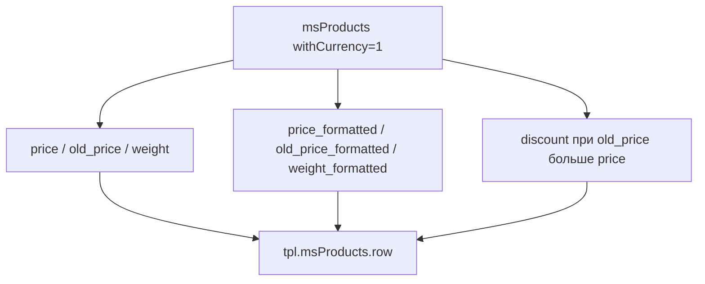

# Каталог товаров

Каталог — основная страница магазина, где выводится список товаров из категории.

Для SPA или мобильного клиента без msProducts используйте публичный Web API: `GET /api/v1/product/list`, `GET /api/v1/category/list` / `tree`, `GET /api/v1/product/filters`. Ответ каталога проходит через `ProductCatalogService` с allowlist полей. См. [Web API: каталог](/components/minishop3/development/web-api/catalog).

<!--  -->

[](https://file.modx.pro/files/e/4/2/e42014d3fca7e7073ef6e30d7709cff6.png)

## Структура каталога

| Компонент | Файл | Назначение |
| --- | --- | --- |
| Шаблон категории | `elements/templates/catalog.tpl` | Разметка страницы, вызов сниппета msProducts |
| Чанк карточки | `elements/chunks/ms3_products_row.tpl` | Внешний вид одного товара в сетке |

## Шаблон категории

**Путь:** `core/components/minishop3/elements/templates/catalog.tpl`

Шаблон наследуется от базового (`base.tpl`) и содержит:

```fenom
{extends 'file:templates/base.tpl'}
{block 'pagecontent'}
    <div class="container py-4">
        <main>
            {* Заголовок категории *}
            <div class="page-header mb-4">
                <h1>{$_modx->resource.pagetitle}</h1>
                {if $_modx->resource.introtext}
                    <p class="lead text-muted">{$_modx->resource.introtext}</p>
                {/if}
            </div>

            {* Сетка товаров Bootstrap Grid *}
            <div class="row">
                {* Вызов сниппета msProducts с параметрами *}
                {'!msProducts'|snippet:[
                    'tpl' => 'tpl.msProducts.row',
                    'includeThumbs' => 'small,medium',
                    'includeVendorFields' => 'name,logo',
                    'formatPrices' => 1,
                    'withCurrency' => 1,
                    'limit' => 12,
                    'showLog' => 0,
                    'sortby' => 'menuindex',
                    'sortdir' => 'ASC',
                    'includeTVs' => '',
                    'showZeroPrice' => 0,
                ]}
            </div>
        </main>
    </div>
{/block}
```

Ниже в файле лежит закомментированный пример разметки пагинации — рабочий вариант через pdoPage описан [в конце страницы](#пагинация).

### Ключевые параметры вызова

| Параметр | Значение | Зачем |
| --- | --- | --- |
| `tpl` | `tpl.msProducts.row` | Чанк карточки товара |
| `includeThumbs` | `small,medium` | Загрузить превью изображений |
| `includeVendorFields` | `name,logo` | Подключить данные производителя |
| `withCurrency` | `1` | Добавить символ валюты в `{$price_formatted}` и `{$old_price_formatted}` |
| `showZeroPrice` | `0` | Скрыть товары без цены |

Параметра `formatPrices` у `msProducts` нет (он есть у `msOrderTotal`). Демо-шаблон `catalog.tpl` всё ещё его передаёт — сниппет молча игнорирует ([issue #818](https://github.com/modx-pro/MiniShop3/issues/818)).

Штатный чанк карточки печатает сырой `{$price}`. Для форматированной цены используйте `{$price_formatted}` при `withCurrency`. Поле `{$weight_formatted}` заполняется всегда, от `withCurrency` не зависит.



::: tip Подробнее о параметрах
Полный список параметров смотрите в документации сниппета [msProducts](/components/minishop3/snippets/msproducts).
:::

## Карточка товара

**Путь:** `core/components/minishop3/elements/chunks/ms3_products_row.tpl`

**Имя чанка в БД:** `tpl.msProducts.row`

[](https://file.modx.pro/files/2/e/8/2e8fceaf20e53d57b44631b3fea62888.png)

Карточка построена на Bootstrap 5.

### Элементы карточки

- **Изображение** с плавным увеличением при наведении (`transform: scale(1.05)`), при отсутствии превью — заглушка `ms3_small.png`
- **Бейджи статуса**: наличие, скидка, NEW, ХИТ, избранное
- **Информация о товаре**: производитель, артикул, название
- **Варианты товара**: цвет, размер (первые 3 + счётчик остальных)
- **Цена**: старая и текущая, сырыми значениями `{$old_price}` и `{$price}`
- **Вес и срок доставки**: `{$weight}` кг при `weight > 0` и жёстко прописанная подпись «1-3 дня»
- **Кнопки корзины**: две формы с переключением состояния

Блока «Быстрый просмотр» в чанке нет: правила `.product-overlay` в `default.css` остались, но сам элемент из разметки убран.

### Бейджи и метки

| Бейдж | Условие в чанке | Расположение |
| --- | --- | --- |
| В наличии / Под заказ | `{$weight > 0}` | Левый верхний угол |
| Скидка (-XX%) | `{$discount > 0}` | Правый верхний угол |
| NEW | `{$new}` | Правый верхний угол |
| ХИТ | `{$popular}` | Правый верхний угол |
| FAV | `{$favorite}` | Правый верхний угол |

::: warning Наличие по weight
В штатном чанке бейдж смотрит на вес `weight`, а не на остаток `stock`. `itemprop="availability"` всегда `InStock`. См. [issue #813](https://github.com/modx-pro/MiniShop3/issues/813).
:::

Процент `{$discount}` считает цикл `msProducts` при `old_price > price`.

### Состояния кнопки корзины

Карточка содержит две формы:

**Состояние «Добавить»** — товара нет в корзине:

```html
<form method="post" class="ms3_form ms3-add-to-cart" data-cart-state="add" data-ms3-form>
    <input type="hidden" name="id" value="{$id}">
    <input type="hidden" name="count" value="1">
    <input type="hidden" name="ms3_action" value="cart/add">
    <button type="submit">В корзину</button>
</form>
```

**Состояние «В корзине»** — товар уже добавлен:

```html
<form method="post" class="ms3_form ms3-cart-controls" data-cart-state="change" data-ms3-form>
    <input type="hidden" name="product_key" value="">
    <input type="hidden" name="ms3_action" value="cart/change">
    <button class="dec-qty" data-ms3-qty="dec">−</button>
    <input name="count" value="1" data-ms3-qty="input">
    <button class="inc-qty" data-ms3-qty="inc">+</button>
    <span>✓ В корзине</span>
</form>
```

Обе формы лежат в разметке одновременно, показом управляет JavaScript-модуль `ProductCardUI` по атрибуту `data-cart-state`. Переключение срабатывает на событии `ms3:cart:updated`. Действие задаёт скрытое поле `ms3_action`: `cart/add` и `cart/change`. Поле `product_key` скрипт заполняет после того, как товар попал в корзину.

[](https://file.modx.pro/files/2/c/b/2cbef63bd61c6ee6e707163e52917a12.png)

### Микроразметка Schema.org

Карточка включает разметку для поисковых систем:

```html
<div class="card ..." itemtype="http://schema.org/Product" itemscope>
    <meta itemprop="description" content="{$description ?: $pagetitle}">
    <meta itemprop="name" content="{$pagetitle}">

    {if $thumb?}
        
    {/if}

    <div class="card-body ..." itemtype="http://schema.org/Offer" itemprop="offers" itemscope>
        <meta itemprop="price" content="{$price}">
        <meta itemprop="priceCurrency" content="RUB">
        <link itemprop="availability" href="http://schema.org/InStock"/>
        <link itemprop="url" href="{$id | url : ['scheme' => 'full']}"/>
    </div>
</div>
```

В штатной разметке `description` при пустом описании подставляет `pagetitle`, а `itemprop="image"` ставится только при наличии превью: у товара с заглушкой изображение в микроразметку не попадает. Валюта `priceCurrency` жёстко прописана как `RUB`.

## Адаптивная сетка

Карточки используют Bootstrap Grid с адаптивными классами:

```html
<div class="col-12 col-sm-6 col-md-4 col-lg-3">
```

| Экран | Товаров в ряду |
| --- | --- |
| < 576px (мобильный) | 1 |
| ≥ 576px (sm) | 2 |
| ≥ 768px (md) | 3 |
| ≥ 992px (lg) | 4 |

## Кастомизация

### Изменение шаблона категории

1. Скопируйте `catalog.tpl` в свою тему
2. Измените параметры вызова msProducts
3. Назначьте шаблон категориям в админке

### Изменение карточки товара

1. Создайте свой чанк, например `tpl.myProducts.row`
2. Укажите его в вызове: `'tpl' => 'tpl.myProducts.row'`

### Добавление фильтров

Для фильтрации товаров используйте компонент mFilter2 или добавьте параметры `where` и `optionFilters`:

```fenom
{'!msProducts' | snippet : [
    'tpl' => 'tpl.msProducts.row',
    'where' => ['Data.vendor_id' => 5],
    'optionFilters' => ['color' => 'red']
]}
```

## Пагинация

Для постраничной навигации оберните вызов в pdoPage:

```fenom
{'!pdoPage' | snippet : [
    'element' => 'msProducts',
    'tpl' => 'tpl.msProducts.row',
    'limit' => 12
]}

<nav class="mt-4">
    {'page.nav' | placeholder}
</nav>
```
