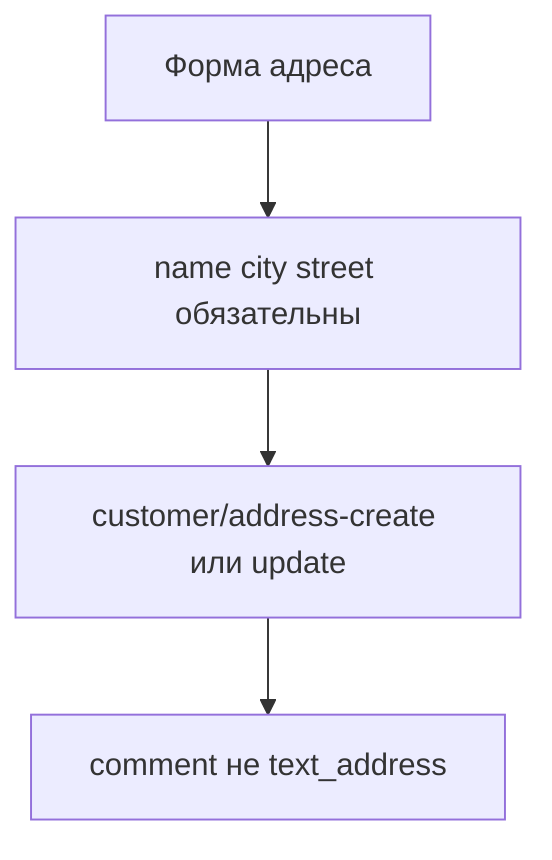

# Адреса доставки

<!--  -->

Страница управления адресами доставки покупателя. Позволяет создавать, редактировать, удалять адреса и устанавливать адрес по умолчанию.

## Структура страницы

| Компонент | Файл | Назначение |
| --- | --- | --- |
| Базовый layout | `tpl.msCustomer.base` | Общая обёртка с sidebar |
| Боковая панель | `tpl.msCustomer.sidebar` | Навигация ЛК |
| Список адресов | `tpl.msCustomer.addresses` | Контейнер списка |
| Строка адреса | `tpl.msCustomer.address.row` | Один адрес в списке |
| Форма адреса | `tpl.msCustomer.address.form` | Создание/редактирование |

## Вызов сниппета

```fenom
{'!msCustomer' | snippet : [
    'service' => 'addresses'
]}
```

### Параметры

| Параметр | По умолчанию | Описание |
| --- | --- | --- |
| **service** | | Тип сервиса (`addresses`) |
| **tpl** | `tpl.msCustomer.addresses` | Чанк списка адресов |
| **addressTpl** | `tpl.msCustomer.address.row` | Чанк строки адреса |
| **formTpl** | `tpl.msCustomer.address.form` | Чанк формы |
| **unauthorizedTpl** | `tpl.msCustomer.unauthorized` | Чанк для гостей |
| **return** | `tpl` | Формат: `tpl` или `data` |

## Режимы работы

Страница работает в трёх режимах через GET-параметр `mode`:

| URL | Режим | Описание |
| --- | --- | --- |
| `/cabinet/addresses/` | `list` | Список адресов |
| `/cabinet/addresses/?mode=create` | `create` | Создание адреса |
| `/cabinet/addresses/?mode=edit&id=5` | `edit` | Редактирование адреса #5 |

## Плейсхолдеры

### В чанке tpl.msCustomer.addresses (список)

| Плейсхолдер | Тип | Описание |
| --- | --- | --- |
| `{$addresses}` | string | Отрендеренные строки адресов (HTML) |
| `{$addresses_count}` | int | Количество адресов |
| `{$customer}` | array | Данные покупателя |
| `{$success}` | string | Сообщение об успехе |
| `{$error}` | string | Сообщение об ошибке |
| `{$page_url}` | string | URL страницы со списком адресов |
| `{$create_url}` | string | URL страницы в режиме создания (`?mode=create`) |

### В чанке tpl.msCustomer.address.row

| Плейсхолдер | Тип | Описание |
| --- | --- | --- |
| `{$id}` | int | ID адреса |
| `{$name}` | string | Название адреса |
| `{$display_name}` | string | Автоматическое название |
| `{$is_default}` | bool | Адрес по умолчанию |
| `{$index}` | string | Почтовый индекс |
| `{$country}` | string | Страна |
| `{$region}` | string | Регион |
| `{$city}` | string | Город |
| `{$street}` | string | Улица |
| `{$building}` | string | Дом |
| `{$entrance}` | string | Подъезд |
| `{$floor}` | string | Этаж |
| `{$room}` | string | Квартира |
| `{$metro}` | string | Метро |
| `{$comment}` | string | Комментарий к адресу |
| `{$page_url}` | string | URL страницы со списком адресов |
| `{$edit_url}` | string | URL редактирования адреса (`?mode=edit&id=...`) |

### В чанке tpl.msCustomer.address.form

| Плейсхолдер | Тип | Описание |
| --- | --- | --- |
| `{$mode}` | string | Режим: `create` или `edit` |
| `{$address}` | array | Данные адреса (при редактировании) |
| `{$errors}` | array | Ошибки валидации |
| `{$customer}` | array | Данные покупателя |
| `{$page_url}` | string | URL страницы со списком адресов (кнопка «Отмена») |

## Чанк списка адресов

```fenom
{* tpl.msCustomer.addresses *}
{extends 'tpl.msCustomer.base'}

{block 'content'}
<div class="ms3-customer-addresses">
    <div class="card shadow-sm">
        <div class="card-header bg-primary text-white d-flex justify-content-between align-items-center">
            <h5 class="mb-0">{'ms3_customer_addresses_title' | lexicon}</h5>
            <a href="?mode=create" class="btn btn-sm btn-light">
                {'ms3_customer_address_add' | lexicon}
            </a>
        </div>
        <div class="card-body">
            {if $success?}
            <div class="alert alert-success" role="alert">
                {$success}
            </div>
            {/if}

            {if $error?}
            <div class="alert alert-danger" role="alert">
                {$error}
            </div>
            {/if}

            {if $addresses_count > 0}
            <div class="list-group list-group-flush">
                {$addresses}
            </div>
            {else}
            <div class="alert alert-info" role="alert">
                {'ms3_customer_addresses_empty' | lexicon}
            </div>
            {/if}
        </div>
    </div>
</div>
{/block}
```

::: info Подключение JS
Начиная с версии 1.6, отдельный скрипт `customer-addresses.js` не требуется. Управление адресами (set default, delete) встроено в `CustomerUI` и инициализируется автоматически через `ms3.js`.
:::

## Чанк строки адреса

```fenom
{* tpl.msCustomer.address.row *}
<div class="list-group-item"
     data-confirm-set-default="{'ms3_customer_address_set_default_confirm' | lexicon}"
     data-confirm-delete="{'ms3_customer_address_delete_confirm' | lexicon}"
     data-error-unknown="{'ms3_err_unknown' | lexicon}">
    <div class="d-flex w-100 justify-content-between align-items-start">
        <div class="flex-grow-1">
            <h6 class="mb-1">
                {if $name}
                    {$name}
                {else}
                    {$display_name}
                {/if}
                {if $is_default}
                <span class="badge bg-success ms-2">
                    {'ms3_customer_address_default' | lexicon}
                </span>
                {/if}
            </h6>
            <p class="mb-1 text-muted small">
                {if $index}{$index}, {/if}
                {$city}{if $region}, {$region}{/if}{if $country}, {$country}{/if}
            </p>
            <p class="mb-1 small">
                {$street}{if $building}, д. {$building}{/if}
                {if $entrance}, п. {$entrance}{/if}
                {if $floor}, эт. {$floor}{/if}
                {if $room}, кв. {$room}{/if}
            </p>
            {if $metro}
            <p class="mb-1 small text-muted">м. {$metro}</p>
            {/if}
        </div>
        <div class="btn-group btn-group-sm ms-3" role="group">
            {if !$is_default}
            <button type="button"
                    class="btn btn-outline-secondary set-default-address"
                    data-address-id="{$id}"
                    title="{'ms3_customer_address_set_default' | lexicon}">
                ★
            </button>
            {/if}
            <a href="?mode=edit&id={$id}"
               class="btn btn-outline-primary"
               title="{'ms3_customer_address_edit' | lexicon}">
                ✎
            </a>
            <button type="button"
                    class="btn btn-outline-danger delete-address"
                    data-address-id="{$id}"
                    title="{'ms3_customer_address_delete' | lexicon}">
                ✕
            </button>
        </div>
    </div>
</div>
```

## Чанк формы адреса

```fenom
{* tpl.msCustomer.address.form *}
<div class="ms3-customer-address-form">
    <div class="card shadow-sm">
        <div class="card-header bg-primary text-white">
            <h5 class="mb-0">
                {if $mode == 'edit'}
                    {'ms3_customer_address_edit' | lexicon}
                {else}
                    {'ms3_customer_address_add' | lexicon}
                {/if}
            </h5>
        </div>
        <div class="card-body">
            <form class="ms3_form ms3-address-form" method="post" action="" data-ms3-form="customer-address">
                <input type="hidden" name="ms3_action" value="customer/{if $mode == 'edit'}address-update{else}address-create{/if}">
                {if $mode == 'edit'}
                <input type="hidden" name="id" value="{$address.id}">
                {/if}

                {* Название адреса *}
                <div class="mb-3">
                    <label for="name" class="form-label">
                        {'ms3_customer_address_name' | lexicon}
                    </label>
                    <input type="text"
                           class="form-control {if $errors.name?}is-invalid{/if}"
                           id="name"
                           name="name"
                           value="{$address.name}"
                           placeholder="{'ms3_customer_address_name_placeholder' | lexicon}">
                    {if $errors.name?}
                    <div class="invalid-feedback">{$errors.name}</div>
                    {/if}
                    <div class="form-text">
                        {'ms3_customer_address_name_help' | lexicon}
                    </div>
                </div>

                <div class="row">
                    {* Индекс *}
                    <div class="col-md-4 mb-3">
                        <label for="index" class="form-label">
                            {'ms3_customer_index' | lexicon}
                        </label>
                        <input type="text"
                               class="form-control {if $errors.index?}is-invalid{/if}"
                               id="index"
                               name="index"
                               value="{$address.index}">
                        {if $errors.index?}
                        <div class="invalid-feedback">{$errors.index}</div>
                        {/if}
                    </div>

                    {* Страна *}
                    <div class="col-md-8 mb-3">
                        <label for="country" class="form-label">
                            {'ms3_customer_country' | lexicon}
                        </label>
                        <input type="text"
                               class="form-control {if $errors.country?}is-invalid{/if}"
                               id="country"
                               name="country"
                               value="{$address.country}">
                        {if $errors.country?}
                        <div class="invalid-feedback">{$errors.country}</div>
                        {/if}
                    </div>
                </div>

                <div class="row">
                    {* Регион *}
                    <div class="col-md-6 mb-3">
                        <label for="region" class="form-label">
                            {'ms3_customer_region' | lexicon}
                        </label>
                        <input type="text"
                               class="form-control {if $errors.region?}is-invalid{/if}"
                               id="region"
                               name="region"
                               value="{$address.region}">
                        {if $errors.region?}
                        <div class="invalid-feedback">{$errors.region}</div>
                        {/if}
                    </div>

                    {* Город *}
                    <div class="col-md-6 mb-3">
                        <label for="city" class="form-label">
                            {'ms3_customer_city' | lexicon} <span class="text-danger">*</span>
                        </label>
                        <input type="text"
                               class="form-control {if $errors.city?}is-invalid{/if}"
                               id="city"
                               name="city"
                               value="{$address.city}"
                               required>
                        {if $errors.city?}
                        <div class="invalid-feedback">{$errors.city}</div>
                        {/if}
                    </div>
                </div>

                {* Улица *}
                <div class="mb-3">
                    <label for="street" class="form-label">
                        {'ms3_customer_street' | lexicon} <span class="text-danger">*</span>
                    </label>
                    <input type="text"
                           class="form-control {if $errors.street?}is-invalid{/if}"
                           id="street"
                           name="street"
                           value="{$address.street}"
                           required>
                    {if $errors.street?}
                    <div class="invalid-feedback">{$errors.street}</div>
                    {/if}
                </div>

                <div class="row">
                    {* Дом *}
                    <div class="col-md-3 mb-3">
                        <label for="building" class="form-label">
                            {'ms3_customer_building' | lexicon} <span class="text-danger">*</span>
                        </label>
                        <input type="text"
                               class="form-control {if $errors.building?}is-invalid{/if}"
                               id="building"
                               name="building"
                               value="{$address.building}"
                               required>
                        {if $errors.building?}
                        <div class="invalid-feedback">{$errors.building}</div>
                        {/if}
                    </div>

                    {* Подъезд *}
                    <div class="col-md-3 mb-3">
                        <label for="entrance" class="form-label">
                            {'ms3_customer_entrance' | lexicon}
                        </label>
                        <input type="text"
                               class="form-control {if $errors.entrance?}is-invalid{/if}"
                               id="entrance"
                               name="entrance"
                               value="{$address.entrance}">
                        {if $errors.entrance?}
                        <div class="invalid-feedback">{$errors.entrance}</div>
                        {/if}
                    </div>

                    {* Этаж *}
                    <div class="col-md-3 mb-3">
                        <label for="floor" class="form-label">
                            {'ms3_customer_floor' | lexicon}
                        </label>
                        <input type="text"
                               class="form-control {if $errors.floor?}is-invalid{/if}"
                               id="floor"
                               name="floor"
                               value="{$address.floor}">
                        {if $errors.floor?}
                        <div class="invalid-feedback">{$errors.floor}</div>
                        {/if}
                    </div>

                    {* Квартира *}
                    <div class="col-md-3 mb-3">
                        <label for="room" class="form-label">
                            {'ms3_customer_room' | lexicon}
                        </label>
                        <input type="text"
                               class="form-control {if $errors.room?}is-invalid{/if}"
                               id="room"
                               name="room"
                               value="{$address.room}">
                        {if $errors.room?}
                        <div class="invalid-feedback">{$errors.room}</div>
                        {/if}
                    </div>
                </div>

                {* Метро *}
                <div class="mb-3">
                    <label for="metro" class="form-label">
                        {'ms3_customer_metro' | lexicon}
                    </label>
                    <input type="text"
                           class="form-control {if $errors.metro?}is-invalid{/if}"
                           id="metro"
                           name="metro"
                           value="{$address.metro}">
                    {if $errors.metro?}
                    <div class="invalid-feedback">{$errors.metro}</div>
                    {/if}
                </div>

                {* Комментарий к адресу *}
                <div class="mb-3">
                    <label for="text_address" class="form-label">
                        {'ms3_customer_comment' | lexicon}
                    </label>
                    <textarea class="form-control {if $errors.text_address?}is-invalid{/if}"
                              id="text_address"
                              name="text_address"
                              rows="2">{$address.text_address}</textarea>
                    {if $errors.text_address?}
                    <div class="invalid-feedback">{$errors.text_address}</div>
                    {/if}
                    <div class="form-text">
                        {'ms3_customer_address_comment_help' | lexicon}
                    </div>
                </div>

                {* Кнопки *}
                <div class="d-flex justify-content-between gap-2 mt-4">
                    <a href="{$page_url}" class="btn btn-secondary">
                        {'ms3_customer_cancel' | lexicon}
                    </a>
                    <button type="submit" class="btn btn-primary ms3_link">
                        {if $mode == 'edit'}
                            {'ms3_customer_save' | lexicon}
                        {else}
                            {'ms3_customer_address_add' | lexicon}
                        {/if}
                    </button>
                </div>
            </form>
        </div>
    </div>
</div>
```

## JavaScript API

Управление адресами встроено в `CustomerUI` и работает автоматически через `ms3.js`.

### API endpoints

```
PUT    /api/v1/customer/addresses/{id}/set-default  // Установить по умолчанию
DELETE /api/v1/customer/addresses/{id}               // Удалить адрес
```

### Кнопки действий

```html
<!-- Установить по умолчанию -->
<button class="set-default-address" data-address-id="5">★</button>

<!-- Удалить -->
<button class="delete-address" data-address-id="5">✕</button>
```

При удалении и установке по умолчанию отображается диалог подтверждения (`ms3Confirm`). Текст подтверждения берётся из data-атрибутов строки адреса:

```html
<div class="list-group-item"
     data-confirm-set-default="{'ms3_customer_address_set_default_confirm' | lexicon}"
     data-confirm-delete="{'ms3_customer_address_delete_confirm' | lexicon}">
```

### Хуки

| Хук | Описание |
| --- | --- |
| `beforeCreateAddress` / `afterCreateAddress` | Создание адреса |
| `beforeUpdateAddress` / `afterUpdateAddress` | Редактирование адреса |
| `beforeSetDefaultAddress` / `afterSetDefaultAddress` | Адрес по умолчанию |
| `beforeDeleteAddress` / `afterDeleteAddress` | Удаление адреса |

## Обработка форм

| Действие | ms3_action | Описание |
| --- | --- | --- |
| Создание | `customer/address-create` | Создание нового адреса |
| Редактирование | `customer/address-update` | Обновление адреса |



## Поля адреса

| Поле | Обязательное | Описание |
| --- | --- | --- |
| `name` | **Да** | Название адреса (Дом, Офис) |
| `index` | Нет | Почтовый индекс |
| `country` | Нет | Страна |
| `region` | Нет | Регион/область |
| `city` | **Да** | Город |
| `street` | **Да** | Улица |
| `building` | Нет | Дом |
| `entrance` | Нет | Подъезд |
| `floor` | Нет | Этаж |
| `room` | Нет | Квартира/офис |
| `metro` | Нет | Станция метро |
| `comment` | Нет | Комментарий к адресу |

Поле `text_address` относится к адресу **заказа** (`msOrderAddress`), не к сохранённому адресу покупателя (`msCustomerAddress`).

::: warning Форма vs API
Демо-чанк `ms3_customer_address_form.tpl` шлёт `text_address` и помечает `building` как required. API ждёт `comment` и `name`+`city`+`street` ([issue #816](https://github.com/modx-pro/MiniShop3/issues/816)).
:::

## Системные настройки

| Настройка | Описание |
| --- | --- |
| `ms3_customer_addresses_page_id` | ID страницы адресов |

## CSS-классы

| Класс | Элемент |
| --- | --- |
| `.ms3-customer-addresses` | Контейнер списка |
| `.ms3-customer-address-form` | Контейнер формы |
| `.ms3-address-form` | Форма адреса |
| `.set-default-address` | Кнопка "по умолчанию" |
| `.delete-address` | Кнопка удаления |
