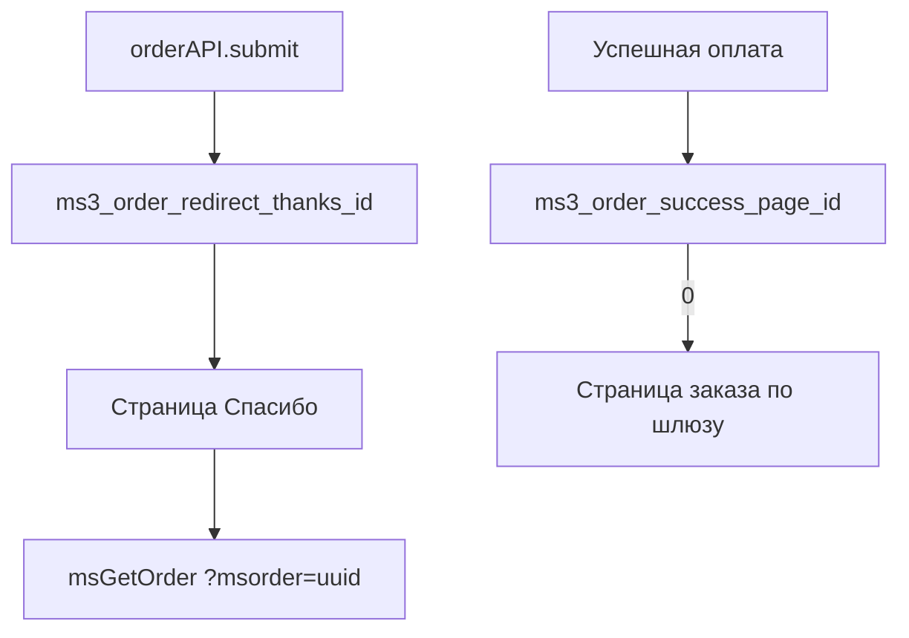

# Спасибо за заказ

Страница благодарности открывается после успешного оформления заказа. Показывает детали заказа и дальнейшие действия покупателя.

<!--  -->

[](https://file.modx.pro/files/e/9/3/e936fc08c9cbf5e83cae96910ae66fd7.png)

## Структура страницы

| Компонент | Файл | Назначение |
| --- | --- | --- |
| Шаблон страницы | `elements/templates/thanks.tpl` | Разметка страницы благодарности |
| Чанк заказа | `elements/chunks/ms3_get_order.tpl` | Детали оформленного заказа |

## Шаблон страницы

**Путь:** `core/components/minishop3/elements/templates/thanks.tpl`

Шаблон наследуется от базового и содержит три секции.

### Секции страницы

| Секция | Описание |
| --- | --- |
| Заголовок успеха | Иконка, заголовок «Спасибо за заказ!», подзаголовок |
| Детали заказа | Вызов сниппета msGetOrder |
| Блок «Что дальше?» | Информация и кнопки навигации |

### Код шаблона

```fenom
{extends 'file:templates/base.tpl'}
{block 'pagecontent'}
    <div class="container my-5">
        <main>
            {* Заголовок успеха *}
            <div class="text-center mb-5">
                <div class="mb-4">
                    <svg class="text-success" width="80" height="80" fill="currentColor">
                        <use xlink:href="#icon-check"/>
                    </svg>
                </div>
                <h1 class="display-5 fw-bold text-success mb-3">Спасибо за заказ!</h1>
                <p class="lead text-muted">Ваш заказ успешно оформлен и принят в обработку</p>
            </div>

            {* Детали заказа *}
            <div class="row justify-content-center">
                <div class="col-lg-10">
                    {'!msGetOrder'|snippet:[
                        'tpl' => 'tpl.msGetOrder',
                    ]}
                </div>
            </div>

            {* Блок "Что дальше?" *}
            <div class="row justify-content-center mt-5">
                <div class="col-lg-10">
                    <div class="card border-0 bg-light">
                        <div class="card-body text-center py-4">
                            <h5 class="card-title mb-3">Что дальше?</h5>
                            <p class="card-text text-muted mb-4">
                                Мы отправили подтверждение заказа на вашу электронную почту.<br>
                                Наш менеджер свяжется с вами в ближайшее время для уточнения деталей.
                            </p>
                            <div class="d-flex gap-3 justify-content-center flex-wrap">
                                <a href="[[~[[++site_start]]]]" class="btn btn-outline-primary">
                                    На главную
                                </a>
                                <a href="[[~[[++ms3.page_id.catalog:default=`0`]]]]" class="btn btn-primary">
                                    Продолжить покупки
                                </a>
                            </div>
                        </div>
                    </div>
                </div>
            </div>
        </main>
    </div>
{/block}
```

::: warning Кэширование
Заказ определяется по GET-параметру `msorder` (или по параметру `id` в вызове), поэтому результат нельзя отдавать из кэша страницы.

В MODX-синтаксисе префикс обязателен — `[[!msGetOrder]]`. В Fenom вызов отрабатывает на каждом запросе и без префикса: pdoTools обрабатывает Fenom-разметку целиком на той фазе парсера, где выполняются некэшируемые теги. Восклицательный знак в `{'!msGetOrder'|snippet}` на это не влияет — он управляет только переносом зарегистрированных скриптов. Вреда он не несёт и оставлен в демо-шаблоне для единообразия.
:::

## Как работает определение заказа

После оформления покупатель попадает на страницу благодарности с UUID заказа в адресе:

```
/thanks/?msorder=a1b2c3d4-e5f6-7890-abcd-ef1234567890
```

Сниппет msGetOrder определяет заказ из GET-параметра `msorder`: значение длиной 36 символов трактуется как UUID, остальное — как числовой `id`. Идентификатор можно передать и прямо в вызов параметром `id`.

UUID в ссылке не раскрывает порядковый номер заказа и общее число заказов в магазине — в отличие от числового `id`.

::: info Когда страница благодарности не открывается
Редирект на неё формируется, только если обработчик оплаты не вернул свой `redirect`. Платёжный сервис со своей страницей оплаты забирает покупателя сразу после отправки заказа, минуя страницу благодарности — см. [OrderSubmitHandler](/components/minishop3/development/services).
:::

## Детали заказа

Блок деталей заказа выводится через сниппет [msGetOrder](/components/minishop3/snippets/msgetorder) и чанк `tpl.msGetOrder`.

Состав блока:

- Номер и статус заказа
- Таблица товаров с ценами
- Итоговая стоимость
- Способ доставки и оплаты
- Контактные данные и адрес
- Ссылка на оплату (если доступна)

## Ссылка на оплату

Если способ оплаты поддерживает онлайн-оплату, в блоке оплаты появится кнопка «Оплатить заказ»:

```fenom
{if $payment_link?}
    <a href="{$payment_link}" class="btn btn-success">
        Оплатить заказ
    </a>
{/if}
```

Ссылку отдаёт обработчик оплаты методом `getPaymentLink()`, а решение показывать её принимает `PaymentLinkResolver`: статус заказа должен входить в список из системной настройки `ms3_payment_link_statuses` (CSV идентификаторов статусов). Если настройка пуста, используется `ms3_status_new` — то есть по умолчанию ссылка видна только у нового заказа.

## Настройка редиректа

Адрес страницы благодарности задают системные настройки:

| Настройка | По умолчанию | Описание |
| --- | --- | --- |
| `ms3_order_redirect_thanks_id` | `1` | ID ресурса страницы «Спасибо» после `orderAPI.submit` |
| `ms3_order_success_page_id` | `0` | Куда вести после успешной оплаты (`return_url` платёжного сервиса). При `0` адрес выбирает сам сервис: страница заказа или благодарности |

Ключа `ms3.page_id.thanks` в пакете нет. В демо-шаблоне `thanks.tpl` ссылка «Продолжить покупки» читает несуществующий `ms3.page_id.catalog` ([issue #817](https://github.com/modx-pro/MiniShop3/issues/817)).

Адрес редиректа приходит в ответе `orderAPI.submit` — прочитать его можно в хуке `afterSubmitOrder`:

```javascript
ms3Hooks.addHook('afterSubmitOrder', async ({ response }) => {
  if (response.success && response.data.redirect) {
    window.location.href = response.data.redirect
    // например /thanks/?msorder=<uuid>
  }
})
```

В URL попадает **UUID** заказа, а не числовой `id`. Значение `?msorder=15` сниппет `msGetOrder` принимает, если подставить его вручную, но после оформления заказа такой ссылки не будет.



## Кастомизация

### Изменение шаблона

1. Скопируйте `thanks.tpl` в свою тему
2. Измените разметку и стили
3. Назначьте шаблон ресурсу страницы благодарности

### Изменение чанка заказа

Создайте свой чанк и укажите его в вызове:

```fenom
{'!msGetOrder' | snippet : [
    'tpl' => 'tpl.myGetOrder',
    'includeThumbs' => 'small'
]}
```

### Добавление превью товаров

```fenom
{'!msGetOrder' | snippet : [
    'tpl' => 'tpl.msGetOrder',
    'includeThumbs' => 'small,medium'
]}
```

### Добавление блока рекомендаций

После блока заказа можно добавить рекомендуемые товары:

```fenom
{* После деталей заказа *}
<div class="row justify-content-center mt-5">
    <div class="col-lg-10">
        <h4 class="mb-4">Вам также может понравиться</h4>
        {'!msProducts' | snippet : [
            'parents' => 0,
            'where' => ['Data.popular' => 1],
            'limit' => 4,
            'tpl' => 'tpl.msProducts.row'
        ]}
    </div>
</div>
```

`parents => 0` здесь обязателен: без него msProducts подставляет id текущего ресурса, а на странице благодарности дочерних товаров нет — блок окажется пустым. Префикс `Data.` в `where` указывает на таблицу `msProductData`, где и лежит флаг `popular`.

## Отправка уведомлений

После оформления заказа уведомления уходят автоматически:

| Получатель | Шаблон | Описание |
| --- | --- | --- |
| Покупатель | `tpl.msEmail.new.customer` | Подтверждение заказа |
| Менеджер | `tpl.msEmail.new.manager` | Уведомление о новом заказе |

Имена `tpl.msEmail.order.new` и `tpl.msEmail.order.manager` в пакет не входят — они остались только в устаревшей подсказке лексикона. Письма отправляет [Центр уведомлений](/components/minishop3/interface/notifications) по событию `order_status_changed`. Событие `order_created` в интерфейсе есть, но письма по нему не уходят ([#811](https://github.com/modx-pro/MiniShop3/issues/811)).

Настройка: [События → Уведомления](/components/minishop3/development/events/notifications).

## Адаптивная вёрстка

Страница использует Bootstrap 5 Grid:

| Экран | Ширина контента |
| --- | --- |
| < 992px | 100% |
| ≥ 992px | 10 колонок (~83%) |

```html
<div class="row justify-content-center">
    <div class="col-lg-10">
        {* Контент центрирован *}
    </div>
</div>
```
