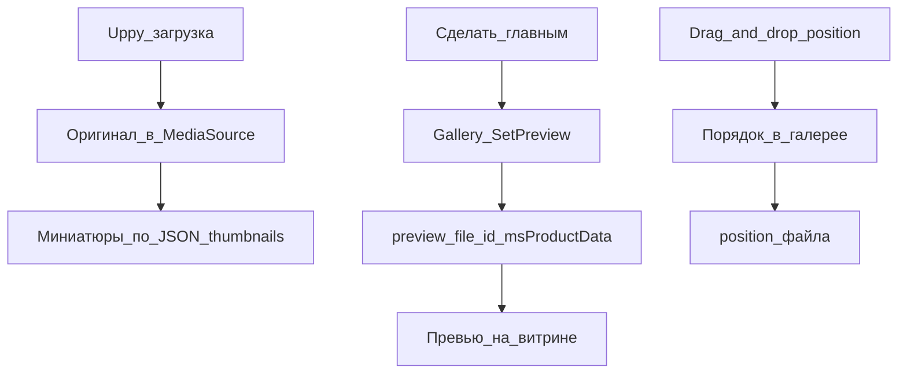

# Галерея товара


Вкладка на карточке товара: загрузка, миниатюры, сортировка.

## Технология обработки изображений

MiniShop3 использует библиотеку [Intervention Image](https://image.intervention.io/) v3 вместо устаревшего phpThumb.

**Требования:**

- PHP 8.2+
- Imagick (рекомендуется) или GD расширение
- Для AVIF — Imagick, собранный с libheif (код проверяет только наличие расширения `imagick`)

### Поддерживаемые форматы

| Формат | Чтение | Запись | Примечание |
| --- | --- | --- | --- |
| JPEG | ✅ | ✅ | Основной формат |
| PNG | ✅ | ✅ | С прозрачностью |
| GIF | ✅ | ✅ | Анимация (только первый кадр) |
| WebP | ✅ | ✅ | Примерно на четверть меньше JPEG (ориентировочно, зависит от контента) |
| AVIF | ✅ | ✅ | Примерно вдвое меньше JPEG (ориентировочно); на запись нужен Imagick |
| HEIC | зависит от сборки | ❌ | Чтение зависит от Imagick с libheif — код это не проверяет |

## Интерфейс управления

- **Сетка изображений** — drag-and-drop сортировка, поиск и пагинация
- **Контекстное меню** — правый клик: редактировать, показать, сделать главным, сгенерировать миниатюры, удалить
- **Панель инструментов** — выбор Media Source, массовое удаление и перегенерация миниатюр
- **Диалог редактирования** — имя файла, название (уходит в `alt` на витрине), описание

### Смена Media Source

Выбор источника файлов в панели инструментов переключает Media Source без сохранения всей формы товара. Используется процессор `Product\UpdateSource`.

### Главное изображение (превью)

Действие «Сделать главным» в контекстном меню **не меняет** `position` в галерее. Вызывается процессор `MiniShop3\Processors\Gallery\SetPreview`, который пишет `preview_file_id` в `msProductData`. Метод `ProductImageService::setProductPreview()` связывает файл с карточкой товара. Сортировка drag-and-drop и превью для витрины — разные механизмы.



## Загрузчик изображений

Загрузчик построен на библиотеке [Uppy](https://uppy.io/).

**Возможности:**

- **Drag & Drop** — перетаскивание файлов в область загрузки
- **Множественная загрузка** — несколько файлов одновременно
- **Предпросмотр** — миниатюры перед загрузкой
- **Прогресс** — отображение процесса загрузки
- **Валидация** — проверка типа и размера файлов

### Параметры загрузчика

| Параметр | По умолчанию | Описание |
| --- | --- | --- |
| `maxFileSize` | 10 MB | Максимальный размер файла |
| `allowedFileTypes` | JPEG, PNG, GIF, WebP, AVIF, HEIC | Разрешённые типы |

Ограничений по ширине и высоте при загрузке нет: проверяются только тип и размер файла. Свойства Media Source `maxUploadWidth` / `maxUploadHeight` на загрузку не влияют.

### Редактор изображений

Перед загрузкой изображение можно отредактировать:

- **Обрезка** — выбор нужной области
- **Поворот** — на 90° в любую сторону
- **Отражение** — по горизонтали/вертикали
- **Масштабирование** — изменение размера

[](https://file.modx.pro/files/9/c/a/9caa72a7b355926f74132f2b61db90d1.png)

[](https://file.modx.pro/files/e/9/a/e9ab2d93401728e0a90735592f690407.png)

## Конфигурация миниатюр

### Где настраивается

Конфигурация миниатюр хранится в **Media Source**:

1. Перейдите в **Медиа → Источники файлов**
2. Откройте источник товаров (по умолчанию `MS3 Images`)
3. Найдите свойство `thumbnails`
4. Укажите JSON-конфигурацию

### Формат конфигурации

```json
{
  "small": {
    "width": 150,
    "height": 150,
    "quality": 85,
    "mode": "cover",
    "format": "webp"
  },
  "medium": {
    "width": 400,
    "height": 400,
    "quality": 88,
    "mode": "cover",
    "format": "webp"
  },
  "large": {
    "width": 800,
    "height": 800,
    "quality": 90,
    "mode": "max",
    "format": "jpg"
  }
}
```

### Параметры миниатюры

| Параметр | Тип | Описание |
| --- | --- | --- |
| `width` | int | Ширина в пикселях |
| `height` | int | Высота в пикселях |
| `quality` | int | Качество сжатия (0-100) |
| `mode` | string | Режим масштабирования |
| `format` | string | Формат файла |

### Режимы масштабирования (mode)

| `mode` | Поведение | Когда применять |
| --- | --- | --- |
| `cover` | Заполнение области с обрезкой | Единый размер: карточки товаров, сетки, миниатюры |
| `contain` | Вписывание с сохранением пропорций через `scale()`. Фон и параметр `background` код не рисует | Показать объект целиком без обрезки |
| `max` | Уменьшение до указанного размера без увеличения | Галерея товара и zoom: сохранить качество |
| `stretch` | Точные `width`×`height` без сохранения пропорций (`resize()`) | Строгий прямоугольник, искажение допустимо |

## Готовые конфигурации

### Базовая (минимальная)

Для небольших магазинов с ограниченным дисковым пространством.

```json
{
  "thumb": {
    "width": 150,
    "height": 150,
    "quality": 80,
    "mode": "cover",
    "format": "webp"
  },
  "medium": {
    "width": 600,
    "height": 600,
    "quality": 85,
    "mode": "cover",
    "format": "webp"
  },
  "large": {
    "width": 1200,
    "height": 1200,
    "quality": 85,
    "mode": "max",
    "format": "jpg"
  }
}
```

**Результат (ориентировочно):** ~256 KB на изображение, 12-20 файлов на товар — зависит от контента и настроек.

### Оптимальная (рекомендуется)

Баланс качества и производительности с поддержкой всех браузеров.

```json
{
  "thumb_webp": {
    "width": 150,
    "height": 150,
    "quality": 80,
    "mode": "cover",
    "format": "webp"
  },
  "thumb_jpg": {
    "width": 150,
    "height": 150,
    "quality": 85,
    "mode": "cover",
    "format": "jpg"
  },
  "card_webp": {
    "width": 300,
    "height": 300,
    "quality": 82,
    "mode": "cover",
    "format": "webp"
  },
  "card_jpg": {
    "width": 300,
    "height": 300,
    "quality": 85,
    "mode": "cover",
    "format": "jpg"
  },
  "gallery_webp": {
    "width": 800,
    "height": 800,
    "quality": 85,
    "mode": "max",
    "format": "webp"
  },
  "gallery_jpg": {
    "width": 800,
    "height": 800,
    "quality": 88,
    "mode": "max",
    "format": "jpg"
  },
  "zoom": {
    "width": 1500,
    "height": 1500,
    "quality": 90,
    "mode": "max",
    "format": "jpg"
  }
}
```

**HTML с запасным вариантом:**

```html
<picture>
  <source srcset="[[+card_webp]]" type="image/webp">
  
</picture>
```

### Премиум (с Retina)

Максимальное качество для крупных магазинов.

```json
{
  "card_webp": {
    "width": 350,
    "height": 350,
    "quality": 82,
    "mode": "cover",
    "format": "webp"
  },
  "card_webp_2x": {
    "width": 700,
    "height": 700,
    "quality": 78,
    "mode": "cover",
    "format": "webp"
  },
  "card_jpg": {
    "width": 350,
    "height": 350,
    "quality": 85,
    "mode": "cover",
    "format": "jpg"
  }
}
```

**HTML с Retina:**

```html
<picture>
  <source
    srcset="[[+card_webp]] 1x, [[+card_webp_2x]] 2x"
    type="image/webp">
  
</picture>
```

## Водяные знаки

```json
{
  "watermarked": {
    "width": 800,
    "height": 600,
    "quality": 85,
    "mode": "cover",
    "format": "jpg",
    "watermark": {
      "enabled": true,
      "path": "assets/watermark.png",
      "position": "bottom-right",
      "offset_x": 10,
      "offset_y": 10,
      "opacity": 50
    }
  }
}
```

## Рекомендации по качеству

| Тип изображения | WebP | JPEG | Комментарий |
| --- | --- | --- | --- |
| Миниатюры (≤200px) | 75-80% | 85% | Артефакты не видны |
| Карточки (200-400px) | 80-85% | 85-88% | Оптимальный баланс |
| Галерея (400-1000px) | 85% | 88-90% | Важны детали |
| Zoom (>1000px) | — | 90-92% | Максимальное качество |

::: tip Правило
Ориентировочно WebP можно использовать на 3-5% меньше качества, чем JPEG, при том же визуальном восприятии (замер, а не гарантия компонента).
:::

## Структура файлов

```text
assets/images/products/
└── {product_id}/
    ├── photo.jpg           # Оригинал
    ├── thumb_webp/
    │   └── photo.webp      # Миниатюра WebP
    ├── thumb_jpg/
    │   └── photo.jpg       # Миниатюра JPEG
    ├── card_webp/
    │   └── photo.webp
    ├── card_jpg/
    │   └── photo.jpg
    └── ...
```

## API для разработчиков

Сервис `ms3_image`:

```php
// Получение сервиса
$imageService = $modx->services->get('ms3_image');

// Генерация миниатюры
$thumbnailData = $imageService->makeThumbnail($sourceInfo, [
    'width' => 300,
    'height' => 200,
    'quality' => 85,
    'mode' => 'cover',
    'format' => 'webp'
]);

// Сохранение в Media Source
$path = $imageService->saveThumbnailToSource(
    $thumbnailData,
    'products/123/',
    'photo_thumb.webp',
    $mediaSource
);

// Информация о драйвере
$driverInfo = $imageService->getDriverInfo();
// ['name' => 'Imagick'|'GD', 'supports_webp' => true, 'supports_avif' => true|false]
```

## Решение проблем

### Миниатюры не создаются

**Проверьте:**

1. Наличие Imagick или GD: `php -m | grep -E "(imagick|gd)"`
2. Права на запись в `assets/images/products/`
3. Корректность JSON в настройках Media Source
4. Логи MODX в `core/cache/logs/error.log`

### WebP не генерируется

**Требования:**

- Imagick с поддержкой WebP или GD, скомпилированный с `--enable-webp`

**Проверка:**

```php
$imageService = $modx->services->get('ms3_image');
$info = $imageService->getDriverInfo();
var_dump($info['supports_webp']);
```

### AVIF не генерируется

Для AVIF нужен Imagick, собранный с libheif. GD не поддерживает AVIF.

**Проверка:**

```bash
php -r "var_dump(Imagick::queryFormats('AVIF'));"
```

### Изображения загружаются, но не отображаются

**Проверьте:**

- URL Media Source в настройках
- Доступность файлов по указанному пути
- Настройки `.htaccess` для статических файлов

## Связанные страницы

- [Утилиты: Галерея](utilities/gallery) — массовая перегенерация миниатюр
- [msGallery](../snippets/msgallery) — сниппет вывода галереи на сайте
