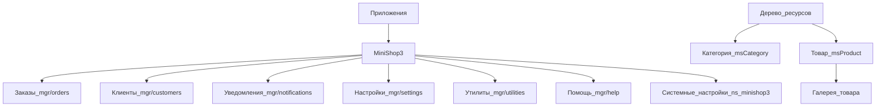

# Административный интерфейс

Откройте **Приложения → MiniShop3**. Ресурсы категории и товара — в дереве MODX.

## Доступ

**Меню:** Приложения → MiniShop3



| Пункт | `action` | Примечание |
| --- | --- | --- |
| Заказы | `mgr/orders` | [Заказы](orders) |
| Клиенты | `mgr/customers` | [Клиенты](customers) |
| Уведомления | `mgr/notifications` | [Центр уведомлений](notifications) |
| Настройки | `mgr/settings` | Вкладки магазина, см. [Настройки](settings) |
| Системные настройки | `system/settings` + `&ns=minishop3` | Namespace MODX `minishop3`, не вкладки `mgr/settings` |
| Помощь | `mgr/help` | Справка по менеджеру MS3 |
| Утилиты | `mgr/utilities` | [Утилиты](utilities) |

## Страницы ресурсов

| Страница | Описание |
| --- | --- |
| [Категория](category) | Редактирование категории товаров с таблицей товаров |
| [Товар](product) | Редактирование карточки товара |
| [Галерея](gallery) | Управление изображениями товара |

## Раздел настроек

**Меню:** Приложения → MiniShop3 → Настройки

| Вкладка | Описание |
| --- | --- |
| [Доставки](settings/deliveries) | Способы доставки |
| [Оплаты](settings/payments) | Способы оплаты |
| [Производители](settings/vendors) | Справочник производителей |
| [Связи](settings/links) | Типы связей товаров |
| [Опции](settings/options) | Справочник опций товаров |

Подробнее: [Настройки](settings)

## Утилиты

**Меню:** Приложения → MiniShop3 → Утилиты

| Вкладка | Описание |
| --- | --- |
| [Галерея](utilities/gallery) | Перегенерация миниатюр |
| [Импорт](utilities/import) | Импорт товаров из CSV |
| [Поля товара](utilities/product-fields) | Настройка полей в карточке товара |
| [Дополнительные поля](utilities/extra-fields) | Создание новых полей |
| [Колонки гридов](utilities/grid-columns) | Настройка таблиц |
| [Поля модели](utilities/model-fields) | Поля моделей БД |

Пошаговые сценарии полей и гридов: [Cookbook менеджера](/components/minishop3/manager/).

Подробнее: [Утилиты](utilities)

## Технологии

| Технология | Применение |
| --- | --- |
| **Vue 3 + PrimeVue** | Заказы, клиенты, уведомления, настройки (`settings.min.js`), утилиты, вкладки товара |
| **ExtJS 3.4** | Оболочка ресурса категории/товара в дереве MODX (Document / Settings / Access); гриды и вкладки «Товар» — Vue |

Deep-link вкладок настроек: `#tab-deliveries`, `#tab-payments`, `#tab-statuses`, `#tab-vendors`, `#tab-links`, `#tab-options`.

Нужен пакет [VueTools](/components/vuetools/).

## Расширение интерфейса

### Добавление CSS/JS

Событие `msOnManagerCustomCssJs`:

```php
<?php
switch ($modx->event->name) {
    case 'msOnManagerCustomCssJs':
        $page = $scriptProperties['page'];
        $controller = $scriptProperties['controller'];

        if ($page === 'product_update') {
            $controller->addCss('/assets/components/mycomponent/css/product.css');
            $controller->addLastJavascript('/assets/components/mycomponent/js/product.js');
        }
        break;
}
```

### Свои действия в таблицах

Регистрация через `MS3ActionRegistry`:

```javascript
MS3ActionRegistry.register('myAction', async (data, context) => {
    // Ваш код
    return { success: true, refresh: true };
});
```

Подробнее: [Категория — Добавление действий](category#добавление-действий-в-колонку)
