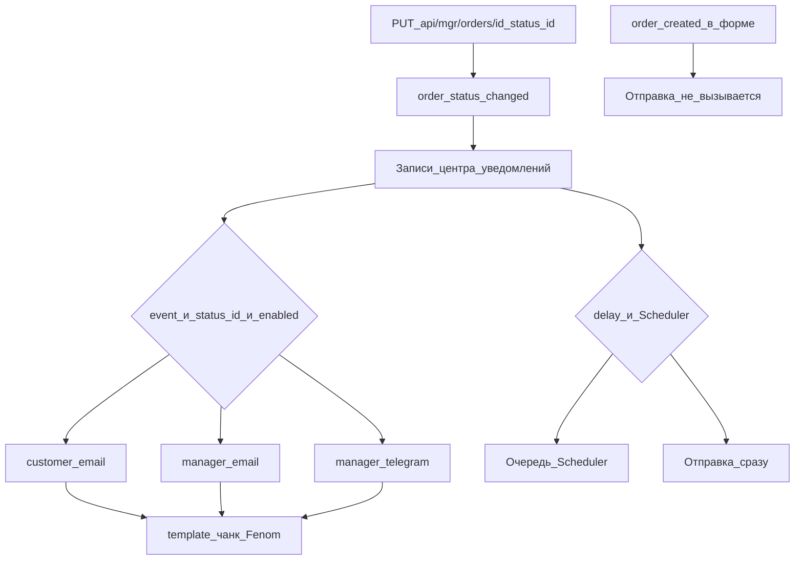

# Центр уведомлений

Откройте **Extras → MiniShop3 → Уведомления**. Задаёте, кому и через какой канал писать при смене статуса заказа, и какой шаблон использовать.

## Назначение

Типовые записи:

- Письмо клиенту при создании заказа.
- Письмо менеджеру о новом заказе.
- Уведомление клиенту при переходе в статус «Оплачен», «Отправлен», «Доставлен».
- Дубль в Telegram-канал менеджеров.
- Любые комбинации «событие → статус → получатель → канал».

Каждое уведомление — отдельная запись. На одно событие можно повесить несколько (email клиенту и Telegram менеджеру одновременно).



## Поля уведомления

| Поле | Тип | Описание |
| --- | --- | --- |
| `event` | string | Тип события: смена статуса заказа, создание заказа |
| `status_id` | int | ID статуса заказа. Только для события «смена статуса». Пусто = срабатывать на любой статус |
| `recipient_type` | string | Получатель: `customer` (клиент) или `manager` (менеджер) |
| `channel` | string | Канал доставки: `email`, `telegram` и др. |
| `enabled` | bool | Включено / отключено |
| `subject` | string | Тема письма (для email; поддерживает Fenom) |
| `template` | string | Имя чанка для тела сообщения. Пусто = стандартный шаблон канала |
| `delay` | int | Задержка отправки в секундах. Требует Scheduler |
| `position` | int | Порядок отправки при нескольких уведомлениях на одно событие |

## События

В коде диспатчится только **`order_status_changed`** (`StatusChangedNotification`). Письма и каналы выбираются по этому событию и `status_id`.

| Событие | ID | Работает сейчас |
| --- | --- | --- |
| Смена статуса заказа | `order_status_changed` | Да — при смене статуса заказа |
| Создание заказа | `order_created` | Нет — пункт есть в форме, но отправка по нему не вызывается |

::: warning order_created
Событие `order_created` можно выбрать в UI, но на `ad7da5fb` уведомления с этим событием **не отправляются** (ни при submit на витрине, ни при финализации черновика). Отслеживание: [MiniShop3#811](https://github.com/modx-pro/MiniShop3/issues/811). Пока баг не закрыт, настраивайте оповещения о новом заказе через `order_status_changed` и нужный `status_id`.
:::

Для события «смена статуса» поле `status_id` ограничивает переход в один статус. Пустое поле — любая смена статуса.

## Получатели

- **Клиент** (`customer`) — получает уведомление по контактам из заказа (email, телефон, Telegram chat_id, если указан).
- **Менеджер** (`manager`) — получает уведомление по контактам, заданным в системных настройках канала (например, `ms3_email_managers` для email, Telegram bot chat ID для Telegram).

## Каналы

### Email (встроенный)

Канал по умолчанию. Берёт SMTP-настройки MODX.

Параметры в системных настройках:

- `ms3_email_from` — адрес отправителя.
- `ms3_email_managers` — адреса менеджеров через запятую.

Для тела письма укажите имя чанка в `template`, например `tpl.msEmail.order.new`. Пустое поле — стандартный шаблон канала.

Тема письма (`subject`) принимает Fenom и плейсхолдеры заказа:

```
Заказ #{$num} — изменение статуса
```

### Telegram

Канал для отправки сообщений в Telegram (бот → клиент по chat_id или бот → канал/чат менеджеров).

Параметры (системные настройки):

- `ms3_telegram_bot_token` — токен бота, полученный у `@BotFather`.
- `ms3_telegram_managers_chat_id` — ID чата/канала менеджеров.

Для клиента в заказе нужен `telegram_chat_id` (своё поле или авторизация через Telegram-бота). Без него канал клиенту не отправит сообщение.

### SMS и свои каналы

В коде есть скелет SMS-канала. Компонент регистрирует свой канал через событие `msOnRegisterNotificationChannels`. См. [Notification Events](../development/events/notifications.md). Зарегистрированные каналы появляются в списке формы.

## Шаблоны сообщений

В поле `template` указывается имя чанка MODX, который рендерится через Fenom. Доступные плейсхолдеры:

- `{$order}` — массив полей заказа (`num`, `cost`, `status_id` и т.д.).
- `{$customer}` — данные клиента.
- `{$products}` — массив позиций заказа.
- `{$status_name}`, `{$old_status_name}` — для события смены статуса.
- `{$shop_name}` — название магазина из системной настройки.

Пример минимального чанка `tpl.msEmail.order.new`:

```
<h1>Спасибо за заказ #{$order.num}</h1>
<p>Сумма: {$order.cost}</p>
<ul>
{foreach $products as $product}
    <li>{$product.name} × {$product.count}</li>
{/foreach}
</ul>
```

Если чанк не указан или не найден, канал берёт свой стандартный шаблон.

## Задержка отправки

Поле `delay` (в секундах) откладывает отправку. Пример: через 24 часа после оплаты или через 7 дней после доставки.

Для задержки нужен установленный **Scheduler**: уведомление встаёт в очередь и уходит по расписанию. Без Scheduler параметр игнорируется, уведомление уходит сразу.

## Несколько уведомлений на одно событие

На одно событие можно настроить любое количество записей. Поле `position` определяет порядок отправки внутри одного события: меньшее значение — раньше.

Типовая связка для нового заказа:

| Position | Event | Status | Recipient | Channel | Subject / Template |
| --- | --- | --- | --- | --- | --- |
| 1 | `order_status_changed` | ID «Новый» | customer | email | «Спасибо за заказ #{$num}» / `tpl.msEmail.order.thanks` |
| 2 | `order_status_changed` | ID «Новый» | manager | email | «Новый заказ #{$num}» / `tpl.msEmail.order.new.manager` |
| 3 | `order_status_changed` | ID «Новый» | manager | telegram | — / `tpl.msTelegram.order.new` |

Примеры с `order_created` в сиде документации **сейчас не срабатывают**. См. warning выше.

## Фильтры в гриде

Над списком уведомлений три фильтра:

- **Статус заказа** — показать только уведомления для конкретного статуса.
- **Канал** — отфильтровать по типу канала (email / telegram / ...).
- **Получатель** — клиент или менеджер.

Фильтры применяются по кнопке «Применить», сбрасываются по «Очистить».

## Действия

- **Добавить уведомление** — открывает диалог создания.
- **Редактировать** (иконка карандаша) — диалог правки записи.
- **Включить / отключить** — чекбокс в первой колонке грида, переключает поле `enabled` без перехода в редактор.
- **Удалить** (иконка корзины) — с подтверждением.

## Связанные разделы

- [Системные настройки](../settings.md) — `ms3_email_from`, `ms3_email_managers`, `ms3_telegram_bot_token`, `ms3_telegram_managers_chat_id` и др.
- Справочник статусов заказа — определяет, какие `status_id` доступны для привязки. Настраивается в админке (**MiniShop3 → Настройки → Статусы**).
- [События уведомлений](../development/events/notifications.md) — подписка плагинов, регистрация своих каналов.

## Частые вопросы

**Письма не отправляются.**
Проверьте: системную настройку `ms3_email_from`, SMTP-настройки MODX, лог ошибок MODX (там пишется ошибка отправки конкретного канала с пометкой `[ms3] Notification error`), статус «Включено» у нужной записи в Центре уведомлений.

**Письмо ушло не на email из формы заказа.**
Сначала берётся email из адреса заказа (`msOrderAddress`). Email `msCustomer` подставляется только если в адресе поле пустое.

**Хочу свой канал отправки (например, push в мобильное приложение).**
Нужен плагин на событие `msOnRegisterNotificationChannels`, который зарегистрирует класс канала, реализующий `ChannelInterface`. См. [события уведомлений](../development/events/notifications.md).
