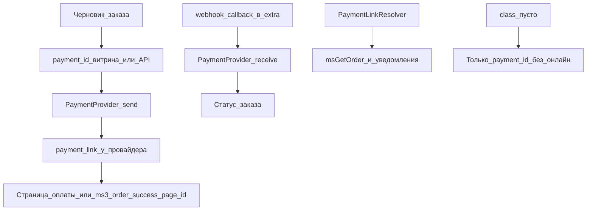

# Способы оплаты

Откройте **Пакеты → MiniShop3 → Настройки → Способы оплаты**.

## Для владельца магазина

1. Создайте способ оплаты: название, описание, логотип, активность.
2. Привяжите его к нужным [доставкам](/components/minishop3/interface/settings/deliveries). Без связки покупатель не сможет выбрать пару на витрине.
3. Для оплаты «при получении» оставьте поле `class` пустым. Заказ получит выбранный `payment_id`.
4. Для онлайн-оплаты установите платёжное дополнение из каталога (например [msp3YooKassa](/components/msp3yookassa/), [mspTBank](/components/msptbank/), [msp3Sberbank](/components/msp3sberbank/)) и укажите класс обработчика в поле `class`, как в инструкции пакета.
5. Проверьте переход после оплаты: `ms3_order_success_page_id` и страницу «Спасибо» с `msGetOrder`.

Наценка в поле `price`:

- `100`: фиксированная сумма к заказу
- `3%`: процент от суммы

## Поля оплаты

| Поле | Тип | Описание |
| --- | --- | --- |
| `name` | string | Название способа оплаты |
| `description` | text | Описание для покупателя |
| `price` | string | Наценка (число или процент) |
| `logo` | string | Путь к изображению |
| `position` | int | Порядок сортировки |
| `active` | bool | Активность |
| `class` | string | PHP-класс обработчика платежа |
| `properties` | JSON | Настройки обработчика |

## Связь с доставкой

Связки правят в карточке доставки. Типичные наборы:

- Самовывоз: наличные, карта при получении
- Курьер: наличные, карта, онлайн
- Почта: наложенный платёж, онлайн

## Обработчики платежей

Встроенных обработчиков нет: онлайн-оплату даёт платёжное дополнение из каталога или собственный класс. Класс наследуется от абстрактной `Payment` и указывается в карточке способа оплаты; готовые шлюзы описаны в документации дополнений. Обязательны только `send()` и `receive()`:

```php
<?php
namespace MyComponent\Payment;

use MiniShop3\Controllers\Payment\Payment;
use MiniShop3\Model\msOrder;

class MyPayment extends Payment
{
    public function send(msOrder $order): array
    {
        // Создать платёж у провайдера; return_url: ms3_order_success_page_id
        // Платёжная запись способа оплаты: $this->config['payment']
        return [
            'success' => true,
            'data' => ['payment_link' => '...'],
        ];
    }

    public function receive(msOrder $order): array
    {
        // Webhook / callback провайдера
        return ['success' => true, 'message' => 'Payment received'];
    }
}
```

Конструктор переопределять не нужно. Базовый `Payment::__construct(MiniShop3 $ms3, array $config = [])` прокидывает `$this->modx` и `$this->ms3`, а сервис создаёт обработчик как `new $class($ms3, ['payment' => $payment])`. Если нужны ключи из `properties`, вызывайте `parent::__construct($ms3, $config)` в своём конструкторе. Методы `getCost()` (наценка по полю `price`), `getPaymentLink()` и `getOrderHash()` (HMAC-SHA256 по `ms3_payment_secret`) уже реализованы в базе, переопределяйте только свою логику.

Регистрация в поле `class`:

```text
MyComponent\Payment\MyPayment
```

Секреты шлюза задают в `properties` (JSON) карточки оплаты:

```json
{
  "shop_id": "123456",
  "secret_key": "live_xxx...",
  "test_mode": false
}
```

В коде: `$this->config['payment']->get('properties')`.

## Уведомления об оплате (webhook / callback)

В ядре MiniShop3 **нет** готового `payment/handler.php`. URL уведомлений задаёт платёжное дополнение (например `webhook.php` / `callback.php` в `assets/components/{ns}/`). Смотрите документацию конкретного шлюза ([msp3YooKassa](/components/msp3yookassa/), [mspTBank](/components/msptbank/) и т.д.).

Класс оплаты реализует `send()` и приём уведомления, по полученному уведомлению он меняет статус заказа. Ссылка на оплату в письмах и `msGetOrder` строится через `PaymentLinkResolver`.



## API

### Доставки и оплаты в черновике заказа

Публичные списки (без токена): `GET /api/v1/delivery/list`, `GET /api/v1/payment/list`. Отдельного `GET /api/v1/order/payments` нет.

Черновик:

```http
GET /api/v1/order/get
```

В `data.order` лежат поля заказа, в том числе `delivery_id` / `payment_id` и `address_*`. Смена способа: `POST /api/v1/order/add` или `POST /api/v1/order/set` с телом-обёрткой `{"fields": {"payment_id": 2}}`. Витрина на Fenom может отображать выбор через `msOrder`.

### Стоимость оплаты

```http
GET /api/v1/order/cost/payment?payment_id=2
```

**Ответ:**

```json
{
    "success": true,
    "data": {
        "cost": 150.00
    }
}
```

Полный расчёт (корзина + доставка + оплата): `GET /api/v1/order/cost`. Карта Web API: [Checkout](/components/minishop3/development/web-api/checkout).

## Ссылка на оплату (`payment_link`)

На странице «спасибо» и в письмах URL оплаты формирует `PaymentLinkResolver` (`ms3_payment_link_resolver`):

- в **msGetOrder** — параметр `payStatus` (CSV статусов);
- в **уведомлениях** — настройка `ms3_payment_link_statuses` (CSV id статусов; скрытая — в Системных настройках не объявлена, задаётся напрямую в БД или кодом), если пуста, берётся `ms3_status_new`;
- ссылка **не** показывается для финальных статусов и статуса «оплачен».

Обработчик способа оплаты должен вернуть URL из метода оплаты (см. пример `send()` выше). Подробнее: [msGetOrder](/components/minishop3/snippets/msgetorder#ссылка-на-оплату).
