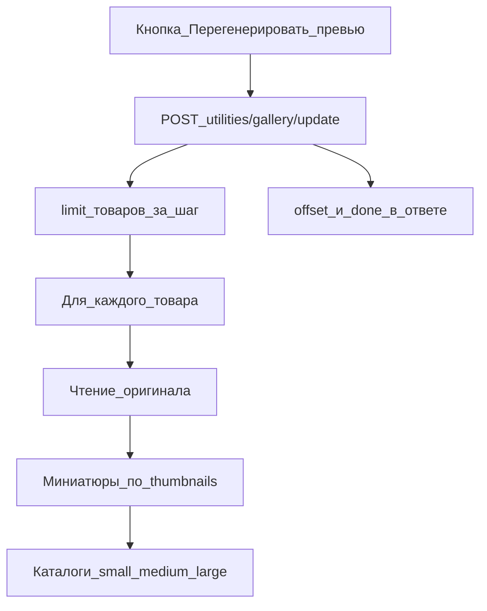

# Утилиты: Галерея

Массовая перегенерация миниатюр всех товаров.

## Назначение

При загрузке в галерею MiniShop3 сразу создаёт миниатюры разных размеров. Утилита нужна, если вы сменили настройки превью или хотите пересобрать все миниатюры.

## Когда использовать

- После изменения JSON `thumbnails` в Media Source
- После миграции сайта на новый сервер
- После массового обновления изображений через FTP
- При повреждении или отсутствии миниатюр
- После обновления MiniShop3 с изменениями в обработке изображений

## Интерфейс

Перегенерация запускается кнопкой и идёт порциями:



### Информационная панель

Текущее состояние галереи:

- **Медиа-источник** — название и ID источника файлов
- **Товаров с изображениями** — количество товаров, имеющих галерею
- **Всего файлов** — общее количество изображений в галереях

### Настройки превью

Сворачиваемая секция выводит JSON каждого ключа из свойства **`thumbnails`** Media Source товаров (тот же источник, что у галереи). Пример вида: `small: {"width":120,"height":120,"mode":"cover",…}`.

::: tip Ключ превью в карточке
`ms3_product_thumbnail_size` (по умолчанию `small`) — **имя ключа** из `thumbnails`, которое подставляется в поле превью товара в менеджере. Сами размеры правятся в источнике файлов: **Медиа → Источники файлов → свойство `thumbnails`**. Если JSON пуст, используется запасной вариант `small` 120×120.
:::

### Параметры обработки

| Параметр | Описание | По умолчанию |
| --- | --- | --- |
| Товаров за шаг | Количество товаров, обрабатываемых за одну итерацию | 10 |

::: warning Рекомендации

Значения эмпирические, подбираются под сервер — в коде закреплено только значение по умолчанию (10).

- Для слабых серверов уменьшите значение до 5
- Для мощных серверов можно увеличить до 20-30
- Большие значения могут привести к таймауту
:::

## Процесс работы

1. Проверьте настройки превью и место на диске, запускайте в период низкой нагрузки.
2. Нажмите **«Перегенерировать превью»**: утилита обрабатывает товары порциями, на странице видны процент и текущая итерация.
3. Процесс можно прервать, закрыв страницу. После завершения показано число обработанных товаров, кнопка **«Сбросить»** готовит новый запуск.

## Техническая информация

### Процессор

Утилита вызывает `MiniShop3\Processors\Utilities\Gallery\Update` (manager API или `$modx->runProcessor()` с полным именем класса).

### API-эндпоинт

```http
POST /api/mgr/utilities/gallery/update
```

Требуется право `msproductfile_generate`.

**Параметры:**

- `limit` — количество товаров за итерацию
- `offset` — смещение (для пагинации)

**Ответ:**

```json
{
  "success": true,
  "data": {
    "updated": 10,
    "total": 150,
    "offset": 10,
    "done": false,
    "limit": 10
  }
}
```

### Процесс обработки

Для каждого товара утилита читает оригиналы, создаёт миниатюры по ключам свойства `thumbnails` и обновляет метаданные в базе данных.

### Хранение файлов

Имена директорий — это ключи свойства `thumbnails` вашего Media Source; для настроек по умолчанию вид такой:

```text
assets/images/products/
├── {product_id}/
│   ├── original.jpg       # Оригинал
│   ├── small/             # Маленькие превью
│   │   └── original.jpg
│   ├── medium/            # Средние превью
│   │   └── original.jpg
│   └── large/             # Большие превью
│       └── original.jpg
```

## Решение проблем

### Процесс прерывается

**Симптом:** Обработка останавливается на определённом проценте.

**Решения:**

- Уменьшите количество товаров за шаг
- Увеличьте `max_execution_time` в PHP
- Проверьте логи ошибок сервера

### Миниатюры не создаются

**Симптом:** После завершения превью отсутствуют.

**Проверьте:**

- Права на запись в директорию `assets/images/`
- Наличие GD или ImageMagick на сервере
- Корректность настроек превью в системных настройках

### Ошибка «Нет товаров»

**Симптом:** Нет товаров для обработки.

**Причины:**

- В каталоге нет товаров с изображениями
- Медиа-источник настроен неправильно
- Таблица галереи пуста
