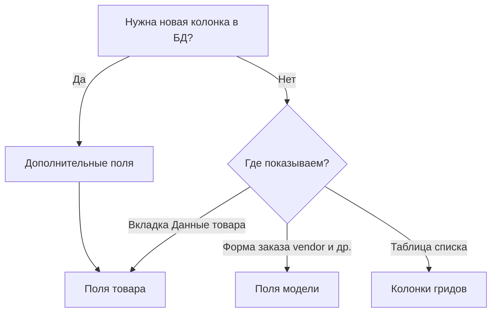

# Cookbook менеджера

Краткие сценарии для integrator-а: поля и колонки в Vue-менеджере MS3 1.13.x без правки PHP ядра.

Справочники API и xtype лежат в [Утилитах](/components/minishop3/interface/utilities). Cookbook показывает, **когда** какой инструмент брать и как довести задачу до результата в UI.

## Когда что выбирать

| Инструмент | Таблица | Задача |
| --- | --- | --- |
| [Дополнительные поля](/components/minishop3/interface/utilities/extra-fields) | `ms3_extra_fields` | Новая колонка в БД + виджет в форме |
| [Поля модели](/components/minishop3/interface/utilities/model-fields) | `ms3_model_fields` | Секции, порядок и xtype для **существующих** колонок |
| [Поля товара](/components/minishop3/interface/utilities/product-fields) | `ms3_product_fields` | Раскладка вкладки «Данные» (`page_key=product_data`) |

Колонки списков настраиваются отдельно: [Колонки гридов](/components/minishop3/interface/utilities/grid-columns).

## Права

| Действие | Политика |
| --- | --- |
| CRUD extra fields, model fields, product fields | `mssetting_save` |
| PUT grid-config (порядок, типы колонок) | `mssetting_save` |
| GET grid-config, списки заказов и категорий | `view_document` |
| Карточка заказа | чтение `msorder_list`, запись `msorder_save` |

## Cookbooks

| Страница | Что получите |
| --- | --- |
| [Поле в заказе](/components/minishop3/manager/examples/order-custom-field) | Текстовое extra field на карточке заказа |
| [Поле у товара](/components/minishop3/manager/examples/product-extra-field) | Числовое extra field + секция на вкладке «Данные» |
| [Дополнительные поля](/components/minishop3/manager/extra-fields/cookbook) | xtype, repeater, key-value |
| [Поля модели](/components/minishop3/manager/model-fields/cookbook) | Секции, visible list, связь с page-fields |
| [Поля товара](/components/minishop3/manager/product-fields/cookbook) | Секции и visible на вкладке «Данные» |
| [Колонки грида](/components/minishop3/manager/grid-config/cookbook) | Badge, price, inline-edit в категории |

## Требования

- MiniShop3 **1.13.x**, MODX 3, Vue-менеджер из пакета
- Для записи конфигов: `mssetting_save`
- Для просмотра гридов: `view_document`
