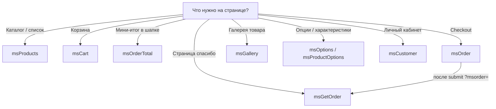

# Сниппеты MiniShop3

MiniShop3 поставляет набор сниппетов для витрины интернет-магазина. Все они работают через pdoTools и поддерживают Fenom.

## Обзор сниппетов

| Сниппет | Назначение |
| --- | --- |
| [msProducts](msproducts) | Вывод списка товаров с фильтрацией и сортировкой |
| [msCart](mscart) | Отображение корзины покупок |
| [msOrder](msorder) | Форма оформления заказа |
| [msGetOrder](msgetorder) | Получение информации о заказе |
| [msGallery](msgallery) | Галерея изображений товара |
| [msOptions](msoptions) | Вывод опций для фильтрации товаров |
| [msProductOptions](msproductoptions) | Характеристики конкретного товара |
| [msCustomer](mscustomer) | Личный кабинет покупателя |
| [msOrderTotal](msordertotal) | Итоговая сумма заказа |

Авторизация покупателя — страница [Вход и регистрация](/components/minishop3/frontend/customer-auth).



## Общие принципы

### Вызов сниппетов

::: code-group

```fenom
{'msProducts' | snippet : [
    'parents' => 5,
    'limit' => 10
]}
```

```modx
[[!msProducts?
    &parents=`5`
    &limit=`10`
]]
```

:::

::: tip Кэширование
Сниппеты, работающие с сессией пользователя (`msCart`, `msOrder`, `msCustomer`), должны вызываться **некэшированно** (с `!`).
:::

### Параметр return

| Сниппет | По умолчанию | Значения |
| --- | --- | --- |
| msProducts | `data` | `data`, `json`, `ids`, `sql` |
| msCart | `tpl` | `tpl`, `data` |
| msOrder | `tpl` | `tpl`, `data` |
| msGetOrder | — | только HTML чанка (параметра `return` нет) |
| msGallery | `tpl` | `data`, `tpl`, `json`, `sql` |
| msOptions | — | только HTML чанка |
| msProductOptions | `tpl` | `tpl`, `data`, `array` |
| msCustomer | `tpl` | `tpl`, `data` |
| msOrderTotal | `tpl` | `tpl`, `data` |

::: tip Значение msGallery по умолчанию
После установки свойство `return` = `tpl` (чанк). В PHP, если свойство пустое, берётся `data` ([issue #823](https://github.com/modx-pro/MiniShop3/issues/823)). Для массива указывайте `return=data` явно.
:::

Общие значения:

| Значение | Описание |
| --- | --- |
| `tpl` | Отрисовка через чанк |
| `data` | Массив данных (или HTML строки у msProducts — см. [msProducts](msproducts#вывод-returndata)) |
| `json` | JSON-строка (msProducts, msGallery) |
| `ids` | ID через запятую (msProducts) |

### Числа и `*_formatted`

Плейсхолдеры цен и веса в чанках — **числа** (`float`). Для вывода на сайте используйте поля `*_formatted`.

| Сниппет | Поведение |
| --- | --- |
| msProducts | `price_formatted`, `old_price_formatted`, `weight_formatted`. Символ валюты — только при `withCurrency => true`. Параметра `formatPrices` нет |
| msCart, msOrder, msGetOrder, msOrderTotal | `*_formatted` всегда с валютой или единицей веса |

У `msOrderTotal` в свойствах сниппета в админке ещё могут быть `formatPrices` и `withCurrency` — код их не читает ([issue #825](https://github.com/modx-pro/MiniShop3/issues/825)).

### Параметр toPlaceholder

```fenom
{'msProducts' | snippet : [
    'toPlaceholder' => 'products'
]}

{* Позже использовать *}
{$_modx->getPlaceholder('products')}
```

## Чанки по умолчанию

| Сниппет | Чанк по умолчанию |
| --- | --- |
| msProducts | `tpl.msProducts.row` |
| msCart | `tpl.msCart` |
| msOrder | `tpl.msOrder` |
| msGetOrder | `tpl.msGetOrder` |
| msGallery | `tpl.msGallery` |
| msOptions | `tpl.msOptions` |
| msProductOptions | `tpl.msProductOptions` |
| msOrderTotal | `tpl.msOrderTotal` |
| msCustomer | `tpl.msCustomer.profile` / `.addresses` / `.orders` (по `service`) |

Чанки можно переопределить, создав свои версии или указав другой чанк в параметре `tpl`. Для ЛК см. [msCustomer](mscustomer).
