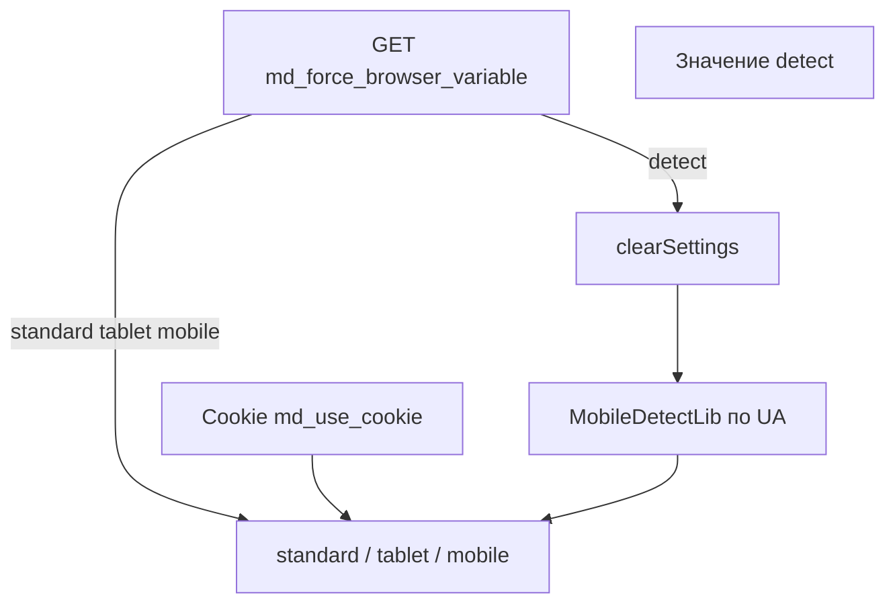

# Интеграция

Четыре способа вывести разный контент по типу устройства, принудительный режим и PHP API.

Плагин **MobileDetect** подписан на события `OnWebPagePrerender` и `pdoToolsOnFenomInit`.

## Способы вывода

| # | Способ | Событие | Плюсы | Минусы |
| --- | --- | --- | --- | --- |
| 1 | Fenom `\| mobiledetect` | `pdoToolsOnFenomInit` | Код в false-ветках не выполняется | Нужен pdoTools |
| 2 | Fenom-блоки | `pdoToolsOnFenomInit` | Читаемая разметка | `{mobile}` = phone **и** tablet |
| 3 | Сниппет `[[!MobileDetect]]` | любой | Работает без Fenom | Громоздкий синтаксис |
| 4 | HTML-теги | `OnWebPagePrerender` | Совместимо с кэшем страницы | MODX-теги внутри блоков парсятся заранее |

## Fenom-модификатор

Рекомендуемый способ при парсинге страниц через pdoTools/Fenom:

::: code-group

```fenom
{if 'standard' | mobiledetect}
  <p>Desktop</p>
{/if}

{if 'tablet' | mobiledetect}
  <p>Tablet</p>
{/if}

{if 'mobile' | mobiledetect}
  <p>Mobile (phone или tablet)</p>
{/if}
```

```modx
[[!pdoPage?
  &element=`tplWithFenom`
]]
```

:::

Модификатор сравнивает ожидаемый тип с текущим (`standard`, `tablet`, `mobile`) и возвращает `1` или `0`.

## Fenom-блоки

Плагин регистрирует блоки на `pdoToolsOnFenomInit`:

| Блок | Когда показывается |
| --- | --- |
| `{mobile}{/mobile}` | `mobile` или `tablet` |
| `{phone}{/phone}` | только `mobile` (телефон) |
| `{tablet}{/tablet}` | только `tablet` |
| `{desktop}{/desktop}` | `standard` (desktop) |
| `{standard}{/standard}` | `standard` (desktop) |

::: code-group

```fenom
{phone}
  <nav class="mobile-menu">...</nav>
{/phone}

{desktop}
  <nav class="desktop-menu">...</nav>
{/desktop}
```

```modx
[[!pdoPage?
  &element=`tplNavigation`
]]
```

:::

## Сниппет MobileDetect

Сниппет возвращает `1` или `0`. Параметр `&input` — ожидаемый тип устройства.

::: code-group

```modx
[[!MobileDetect:is=`1`:then=`
  <p>Mobile view</p>
`:else=``:input=`mobile`]]

[[!MobileDetect:is=`1`:then=`
  <p>Desktop view</p>
`:else=``:input=`standard`]]
```

```fenom
{if $modx->runSnippet('MobileDetect', ['input' => 'mobile']) == 1}
  <p>Mobile view</p>
{/if}
```

:::

Подробнее: [Сниппет MobileDetect](snippets/mobiledetect).

## HTML-теги

Контент оборачивается в настраиваемые теги (по умолчанию `standard`, `tablet`, `mobile`):

```html
<standard>
  <p>Desktop layout</p>
</standard>
<tablet>
  <p>Tablet layout</p>
</tablet>
<mobile>
  <p>Phone layout</p>
</mobile>
```

Логика фильтрации на `OnWebPagePrerender`:

| Тип устройства | Удаляются блоки | Остаётся |
| --- | --- | --- |
| desktop (`standard`) | `tablet`, `mobile` | `standard` |
| tablet | `mobile`; `standard` если `md_tablet_is_standard = Нет` | `tablet` (+ `standard` если планшет = desktop) |
| mobile | `standard`, `tablet` | `mobile` |

::: warning Не рекомендуется для тяжёлых сниппетов
MODX разбирает `[[!Snippet]]` внутри всех блоков до фильтрации. Для условного вызова сниппетов используйте Fenom-модификатор или блоки.
:::

## Определение устройства



Приоритет: GET-параметр → cookie (если включён) → автоопределение по User-Agent.

## Принудительный режим

Передайте GET-параметр (по умолчанию `browser`):

| URL | Результат |
| --- | --- |
| `?browser=standard` | Desktop |
| `?browser=tablet` | Tablet |
| `?browser=mobile` | Mobile |
| `?browser=detect` | Сброс cookie, автоопределение |

При `md_use_cookie = Да` выбор сохраняется в HTTP-only cookie.

### Переключатель tplMobileDetectSwitch

Чанк из пакета — ссылки Desktop / Tablet / Mobile / Auto:

::: code-group

```fenom
{$modx->getChunk('tplMobileDetectSwitch')}
```

```modx
[[$tplMobileDetectSwitch]]
```

:::

### Плейсхолдер текущего режима

Плагин выставляет `mobiledetect.device`:

::: code-group

```modx
Текущий режим: [[+mobiledetect.device]]
```

```fenom
{set $device = $_modx->getPlaceholder('mobiledetect.device') ?: ''}
<p>Режим: {$device}</p>
```

:::

## PHP API

```php
/** @var MobileDetect $md */
$md = $modx->getService('mobiledetect', 'MobileDetect', MODX_CORE_PATH . 'components/mobiledetect/');
if (!$md) {
    return;
}

$key = $md->config['force_browser_variable'];
$forced = isset($_GET[$key]) ? $modx->stripTags($_GET[$key]) : '';

$device = $md->resolveDevice($forced);  // standard | tablet | mobile
$type = $md->getDeviceType();

$md->isMobile();   // mobile или tablet
$md->isTablet();
$md->isDesktop();  // standard

$detector = $md->getDetector();  // Detection\MobileDetect
$detector->isMobile();
```

## Типовые сценарии

### Разная шапка сайта

Fenom-блоки в общем чанке header — `{phone}` для компактного меню, `{desktop}` для полного.

### Редирект не нужен

MobileDetect **не делает** редирект на поддомен `m.`. Контент фильтруется на той же странице.

### Отдельная mobile-версия в одном ресурсе

HTML-теги `<standard>` и `<mobile>` в поле content ресурса — работает без pdoTools, если шаблон не мешает prerender.

## Связанные разделы

- [Системные настройки](settings) — ключи `md_*`
- [Сниппет MobileDetect](snippets/mobiledetect)
- [Решение проблем](troubleshooting) — Fenom, кэш, обновление
