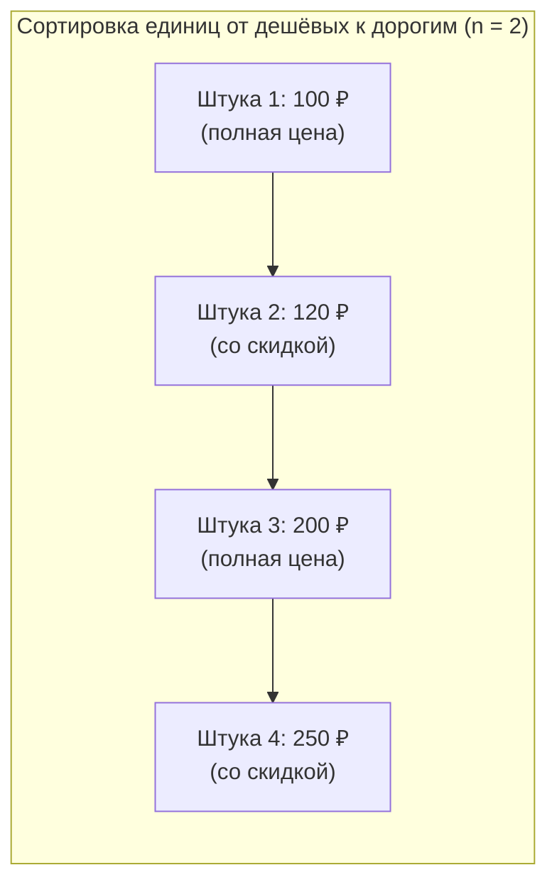

# FAQ

## Почему в каталоге нет бейджа, а на карточке есть?

Бейдж в каталоге не появляется сам по себе. Цены в строках `msProducts` пересчитывает системный плагин, а бейдж нужно вывести вручную — вызовом `ms3discountsGetDiscount` в чанке строки с параметром `id` товара.

## Почему бейдж на витрине не учитывает условия корзины?

Сниппет рассчитывает цену одного товара вне контекста корзины (`hasCart = false`). Условия на общую сумму, количество штук или вес корзины (провайдер `cart`) получают статус `undetermined` и на цену карточки не влияют. Покупатель видит только безусловную скидку на единицу товара.

## Почему prepareSnippet=ms3discountsGetDiscount не добавляет поля в строку?

pdoTools вызывает сниппет подготовки с полями товара во вложенном ключе `row`, а `ms3discountsGetDiscount` ожидает `id` и `pagetitle` в корне параметров. Режим подготовки строки не распознаётся, вызов завершается молча. Выводите бейдж вызовом сниппета в чанке строки `msProducts`: [Скидки в каталоге](snippets/ms3discountsGetDiscount#skidki-v-kataloge-msproducts).

## В каком формате выводится таймер обратного отсчёта?

Скрипт `default.js` находит на странице элементы `.ms3d_remains[data-remain]` и преобразует секунды в читаемый формат: `Nд ЧЧ:ММ:СС`. Если до завершения осталось меньше суток, дни скрываются и остаётся формат `ЧЧ:ММ:СС`.

## Как работает правило «N-й товар»?

Скидка применяется к каждому N-му товару в корзине при значении параметра n ≥ 2. Все подходящие под правило единицы товара сортируются от дешёвых к дорогим. Скидка применяется к более дешёвым штукам. Если общее количество подходящих товаров меньше n, скидка не применяется.



## Как добавляются и удаляются подарки?

Подарок создаётся в заказе отдельной строкой с ценой 0 и отметкой `ms3discounts_gift = true`. Если покупатель удаляет основной товар из корзины или уменьшает количество ниже требуемого порога, плагин автоматически удаляет подарочную строку при следующем пересчёте.

## Почему BuyNow ничего не вывел?

1. У акции включён флаг `show_in_catalog`.
2. При значении `force_date=1` (по умолчанию) у акции заполнена дата окончания `date_end`.
3. В правиле выбрана хотя бы одна include-цель: товар, категория или производитель.

Акция без конкретных include-целей действует на весь каталог в корзине, но сниппет `ms3discountsBuyNow` не включает её в выборку, чтобы не разворачивать весь каталог магазина.

Если ID товаров найдены, но список пуст, проверьте параметр `parents`. Сниппет `ms3discountsBuyNow` автоматически подставляет `parents=0`, если параметр не был передан.

## Остаётся сырое число секунд вместо таймера

Убедитесь, что подключён JavaScript витрины. В чанке вывода должен присутствовать элемент с классом `.ms3d_remains` и атрибутом `data-remain`:

```fenom
<span class="ms3d_remains" data-remain="{$remains}"></span>
```

Сниппеты `ms3discountsBuyNow` и `ms3discounts` подключают скрипт по умолчанию из системной настройки `ms3discounts_frontend_js`.

## Нужно ли вызывать сниппет в корзине?

Нет. Пересчётом корзины занимается системный плагин. Сниппеты витрины предназначены для вывода бейджей, карточек и каталогов.

## Почему в корзине цена без скидки?

1. Проверьте, что настройка `ms3discounts_enabled` включена.
2. Проверьте, что правило активно и текущее время попадает в заданный период, дни недели и контекст.
3. Флаги витрины (`show_in_catalog`, `show_in_product`) влияют только на сниппеты и не отключают скидку в корзине.
4. После сохранения правила очистите кэш MODX и измените состав корзины.
5. Правила с включённым флагом «Только после активации» применяются только после вызова сервиса `ms3discounts_activator`.

## Есть ли промокоды?

В пакет ms3Discounts промокоды не входят. Скидки с активацией подключаются через внешний модуль с помощью сервиса `ms3discounts_activator`. Как устроен вызов: [Интеграция](integration).
