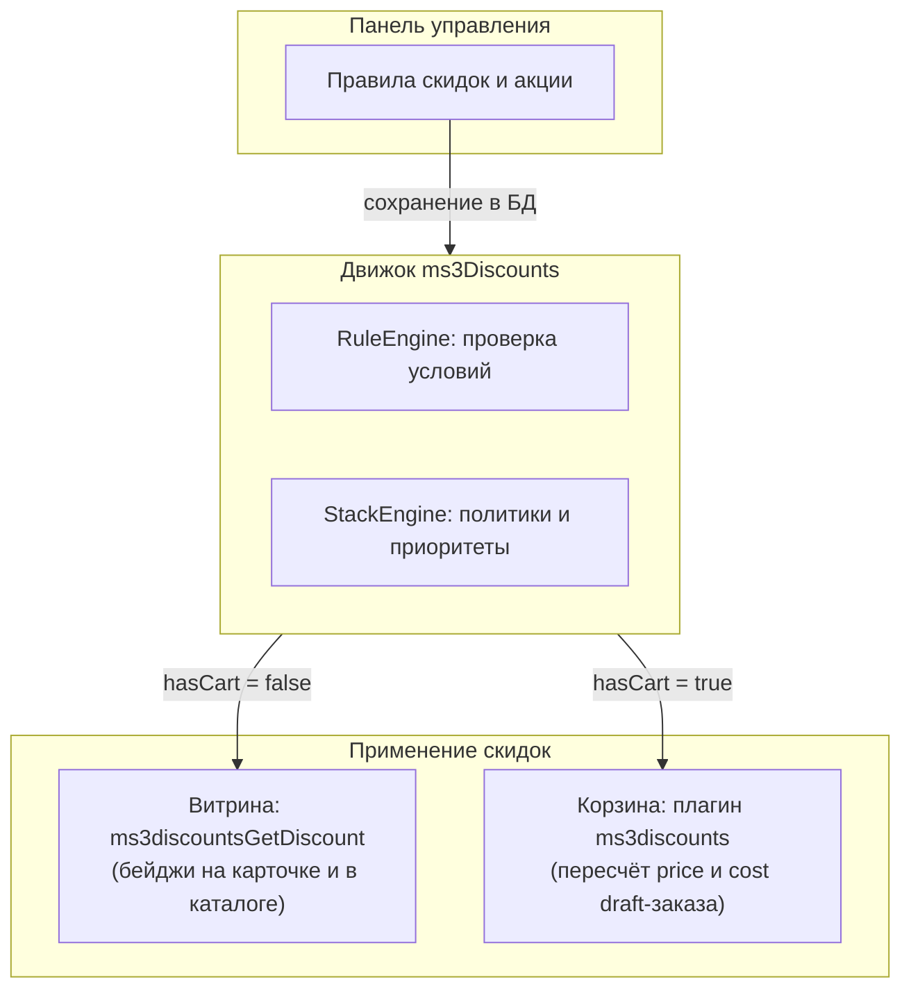

# ms3Discounts

<!-- MEDIA: screenshot-admin | nice | Главный экран управления скидками: дашборд с показателями и ближайшими акциями | Открыть Компоненты → Скидки на тестовом стенде -->
<!--  -->

**ms3Discounts** — дополнение для [MODX Revolution 3](https://modx.com/) и [MiniShop3](/components/minishop3/): правила скидок в панели управления и пересчёт `price` / `cost` в draft-корзине.

Промокоды в пакет не входят. Купоны подключает внешний модуль через сервис `ms3discounts_activator`.

## Минимальный путь

1. Установите **MiniShop3** и **VueTools**. Для стандартных Fenom-чанков установите **pdoTools**.
2. Убедитесь, что настройка `ms3discounts_enabled` включена.
3. В меню **Компоненты → Скидки** создайте правило: тип действия, цели и период.
4. На карточке товара вызовите `ms3discountsGetDiscount`. В каталоге передайте его как `prepareSnippet` в `msProducts`.
5. Очистите кэш и проверьте цену в корзине после добавления товара.

## Быстрые ссылки

| Нужно | Документ |
| --- | --- |
| Установить и вывести бейдж | [Быстрый старт](quick-start) |
| Завести типовую акцию | [Рецепты](recipes/index) |
| Панель управления и конструктор правил | [Панель управления](manager) |
| Ключи `ms3discounts_*` и права | [Системные настройки](settings) |
| Сниппеты и параметры | [Сниппеты](snippets/index) |
| Корзина, сервисы и API | [Интеграция](integration) |
| Частые вопросы и ограничения витрины | [FAQ](faq) |

## Что считает движок

Движок поддерживает пять типов действий:

- **Процент**: скидка в процентах от цены товара.
- **Фиксированная сумма**: скидка в рублях или валюте на единицу товара.
- **Фиксированная цена**: установка точной цены единицы товара.
- **N-й товар**: скидка на каждый N-й товар в заказе (порог n ≥ 2). Единицы сортируются от дешёвых к дорогим.
- **Подарок**: добавление подарочного товара в корзину с ценой 0.

Цели include: товар, категория, производитель. Если цели include не выбраны, скидка распространяется на все товары каталога в корзине. Сниппет `ms3discountsBuyNow` правила без явных include-целей в подборку не включает.

Флаги витрины: `show_in_catalog` (каталог и `prepareSnippet`), `show_in_product` (карточка товара), `show_description` (вывод описания акции). Флаг `activation_required` откладывает применение правила до вызова программного активатора.

## Политики и приоритет

Числовое поле `priority` определяет порядок оценки правил. При равных условиях побеждает правило с большим приоритетом.

| Политика | Поведение |
| --- | --- |
| `exclusive` | Побеждает одна акция с наибольшей выгодой и блокирует все остальные правила в корзине. |
| `best` | Из группы правил с этой политикой применяется одна акция с максимальной выгодой. |
| `stackable` | Складывается с выбранной акцией `best`. Если сработала `exclusive`, не применяется. |
| `fallback` | Применяется только тогда, когда ни одна акция других политик не дала эффекта. |

## Условия и расписание

В конструкторе условий доступны параметры корзины (сумма, количество, позиции, вес), товара (цена, остаток, артикул), категории, производителя, опций, пользователя, группы пользователей, контекста и даты.

Блок **Исключить** отменяет скидку, если выполняется хотя бы одно из его условий. Блок поддерживает любые провайдеры условий.

Расписание задаётся полями `date_start`, `date_end`, временем `time_start`, `time_end`, днями недели `weekdays` (1–7) и списком `contexts`. Пустые значения времени, дней недели и контекстов означают отсутствие ограничений.
