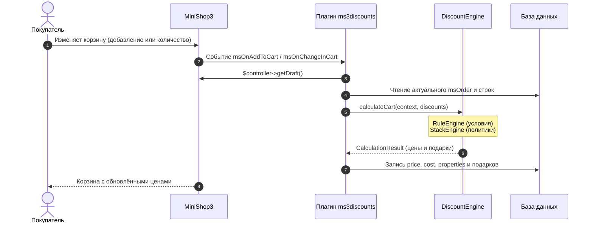
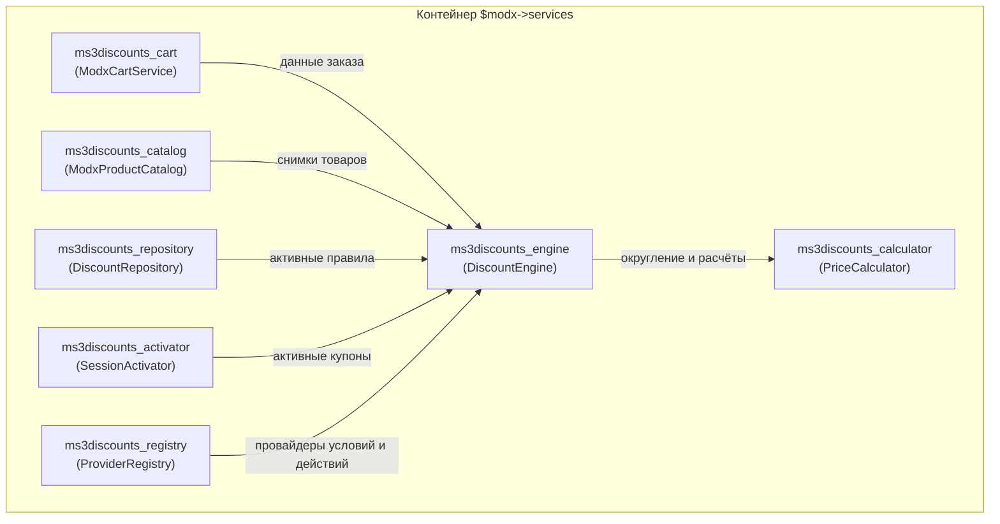

# Интеграция

На обычном магазине корзину не подключают сниппетами ms3Discounts. Плагин автоматически записывает скидки в draft-заказ MiniShop3. Сниппеты используются только на карточке товара, в каталоге и в блоке «успей купить».

## Что сделать на сайте

1. Включите настройку `ms3discounts_enabled`.
2. Создайте активное правило в **Компоненты → Скидки**. Флаги `show_in_catalog` и `show_in_product` влияют только на витрину и не отключают действие скидки в корзине.
3. Оставьте стандартные чанки `msCart` MiniShop3. После добавления товара в поля `price` и `cost` сразу записывается итоговая сумма с учётом скидки.
4. Для показа зачёркнутой цены или суммы скидки выводите значения из `properties` позиции. Отдельного JS для корзины в пакете нет.
5. После сохранения новых правил очистите кэш и измените корзину (измените количество или добавьте товар) либо перейдите к оформлению заказа. Простое открытие страницы корзины пересчёт не запускает.

Доставку и оплату пакет не изменяет. В массив `cart['discounts']` данные не записываются.

## Как устроен пересчёт



Плагин слушает события MiniShop3:

| Событие | Что делает |
| --- | --- |
| `msOnAddToCart`, `msOnChangeInCart`, `msOnRemoveFromCart`, `msOnBeforeGetOrderCost` | Получает draft-заказ, пересчитывает правила скидок и сохраняет строки заказа. |
| `msOnGetStatusCart` | Суммирует `properties.discount_cost` по строкам заказа в `status.total_discount`. Сами цены заново не пересчитывает. |
| `msOnGetProductPrice` | Считает цену одной позиции вне контекста корзины (`hasCart = false`). Условия, зависящие от состава корзины, возвращают статус `undetermined` и цену не меняют. |

### Последовательность работы плагина

1. В событиях изменения корзины плагин получает контроллер через `$scriptProperties['controller']` и извлекает заказ вызовом `$controller->getDraft()`.
2. Объект заказа повторно читается из базы данных для получения актуального списка позиций.
3. Базой для расчёта служит `properties.original_price`, затем цена из каталога `msProductData.price`, затем текущий `price` строки. Метод `getPrice()` не вызывается.
4. Движок отбирает активные правила по товару, категории и производителю. Правила без include-целей действуют на все товары корзины.
5. Плагин обновляет в позициях поля `price` и `cost` (`price × count`), а также сохраняет детализацию в `properties`.
6. Для подарочных акций плагин добавляет отдельную строку заказа либо удаляет её, если условия перестали выполняться.
7. В свойства заказа (`properties`) сохраняется ключ `ms3discounts_hash`. В хеш входят ID пользователя, группы пользователей, контекст, ревизия правил, текущий час (`Y-m-d H`), состав строк (ID, количество, опции) и активные купоны. Если хеш не изменился, повторная перезапись позиций пропускается.

## Поля позиции корзины

<!-- MEDIA: screenshot-front | must | Корзина магазина со строкой позиции со скидкой и подарком | Открыть корзину с применёнными скидками -->
<!--  -->

После пересчёта обычная строка корзины содержит:

| Куда | Поле | Смысл |
| --- | --- | --- |
| строка | `price` | Итоговая цена единицы товара со скидкой. |
| строка | `cost` | Общая стоимость позиции (`price × count`). |
| `properties` | `original_price` | Базовая цена единицы товара до скидок. |
| `properties` | `old_price` | Старая цена из каталога либо `original_price`. |
| `properties` | `discount_price` | Размер скидки на одну штуку товара. |
| `properties` | `discount_cost` | Общая сумма скидки на всю позицию. |
| `properties` | `discount_percent` | Итоговый процент скидки. |
| `properties` | `discounts` | Список применённых правил: `id`, `name`, `action_type`, `value`, `discount`. |

Подарочная позиция создаётся с полями `price = 0` и `cost = 0`. В её `properties` записываются `ms3discounts_gift = true`, `discount_id`, а числовые поля скидок равны `0`. Такие строки исключаются из расчёта других скидок.

Пример вывода в чанке строки корзины:

::: code-group

```fenom
{$price}
{$cost}
{$properties.original_price}
{$properties.discount_cost}
```

```modx
[[+price]]
[[+cost]]
[[+properties.original_price]]
[[+properties.discount_cost]]
```

:::

Поле `total_discount` в статусе корзины формируется как сумма всех `properties.discount_cost` товарных позиций.

## Сервисы контейнера



Компонент регистрирует 7 сервисов в `$modx->services`:

| Сервис | Класс / Назначение |
| --- | --- |
| `ms3discounts_engine` | `DiscountEngine`: расчёт скидок корзины и единичных товаров. |
| `ms3discounts_repository` | `DiscountRepository`: поиск и фильтрация кандидатов скидок. |
| `ms3discounts_activator` | `DiscountActivatorInterface`: программная активация скидок. |
| `ms3discounts_registry` | `ProviderRegistry`: реестр провайдеров условий и действий. |
| `ms3discounts_calculator` | `PriceCalculator`: математические операции и округление цен. |
| `ms3discounts_catalog` | `ModxProductCatalog`: получение снимков данных товаров каталога. |
| `ms3discounts_cart` | `ModxCartService`: интеграция с заказами и корзиной MiniShop3. |

## Программная активация скидок

Скидки с включённым флагом «Только после активации» применяются только после регистрации их ID через сервис активатора:

```php
$activator = $modx->services->get('ms3discounts_activator');

// Активировать скидку с ID 12
$activator->activateDiscount(12, 'promocode');

// Отключить скидку
$activator->deactivateDiscount(12);

// Получить список активированных ID
$activeIds = $activator->activeDiscountIds();
```

Список активированных скидок сохраняется в сессии пользователя под ключом `ms3discounts_activations`.

## Регистрация собственных условий и действий

Для расширения Rule Builder новыми провайдерами используйте системное событие `ms3discountsOnRegisterProviders`:

```php
/** @var \Ms3Discounts\Services\ProviderRegistry $registry */
$registry = $scriptProperties['registry'];

// Регистрация своего условия
$registry->registerCondition(new MyCustomConditionProvider());

// Регистрация своего действия
$registry->registerAction(new MyCustomActionProvider());
```

Зарегистрированные провайдеры автоматически появляются в интерфейсе панели управления и участвуют в расчётах движка.

## REST API панели управления

Маршруты API зарегистрированы с префиксом `/api/mgr/ms3discounts` и требуют авторизации в контексте `mgr`:

| Метод | Путь | Назначение | Требуемое право |
| --- | --- | --- | --- |
| GET | `/api/mgr/ms3discounts/lookup` | Поиск связанных сущностей для выпадающих списков (товары, категории, производители, опции, пользователи, группы, контексты, скидки). | `ms3discounts_view` |
| GET | `/api/mgr/ms3discounts/list` | Получение списка скидок с пагинацией, сортировкой и фильтрами. | `ms3discounts_view` |
| GET | `/api/mgr/ms3discounts/get` | Загрузка полных данных одной скидки по ID. | `ms3discounts_view` |
| GET | `/api/mgr/ms3discounts/definitions` | Схема метаданных условий, действий и операторов для построения формы. | `ms3discounts_view` |
| POST | `/api/mgr/ms3discounts/save` | Создание или обновление правила скидки. | `ms3discounts_manage` |
| POST | `/api/mgr/ms3discounts/bulk` | Массовые операции: `enable`, `disable`, `delete`, `priority`, `duplicate`. | `ms3discounts_manage` / `ms3discounts_delete` |
| POST | `/api/mgr/ms3discounts/preview` | Расчёт превью и трассировки условий для выбранного товара. | `ms3discounts_view` |

## Расчёт из PHP

Для вычисления скидок корзины в собственном коде вызывайте движок напрямую:

```php
$engine = $modx->services->get('ms3discounts_engine');
$factory = new \Ms3Discounts\Integration\MiniShop3\DiscountContextFactory();

$context = $factory->fromItems($items, $userId, $userGroups, $contextKey, $activations, true);
$discounts = $modx->services->get('ms3discounts_repository')->findCandidates(
    new \Ms3Discounts\Dto\CartTargets($productIds, $categoryIds, $vendorIds)
);

$result = $engine->calculateCart($context, $discounts, ['trace' => true]);
```

Массив ответа `$result` содержит:

- `items`: список строк корзины с полями `key`, `price`, `original_price`, `discount_cost`, `discount_percent` и массивом `applied_discounts`.
- `total_discount`: общая сумма скидки на заказ.
- `discounts`: перечень сработавших акций с полями `id`, `name`, `action_type`, `value`, `discount`.
- `trace`: пошаговый лог проверки условий (при передаче опции `trace => true`).
