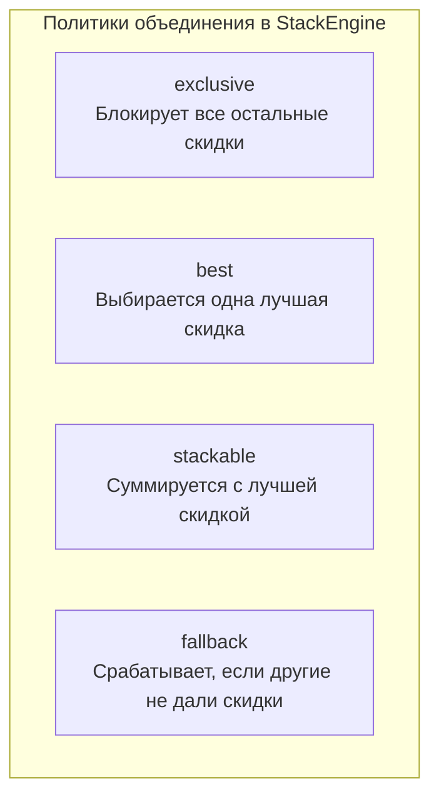
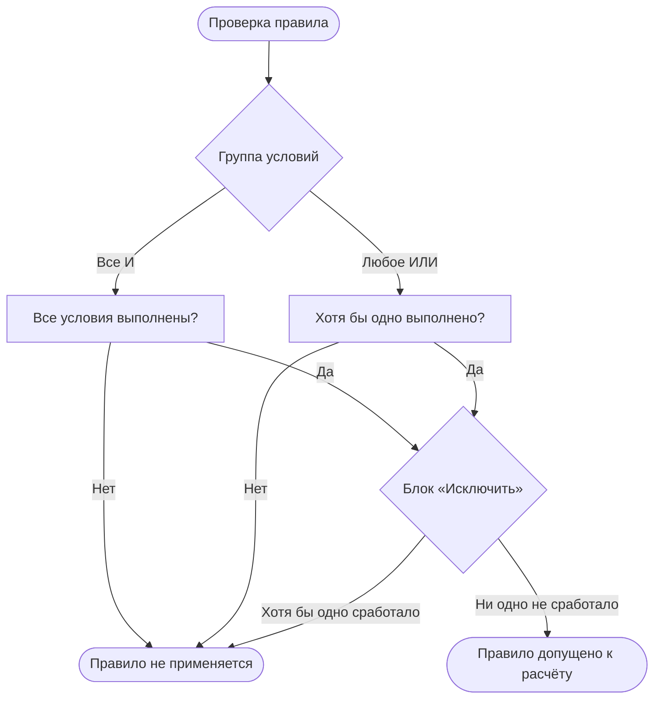

# Панель управления

Управление скидками находится в меню **Компоненты → Скидки**. Интерфейс построен на Vue 3 и PrimeVue и состоит из двух вкладок: **Обзор** и **Скидки**.

Доступ к странице регулируется правом `ms3discounts_view`.

## Вкладка Обзор

<!-- MEDIA: screenshot-admin | must | Вкладка «Обзор»: KPI-счётчики, диаграмма типов и блок «Скоро» | Открыть вкладку Обзор в меню Компоненты → Скидки -->
<!--  -->

Вкладка показывает общую статистику по всем скидкам магазина.

- **Счётчики статусов**: количество активных, запланированных, завершённых и отключённых правил, а также общее число.
- **Распределение по типам**: круговая диаграмма соотношения скидок по типам действий.
- **Блок «Скоро»**: список пяти ближайших акций с датой старта или завершения.
- **Блок «Прошедшие ещё включены»**: показывает завершившиеся по дате акции, которые остаются активными. Кнопка **Выключить** переводит их в статус выключенных.

Клик по карточке статуса переключает на вкладку со списком и применяет соответствующий фильтр.

## Вкладка Скидки

<!-- MEDIA: screenshot-admin | must | Таблица правил скидок с фильтрами, поиском и панелью BulkBar | Открыть вкладку Скидки, отметить 2-3 строки чекбоксами -->
<!--  -->

Вкладка содержит таблицу правил, поиск и фильтры.

В верхней панели доступны:

- Быстрые фильтры: **Все**, **Активные**, **Запланированные**, **Завершённые**, **Отключённые**.
- Фильтр по типу действия.
- Поле текстового поиска по названию и описанию.
- Кнопка **Новая скидка** для создания правила.
- Кнопка **Проверить** для открытия панели превью.

В таблице отображаются статус, название, тип действия, размер выгоды, область применения, период и приоритет.

### Массовые операции

При выборе нескольких строк чекбоксами появляется панель массовых действий:

- **Включить** и **Выключить**: смена активности выбранных правил.
- **Удалить**: удаление выбранных записей после подтверждения.
- **Приоритет**: установка числового приоритета для выбранных правил.
- **Дублировать**: создание копий выбранных скидок с сохранением всех условий.

## Создание правила

<!-- MEDIA: screenshot-admin | must | Боковая панель создания правила с выбором типа действия | Нажать кнопку «Новая скидка» -->
<!--  -->

Кнопка **Новая скидка** открывает боковую панель настройки правила.

Основные поля формы:

- **Название**: обязательное имя скидки.
- **Применяется к**: выбор области include-целей (товары, категории или производители). Если ничего не выбрано, правило действует на весь каталог.
- **Скидка**: выбор типа действия и ввод значения.
- **Период**: даты начала и окончания действия акции.

### Типы действий

| Тип | Поля | Описание |
| --- | --- | --- |
| Процент | `value` | Процент скидки от базовой цены товара. |
| Фиксированная сумма | `value` | Сумма скидки в валюте на единицу товара. |
| Фиксированная цена | `value` | Итоговая цена единицы товара. |
| N-й товар | `n`, `percent` | Скидка на каждый N-й товар в корзине (порог n ≥ 2). Единицы сортируются от дешёвых к дорогим. По умолчанию percent = 100%. |
| Подарок | `product_id`, `count` | Добавление товара из каталога в подарок. В корзине создаётся отдельная строка с ценой 0. |

## Дополнительные параметры

В блоке **Дополнительные условия** настраиваются поведение движка, расписание и флаги отображения.

| Параметр | По умолчанию | Описание |
| --- | --- | --- |
| Политика | `stackable` | Порядок применения: `stackable` (суммируется), `best` (лучшая цена), `exclusive` (перекрывает другие), `fallback` (запасная). |
| Приоритет | `0` | Числовой приоритет. Большее число побеждает при выборе и применяется раньше. |
| Описание | пусто | Пояснительный текст акции. |
| Время | пусто | Окно времени действия в формате ЧЧ:ММ (с и по). Пустые поля означают весь день. |
| Дни недели | пусто | Выбор дней недели (1 — понедельник, 7 — воскресенье). Если не выбраны, скидка действует во все дни. |
| Контексты | пусто | Список контекстов сайта. Если не выбраны, скидка действует во всех контекстах. |
| В каталоге | включено | Показывать скидку в каталоге (`prepareSnippet` и список акций). |
| В товаре | включено | Показывать скидку на карточке товара. |
| Показывать описание | выключено | Выводить текст описания в сниппете `ms3discounts`. |
| Только после активации | выключено | Правило применяется только после программной активации (промокоды, купоны). |

## Конструктор условий (Rule Builder)

<!-- MEDIA: screenshot-admin | must | Конструктор условий с группами условий и блоком «Исключить» | В форме правила открыть блок условий -->
<!--  -->

Конструктор условий позволяет ограничить применение скидки параметрами корзины, покупателя или товара.

Условия объединяются в группу с переключателем логики:

- **Все (И)**: правило сработает, если выполнены все добавленные условия.
- **Любое (ИЛИ)**: правило сработает, если выполнено хотя бы одно условие.

### Доступные провайдеры

| Провайдер | Поле | Операторы | Назначение |
| --- | --- | --- | --- |
| Корзина | `subtotal`, `count`, `positions`, `weight` | `=`, `!=`, `>`, `>=`, `<`, `<=`, `between` | Сумма, количество штук, число позиций или вес. Область (`scope`): вся корзина (`cart`), подходящие товары (`matching`), текущая строка (`product`). |
| Товар | `product`, `article`, `price`, `old_price`, `weight`, `stock` | `=`, `!=`, `>`, `>=`, `<`, `<=`, `in`, `not_in` | Свойства товара: ID, артикул, базовая цена, старая цена, вес, остаток на складе. |
| Категория | `category` | `in`, `not_in` | ID категорий каталога. |
| Производитель | `vendor` | `in`, `not_in` | ID производителей товаров. |
| Опция | `key`, `value` | `=`, `!=`, `in`, `not_in` | Проверка значений опций товара по ключу опции. |
| Пользователь | `customer` | `=`, `!=`, `in`, `not_in` | ID пользователя либо значения `auth` (авторизован) и `guest` (гость). |
| Группа пользователя | `customer_group` | `in`, `not_in` | ID групп пользователей MODX. |
| Контекст | `context` | `in`, `not_in` | Ключи контекстов сайта. |
| Дата | `weekday`, `time`, `date` | `=`, `!=`, `>`, `>=`, `<`, `<=`, `between` | День недели (1–7), время (ЧЧ:ММ) или календарная дата (`YYYY-MM-DD`). |

### Блок «Исключить»

Секция **Исключить** содержит условия отмены скидки. Если хотя бы одно условие из этого блока выполняется, скидка не применяется к заказу или позиции. Блок поддерживает любые провайдеры из таблицы выше.

## Панель проверки (Превью)

<!-- MEDIA: screenshot-admin | nice | Панель тестирования скидок с трассировкой расчёта | Нажать кнопку «Проверить» в шапке панели -->
<!--  -->

Кнопка **Проверить** открывает панель тестирования скидок без оформления заказа на сайте.

В форме превью задаются параметры:

- Товар из каталога.
- Количество товара.
- Пользователь (гость, авторизованный или конкретный ID).
- Контекст выполнения.
- Дополнительные опции товара.

Панель рассчитывает базовую цену, итоговую цену со скидкой и выводит список применённых правил. Пользователи с системным правом `ms3discounts_debug` видят вкладку **Трассировка** с пошаговым журналом оценки условий и выбора политик.
