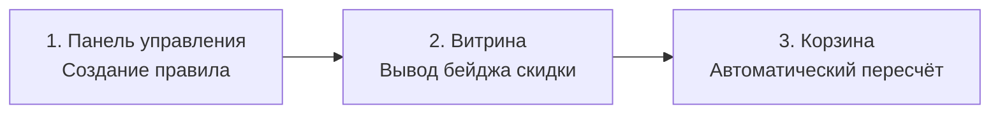

# Быстрый старт

Установите пакет, создайте правило и проверьте скидку на карточке и в корзине.



## Шаг 1. Установите пакет

1. Установите MiniShop3 и VueTools. Для стандартных Fenom-чанков установите pdoTools.
2. Установите ms3Discounts через менеджер пакетов.
3. Очистите кэш MODX.

После установки появляются:

- пункт меню **Компоненты → Скидки**
- плагин на событиях корзины MiniShop3
- сниппеты `ms3discounts`, `ms3discountsGetDiscount`, `ms3discountsBuyNow`
- политика доступа `ms3DiscountsManagerPolicy`

Для перехода в раздел требуется системное право `ms3discounts_view`.

## Шаг 2. Включите компонент

В системных настройках найдите ключи `ms3discounts_*` и оставьте `ms3discounts_enabled` включённым. Описание параметров: [Системные настройки](settings).

## Шаг 3. Создайте правило

<!-- MEDIA: screenshot-admin | must | Боковая панель создания правила с заполненными полями | Открыть Компоненты → Скидки, нажать Новая скидка -->
<!--  -->

Откройте **Компоненты → Скидки**. Нажмите **Новая скидка**. Заполните название, выберите область применения в блоке «Применяется к» (товары, категории или производители), укажите тип действия, значение и политику.

При необходимости задайте период (`date_start`, `date_end`), расписание (время и дни недели), контексты, приоритет и дополнительные условия в конструкторе правил. Подробное руководство по полям: [Панель управления](manager). Сохраните форму.

Кнопка **Проверить** открывает превью для тестирования расчёта цены выбранного товара.

## Шаг 4. Выведите скидку на карточке

<!-- MEDIA: screenshot-front | must | Карточка товара на витрине с бейджем скидки и новой ценой | Открыть карточку товара со скидкой на витрине -->
<!--  -->

В шаблоне товара вызовите сниппет некэшируемым.

::: code-group

```fenom
{'!ms3discountsGetDiscount' | snippet : ['id' => $_modx->resource.id]}
```

```modx
[[!ms3discountsGetDiscount? &id=`[[*id]]`]]
```

:::

Параметры и плейсхолдеры: [ms3discountsGetDiscount](snippets/ms3discountsGetDiscount).

## Шаг 5. Проверьте корзину

<!-- MEDIA: screenshot-front | must | Корзина магазина со строкой позиции со скидкой | Добавить акционный товар в корзину -->
<!--  -->

Сниппет в чанк корзины не ставьте. Добавьте товар в корзину. Плагин автоматически пересчитает `price` и `cost` позиции. Базовая цена и сумма скидки сохраняются в `properties`.

После изменения правил скидок измените состав корзины или перейдите к оформлению заказа для запуска пересчёта. Как устроен механизм: [Интеграция](integration).

Сниппеты витрины: [Сниппеты](snippets/index).
