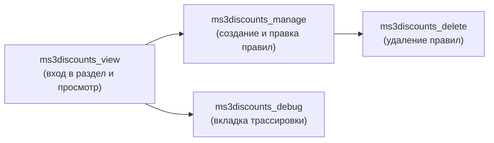

# Системные настройки

Системные настройки MODX содержат ключи с префиксом `ms3discounts_`.

## Движок

| Ключ | Тип | По умолчанию | Описание |
| --- | --- | --- | --- |
| `ms3discounts_enabled` | да/нет | да | Включение работы плагина пересчёта цен в draft-корзине MiniShop3. |
| `ms3discounts_debug` | да/нет | нет | Служебный ключ конфигурации. Доступ к трассировке расчётов в панели управления регулируется правом `ms3discounts_debug`. |
| `ms3discounts_round_precision` | число | `2` | Количество знаков после запятой при округлении цен и скидок. |
| `ms3discounts_log_level` | число | `1` | Числовой уровень системных сообщений компонента. |

## Витрина

| Ключ | Тип | По умолчанию | Описание |
| --- | --- | --- | --- |
| `ms3discounts_frontend_css` | строка | `[[+assetsUrl]]css/web/default.css` | Путь к CSS бейджа и таймера. Значение `0` или пустая строка отключает подключение стилей. |
| `ms3discounts_frontend_js` | строка | `[[+assetsUrl]]js/web/default.js` | Путь к JS таймера обратного отсчёта `.ms3d_remains`. Значение `0` или пустая строка отключает скрипт. |

В путях поддерживаются плейсхолдеры: `[[+assetsUrl]]` заменяется на путь к `assets/components/ms3discounts/`, `[[+cssUrl]]` — на подкаталог `css/`, `[[+jsUrl]]` — на подкаталог `js/`.

Сниппеты витрины по умолчанию используют стили и скрипты из этих настроек. Для отключения стилей на конкретной странице передайте `&frontend_css='0'`.

## Права доступа

<!-- MEDIA: screenshot-admin | nice | Политика доступа ms3DiscountsManagerPolicy в настройках MODX | Открыть Настройки → Управление доступом → Политики доступа -->
<!--  -->

Пакет поставляет шаблон прав `ms3DiscountsPolicyTemplate` и политику `ms3DiscountsManagerPolicy`, содержащую четыре права:

| Право | Назначение |
| --- | --- |
| `ms3discounts_view` | Доступ к разделу меню «Компоненты → Скидки», просмотр списка и деталей акций. |
| `ms3discounts_manage` | Создание, редактирование, копирование и сохранение правил скидок. |
| `ms3discounts_delete` | Удаление правил скидок по отдельности и через массовые операции. |
| `ms3discounts_debug` | Просмотр вкладки пошаговой трассировки расчёта условий в панели превью. |

По умолчанию политика при установке назначается группе пользователей «Администраторы» для контекста `mgr`.
