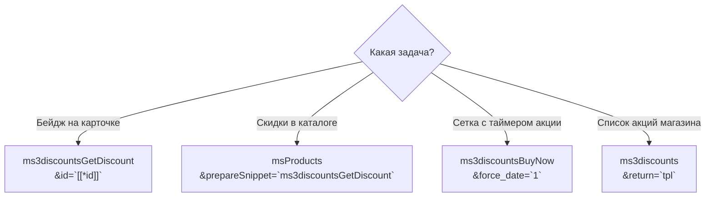

# Сниппеты ms3Discounts

<!-- MEDIA: screenshot-front | nice | Витрина с товарами со скидкой и блоком акций | Открыть главную страницу или каталог на тестовом стенде -->
<!--  -->

Пакет содержит три сниппета для отображения скидок и подборок на витрине магазина.

| Сниппет | Назначение |
| --- | --- |
| [ms3discountsGetDiscount](ms3discountsGetDiscount) | Бейдж на карточке товара или `prepareSnippet` для вызова `msProducts` |
| [ms3discountsBuyNow](ms3discountsBuyNow) | Выборка товаров по акциям и запуск `msProducts` с таймером |
| [ms3discounts](ms3discounts) | Список действующих акций каталога или все скидки конкретного товара |

Для работы скидок в корзине вызывать сниппеты не нужно. Корзину пересчитывает системный плагин: [Интеграция](../integration).

Управление правилами и условиями витрины выполняется в панели управления: [Панель управления](../manager).

## Порядок на типовой странице

1. Карточка товара: вызов `ms3discountsGetDiscount` с параметром `id` текущего ресурса.
2. Каталог: запуск `msProducts` с параметром `prepareSnippet=ms3discountsGetDiscount`.
3. Подборка «Успей купить»: вызов `ms3discountsBuyNow` с таймером окончания акций.
4. Список акций: вызов `ms3discounts` с параметром `return=tpl`.

Вызывайте сниппеты некэшированными (`[[!...]]` или `{'!...' | snippet}`).
