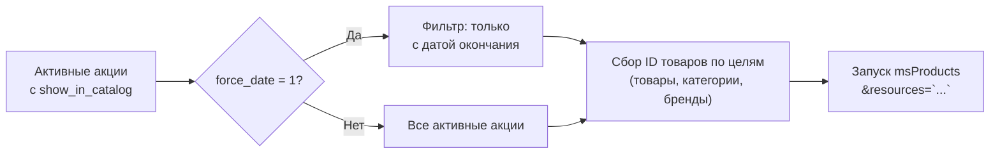

# Сниппет ms3discountsBuyNow

<!-- MEDIA: screenshot-front | must | Сетка акционных товаров с таймером обратного отсчёта | Вызвать ms3discountsBuyNow на промо-странице -->
<!--  -->

Сниппет находит товары, попадающие под действующие акции с включённым флагом `show_in_catalog`, передаёт список ID в сниппет `msProducts` и возвращает готовую разметку подборки.



Как сниппет собирает товары по целям правила:

- `product` — конкретные ID товаров добавляются напрямую.
- `category` — добавляются товары категорий (включая основные категории и связи `msCategoryMember`).
- `vendor` — добавляются все товары указанных производителей.

Акции со сферой «Весь каталог» без явного указания включаемых целей в выборку сниппета не попадают. Это предотвращает случайную выгрузку всего каталога магазина.

По умолчанию сниппет передаёт в `msProducts` параметры `parents=0` и `tpl=tpl.ms3discounts.buynow.row`. Скидочные цены в подборке пересчитывает плагин, бейдж выводится вызовом `ms3discountsGetDiscount` в чанке строки.

## Параметры

| Параметр | По умолчанию | Описание |
| --- | --- | --- |
| `sale` | пусто | Список ID акций через запятую для фильтрации |
| `force_date` | `1` | `1` — отбирать только акции с заполненной датой окончания `date_end`. `0` — отбирать любые акции |
| `tpl` | `tpl.ms3discounts.buynow.row` | Имя чанка строки товара для `msProducts` |
| `frontend_css` | из настроек | Путь к CSS-файлу витрины |
| `frontend_js` | из настроек | Путь к JS-файлу таймера |

Все остальные переданные параметры (например `limit`, `sortby`, `where`, `parents`) без изменений передаются в `msProducts`.

Если подходящих товаров не найдено, сниппет возвращает пустую строку и не запускает `msProducts`.

## Работа таймера

Чанк по умолчанию `tpl.ms3discounts.buynow.row` содержит разметку таймера с классом `.ms3d_remains` и атрибутом `data-remain`:

```fenom
<span class="ms3d_remains" data-remain="{$remains}"></span>
```

Скрипт `default.js` автоматически запускает обратный отсчёт времени до окончания акции.

## Примеры вызова

Вывод 8 акционных товаров со сроком действия:

::: code-group

```fenom
{'!ms3discountsBuyNow' | snippet : [
  'force_date' => 1,
  'limit' => 8,
]}
```

```modx
[[!ms3discountsBuyNow?
  &force_date=`1`
  &limit=`8`
]]
```

:::

Выборка товаров конкретной акции по её ID:

::: code-group

```fenom
{'!ms3discountsBuyNow' | snippet : [
  'sale' => 5,
  'limit' => 12,
]}
```

```modx
[[!ms3discountsBuyNow?
  &sale=`5`
  &limit=`12`
]]
```

:::
