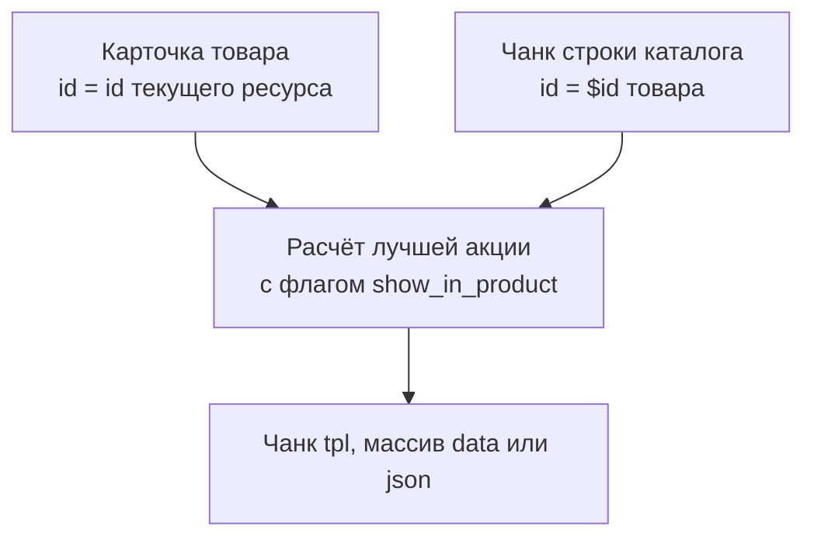

# Сниппет ms3discountsGetDiscount

<!-- MEDIA: screenshot-front | must | Бейдж скидки на карточке товара с ценами до и после скидки | Открыть товар со скидкой на витрине -->
<!--  -->

Сниппет рассчитывает лучшую доступную скидку для одного товара и выводит бейдж через чанк.



Если товару подходит сразу несколько акций, сниппет выбирает правило с наибольшей суммой скидки, а при равенстве сумм — с наибольшим процентом. Расчёт учитывает группы авторизованного пользователя и скидки, активированные в текущей сессии через `ms3discounts_activator`.

## Параметры

| Параметр | По умолчанию | Описание |
| --- | --- | --- |
| `id` | ID текущего ресурса | ID товара MiniShop3. Доступен алиас `product` |
| `sale` | пусто | Список ID акций через запятую. Если не указан, сниппет проверяет плейсхолдер `ms3discounts.sale` (его автоматически выставляет `ms3discountsBuyNow`). Если плейсхолдер пуст, проверяются все активные акции |
| `tpl` | `tpl.ms3discounts.get` | Имя чанка для отображения бейджа |
| `return` | `tpl` | Формат возврата: `tpl` (разметка чанка), `data` (массив данных), `json` (строка JSON) |
| `frontend_css` | пусто | Путь к CSS. Пустая строка использует системную настройку `ms3discounts_frontend_css`. Значение `0` отключает регистрацию стилей |
| `frontend_js` | пусто | Путь к JS. Пустая строка использует настройку `ms3discounts_frontend_js`. Значение `0` отключает регистрацию скрипта |

Для точного расчёта без обращения к базе данных можно передать параметры товара вручную: `price`, `category_ids`, `vendor_id`, `article`, `count`, `options`. Если они не переданы, сниппет запрашивает снимок товара из каталога MiniShop3.

## Плейсхолдеры чанка

| Поле | Смысл |
| --- | --- |
| `sale_discount` | Процент скидки (если больше 0), иначе сумма скидки |
| `remains` | Количество секунд до даты окончания акции `date_end` |
| `price` | Итоговая цена товара с учётом скидки |
| `base_price` | Исходная цена товара до применения скидки |
| `discount` | Сумма скидки в валюте магазина |
| `percent` | Процент скидки |
| `name` | Название применённого правила скидки |
| `id` | ID применённой акции |
| `date_end` | Дата окончания акции в формате `YYYY-MM-DD HH:mm:ss` |
| `potential` | Флаг наличия условий корзины, которые не могут быть проверены на витрине |
| `idx` | Порядковый номер строки начиная с 0 (при выводе через чанк) |

## Примеры вызова

Вывод бейджа на карточке товара:

::: code-group

```fenom
{'!ms3discountsGetDiscount' | snippet : [
  'id' => $_modx->resource.id,
  'tpl' => 'tpl.ms3discounts.get',
]}
```

```modx
[[!ms3discountsGetDiscount?
  &id=`[[*id]]`
  &tpl=`tpl.ms3discounts.get`
]]
```

:::

## Скидки в каталоге msProducts

Цены в списке товаров пересчитываются без дополнительных вызовов: плагин ms3Discounts подписан на событие `msOnGetProductPrice`, поэтому в чанке строки `msProducts` поле `price` уже содержит цену со скидкой, `old_price` — базовую цену, а `discount` — готовый процент. Простой бейдж собирается без сниппета:

```fenom
{if $discount > 0}
  <span class="badge">−{$discount}%</span>
  <s>{$old_price}</s> {$price}
{/if}
```

Для бейджа с названием акции и таймером вызовите сниппет в чанке строки с `id` товара:

```fenom
{'!ms3discountsGetDiscount' | snippet : ['id' => $id]}
```

::: warning Не используйте prepareSnippet
Параметр `prepareSnippet=ms3discountsGetDiscount` у `msProducts` не обогащает строки: pdoTools передаёт поля товара во вложенном ключе `row`, а сниппет ожидает их в корне параметров. Вызов завершается молча, поля скидки в строке не появляются.
:::
