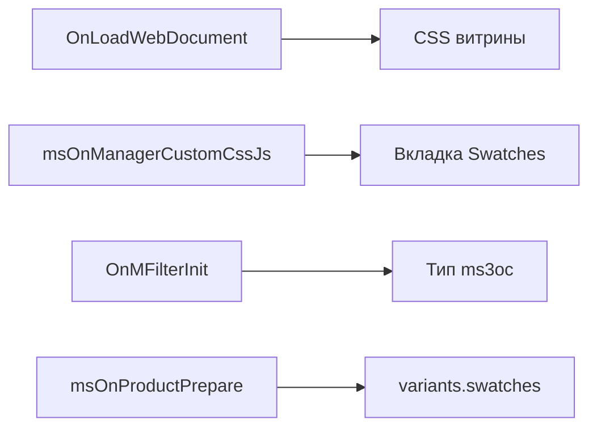
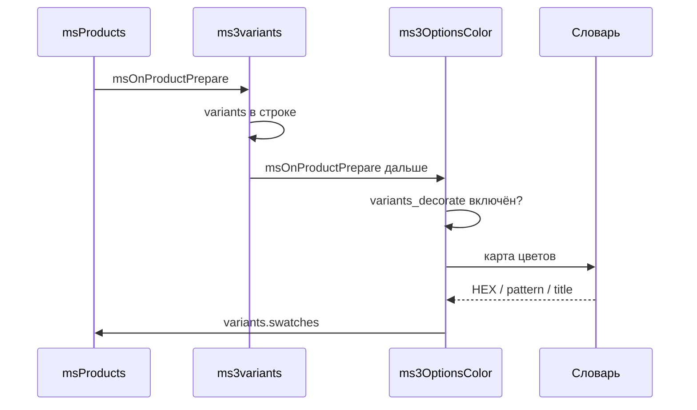
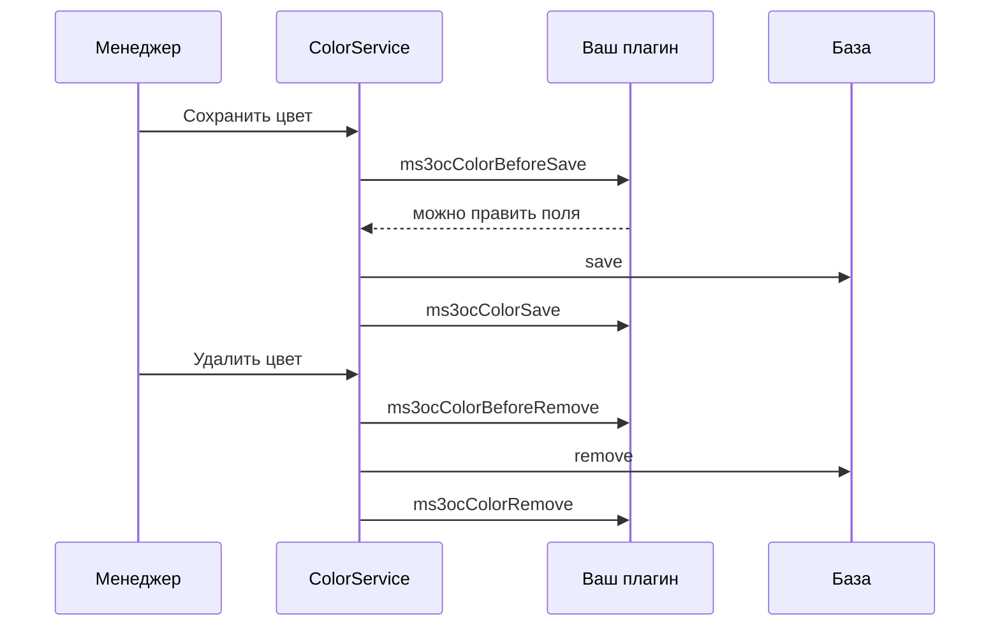

# События

## Подписки плагина

Плагин **ms3OptionsColor** слушает:

| Событие | Действие |
| --- | --- |
| `OnLoadWebDocument` | Подключает стили свотчей на сайте, если включён `ms3optionscolor_frontend_css` |
| `msOnManagerCustomCssJs` | Вкладка Swatches и квадраты цвета в чипах опции на карточке товара |
| `OnMFilterInit` | Регистрирует тип фильтра `ms3oc` |
| `msOnProductPrepare` | Добавляет цвета из словаря в варианты каталога (после ms3variants) |



Свою логику вешайте отдельным плагином. На `OnMFilterInit` зарегистрируйте другой type-ключ. Не перетирайте `ms3oc`, если хотите параллельный тип.

### Дополнение вариантов ms3variants

Пакет не создаёт варианты и не меняет цену, остаток или `_variant_id`. Он только дополняет уже готовый список вариантов от ms3variants:



1. Смотрит настройку `ms3optionscolor_variants_decorate`.
2. Если в строке каталога есть `variants`, один раз за запрос читает словарь цветов.
3. Для совпавших ключа и значения пишет в `swatches` поля `color`, `pattern`, `title`.
4. Обновляет `variants_json` для чанка.

В листинге нужен `usePackages=ms3Variants`. Пример разметки: [ms3variants](ms3variants).

## События словаря

При сохранении и удалении цвета в словаре вызываются:



| Событие | Когда | Параметры |
| --- | --- | --- |
| `ms3ocColorBeforeSave` | до записи в БД | объект `color`, исходные данные `data` |
| `ms3ocColorSave` | после успешной записи | объект `color` |
| `ms3ocColorBeforeRemove` | до удаления | объект `color` |
| `ms3ocColorRemove` | после удаления | объект `color` |

Отменить сохранение через returnedValues нельзя. В `BeforeSave` можно менять поля объекта `$color`. Исходный массив остаётся в `data`. После записи смотрите итоговый объект в `ms3ocColorSave`.

## Пример плагина

::: code-group

```php
<?php
/** @var modX $modx */
switch ($modx->event->name) {
    case 'ms3ocColorBeforeSave':
        /** @var xPDOObject $color */
        $color = $modx->getOption('color', $scriptProperties);
        if ($color && $color->get('title') === '') {
            $color->set('title', $color->get('value'));
        }
        break;
}
```

:::

Свою подписку добавьте в **Элементы → Плагины → Системные события**.
