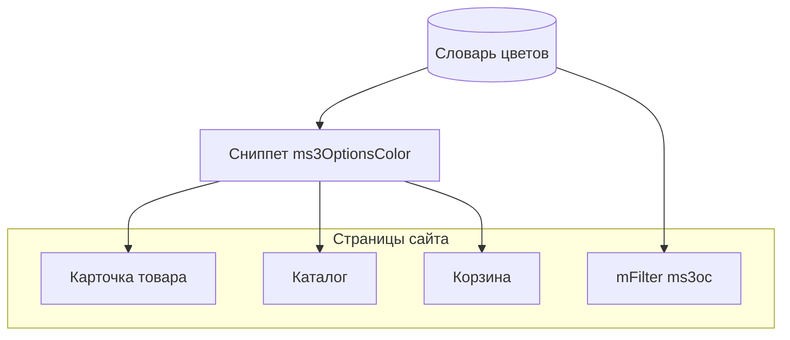
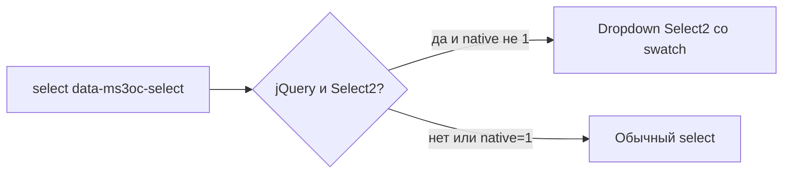

# Вывод на сайте

На витрине вы рисуете свотчи сниппетом `ms3OptionsColor`, select чанком `tplMs3OptionsColorSelect`, фильтр типом `ms3oc`. Параметры сниппета и список чанков: [Сниппеты](snippets/). Стили завязаны на data-атрибуты (`[data-ms3oc-swatch]`, `[data-empty]`, `[data-size]`…), а не на обязательные CSS-классы.



## CSS и JS

При `ms3optionscolor_frontend_css=Да` плагин и сниппет сами подключают `css/web/main.css`. Select нужен отдельно:

::: code-group

```fenom
<link rel="stylesheet" href="{'assets_url' | option}components/ms3optionscolor/css/web/main.css">
<script src="{'assets_url' | option}components/ms3optionscolor/js/web/select.js"></script>
```

```modx
<link rel="stylesheet" href="[[++assets_url]]components/ms3optionscolor/css/web/main.css">
<script src="[[++assets_url]]components/ms3optionscolor/js/web/select.js"></script>
```

:::

`select.js` ищет `[data-ms3oc-select]`. При наличии jQuery + Select2 строит dropdown со swatch. Иначе остаётся обычный `<select>` с `data-ms3oc-select-plain` (параметр `native=1` / `data-ms3oc-native`).



Размер свотча задаёте атрибутом `data-size`: `sm`, `md`, `lg`. Без атрибута размер 1.75rem.


## Страница товара

::: code-group

```fenom
{'!ms3OptionsColor' | snippet : [
  'product' => $_modx->resource.id,
  'options' => 'color',
  'tpl' => 'tplMs3OptionsColor'
]}
```

```modx
[[!ms3OptionsColor?
  &product=`[[*id]]`
  &options=`color`
  &tpl=`tplMs3OptionsColor`
]]
```

:::

Штатный `tplMs3OptionsColor` рисует `<span data-ms3oc-swatch>` с `data-color`, `data-pattern`, `data-ral`, `data-status`. Пустой свотч получает `data-empty`.

Параметры и поля строки: [сниппет ms3OptionsColor](snippets/ms3OptionsColor).

### Select

::: code-group

```fenom
{$_modx->getChunk('tplMs3OptionsColorSelect', [
  'product' => $_modx->resource.id,
  'option_key' => 'color',
  'caption' => 'Цвет',
  'placeholder' => 'Выберите цвет',
  'native' => 1
])}
```

```modx
[[$tplMs3OptionsColorSelect?
  &product=`[[*id]]`
  &option_key=`color`
  &caption=`Цвет`
  &placeholder=`Выберите цвет`
  &native=`1`
]]
```

:::

Чанк внутри вызывает сниппет с `tplMs3OptionsColorSelectOption`. Параметры `tpl` / `optionTpl` переопределяют чанк одной option. Имя поля формы: `options[color]` (или ваш `option_key`).

| Параметр чанка | Назначение |
| --- | --- |
| `product` | ID товара |
| `option_key` | Ключ опции, по умолчанию `color` |
| `caption` | Подпись label |
| `placeholder` | Пустая option в начале |
| `native` | `1` отключает Select2 |
| `selected` / `selectedValue` | Предвыбранное value |
| `activeOnly` / `includeUnset` | Как у сниппета |
| `multiple` / `required` | Атрибуты `<select>` |
| `field_id` | id элемента |

## Каталог

На листинге передайте ID товара строки:

::: code-group

```fenom
{'!ms3OptionsColor' | snippet : [
  'product' => $id,
  'options' => 'color',
  'tpl' => 'tplMs3OptionsColor',
  'limit' => 6
]}
```

```modx
[[!ms3OptionsColor?
  &product=`[[+id]]`
  &options=`color`
  &tpl=`tplMs3OptionsColor`
  &limit=`6`
]]
```

:::


## byOptions

Когда значения уже есть (корзина, свой JSON), не читайте опции товара из БД:

::: code-group

```fenom
{set $colors = $_modx->runSnippet('!ms3OptionsColor', [
  'product' => $product.id,
  'byOptions' => json_encode($product.options),
  'return' => 'data'
])}
```

```modx
[[!ms3OptionsColor?
  &product=`[[+id]]`
  &byOptions=`{"color":["Синий","Чёрный"]}`
  &return=`data`
]]
```

:::

`byOptions` это JSON-строка. В чанке корзины удобнее Fenom/`runSnippet`. В тегах MODX передайте уже сериализованный JSON.

## Корзина

Пример-чанк `tplMs3OptionsColorCart` показывает три ветки:

| Строка корзины | Поведение |
| --- | --- |
| Есть `options._variant_id` | Read-only swatch `color` (+ label `size` при наличии). Без color swatch-блок не рендерится. **Нет** `cart/changeOption`. Ссылка «изменить вариант» ведёт на PDP `?variant=ID` |
| Bundle (`options.msbundles` / `bundle_hash`) | Read-only. Swatch при `options.color`. Иначе один цвет из `product.color` или все цвета товара. **Нет** `cart/changeOption` |
| Обычная позиция | Если у товара есть опция `color`, `<select>` + `cart/changeOption` показывается даже без `options.color` в строке. Inline swatch и подпись только когда цвет уже выбран. Select размера только если `options.size` уже задан |

CSS витрины должен быть подключён. Иначе swatch в корзине часто остаётся с нулевой шириной.

Display-контракт чанка: color swatch и size label. Прочие ключи опций не выводятся. Identity варианта (`_variant_id`, цена, canonical options) остаётся у ms3variants.

Подключите чанк в шаблоне строки `tpl.msCart` под названием товара или замените своим на основе тех же веток.

## mFilter и ms3variants

Отдельные разделы:

- [mFilter](mfilter) — тип фильтра `ms3oc`, Filter Set, чанк ряда
- [ms3variants](ms3variants) — `variants[].swatches` в каталоге

## Свой чанк свотча

Минимальный контракт для CSS и select:

::: code-group

```fenom
<span data-ms3oc-swatch
      {if !$color && !$pattern}data-empty{/if}
      {if $pattern}data-has-pattern{/if}
      title="{($title ?: $value) | escape}"
      data-option="{$option_key | escape}"
      data-value="{$value | escape}"
      data-color="{if $color}#{$color | escape}{/if}"
      data-pattern="{$pattern | escape}"
      data-ral="{$ral | escape}"
      data-status="{$status ?: 'active'}"
      style="{if $color}background-color:#{$color | escape};{/if}{if $pattern}background-image:url('{$pattern | escape}');background-size:cover;{/if}">
</span>
```

```modx
<span data-ms3oc-swatch[[+color:empty=`[[+pattern:empty=` data-empty`]]`]][[+pattern:notempty=` data-has-pattern`]]
      title="[[+title:default=`[[+value]]`]]"
      data-option="[[+option_key]]"
      data-value="[[+value]]"
      data-color="[[+color:notempty=`#[[+color]]`]]"
      data-pattern="[[+pattern]]"
      data-ral="[[+ral]]"
      data-status="[[+status:default=`active`]]"
      style="[[+color:notempty=`background-color:#[[+color]];`]][[+pattern:notempty=`background-image:url('[[+pattern]]');background-size:cover;`]]"></span>
```

:::

Классы темы можно менять. JS select и штатный CSS опираются на `data-ms3oc-*`. Штатные чанки пакета написаны на Fenom.
