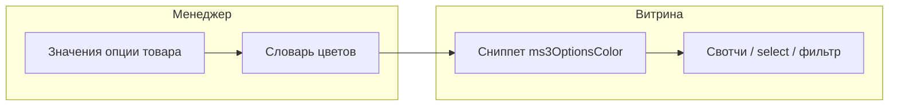

# ms3OptionsColor

С ms3OptionsColor вы назначаете цвет, паттерн или RAL значениям опций [miniShop3](/components/minishop3/) и показываете свотчи на витрине, в select, в фильтре и в корзине. Словарь общий: пара `option_key` + `value` одна на весь каталог. Назначили `color=Синий` один раз, и тот же свотч появится на всех товарах с этим значением.

С чего начать: [Быстрый старт](quick-start).

## Возможности

### Менеджер

CMP на Vue 3 и PrimeVue (через VueTools): вкладки **Словарь** и **RAL**. Поиск по ключу и значению, фильтр статуса, диалог HEX / паттерн / RAL.

На карточке товара вкладка **Swatches** рядом со «Свойства товара». Сначала задаёте значения опции, потом назначаете свотч. В чипах опции скрипт рисует квадрат цвета.

### Витрина

Сниппет `ms3OptionsColor` и Fenom-чанки. CSS витрины подключается сам, если включена настройка `ms3optionscolor_frontend_css`. Select со swatch работает через Select2 или обычный `<select>`.

### mFilter и ms3variants

Тип фильтра `ms3oc` рисует свотчи из словаря и не подменяет встроенный тип `colors`. Если стоит [ms3variants](/components/ms3variants/), в каталоге у вариантов можно показать цвета из словаря. Подробнее: [mFilter](mfilter), [ms3variants](ms3variants).

## Требования

| Компонент | Версия |
| --- | --- |
| MODX Revolution | ≥ 3.0.3 |
| miniShop3 | корзина, опции товара, API менеджера |
| VueTools | ≥ 1.1.2-pl |
| pdoTools | 3.x |
| PHP | ≥ 8.2 |
| mFilter | опционально, для типа `ms3oc` |
| ms3variants | опционально: цвета вариантов в каталоге |

## Установка

1. Установите **ms3OptionsColor** через **Система → Управление пакетами**.
2. Очистите кэш MODX.
3. Убедитесь, что у роли менеджера есть право `msproduct_save` (как у сохранения товара miniShop3). Отдельных ACL-ключей пакет не создаёт.
4. Откройте **Компоненты → ms3OptionsColor**. Словарь должен открыться без белого экрана и ошибок VueTools.

При установке пакет сам готовит базу под словарь цветов и справочник RAL Classic, подключает раздел в менеджере и плагин для вкладки товара, витрины и фильтра. Пошагово с первым swatch: [Быстрый старт](quick-start).

## Элементы пакета

| Тип | Имя | Назначение |
| --- | --- | --- |
| Сниппет | `ms3OptionsColor` | Свотчи, option для select, `return=data` |
| Плагин | `ms3OptionsColor` | Вкладка товара, CSS витрины, фильтр mFilter, цвета в вариантах каталога |
| Чанки | `tplMs3OptionsColor*` | Витрина, select, корзина, mFilter |
| Меню | `ms3OptionsColor` | CMP словаря и RAL |

## Куда дальше

| Задача | Раздел |
| --- | --- |
| Первый swatch за 15 минут | [Быстрый старт](quick-start) |
| Ключи `ms3optionscolor_*` | [Системные настройки](settings) |
| Select, корзина, CSS/JS | [Вывод на сайте](frontend) |
| Параметры сниппета и чанки | [Сниппеты](snippets/) |
| Фильтр каталога `ms3oc` | [mFilter](mfilter) |
| Цвета вариантов в каталоге | [ms3variants](ms3variants) |
| CMP и вкладка товара | [Обзор менеджера](interface/) |
| Flow A–I со скриншотами | [Сценарии](interface/flows) |
| События словаря и плагина | [События](events) |
| Типовые ошибки | [FAQ](faq) |
