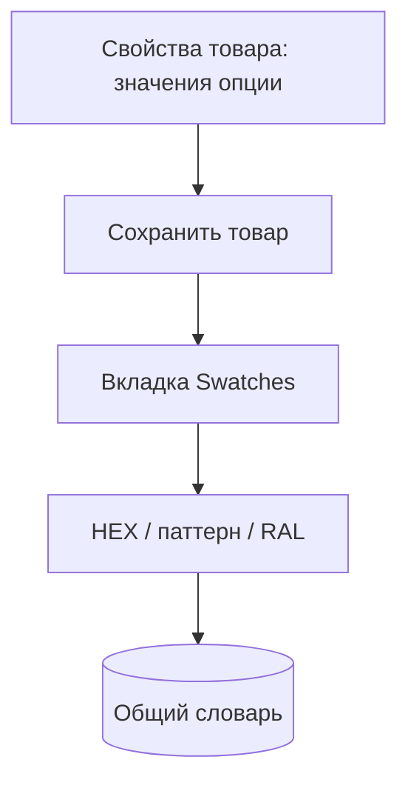

# Обзор менеджера

Раздел **Компоненты → ms3OptionsColor** открывается из меню или по ссылке `manager/?a=index&namespace=ms3optionscolor`. Интерфейс на Vue 3 и PrimeVue через VueTools.

Пошаговые сценарии: [Сценарии](flows).

## Как работает раздел

Список словаря и вкладка **Swatches** сохраняют данные через connector miniShop3, а не отдельным URL. Так задумано: на части хостингов прямой адрес API отвечает 404. Нужны установленный miniShop3 и право `msproduct_save` у менеджера.

## Экран CMP

Сверху вниз:

1. Заголовок и краткое описание.
2. Вкладки **Словарь** и **RAL** (если включён `ms3optionscolor_ral_enabled`).
3. Таблица с поиском, фильтром статуса и действиями.

### Словарь

| Действие | Как |
| --- | --- |
| Поиск | Поле «Поиск значения или ключа» (без учёта регистра, в т.ч. кириллица) |
| Фильтр статуса | все / не задан / активен / выключен |
| Править / назначить | Иконка карандаша в строке |
| Удалить | В диалоге кнопка **Удалить** с confirm |

Словарь общий: пара `option_key` + `value` одна на весь каталог.

### RAL

Вкладка **RAL**: поиск по коду и названию, **Добавить**, правка строки.

### Диалог цвета

В диалоге задаёте HEX (полоска + RGB/HSV), URL паттерна, RAL, title, activity. Переключатель режимов: **Цвет** / **Паттерн**.

Выбор RAL подставляет его HEX. Если изменить HEX вручную или сохранить режим **Паттерн**, форма очищает связь с прежним RAL, чтобы код и цвет не расходились.

При сохранении URL паттерна и поля «Изображение» пакет нормализует путь: `/assets/…` остаётся путём от корня сайта, полный URL этого же сайта становится относительным, внешние HTTPS/CDN URL сохраняются как есть.

## Вкладка товара Swatches

На `product_create` / `product_update` плагин регистрирует вкладку **Swatches** среди Vue-вкладок товара.

Порядок работы:

1. На **Свойства товара** добавьте значения опции (`color` или ключи из `ms3optionscolor_default_option_key`).
2. Сохраните товар.
3. На **Swatches** назначьте HEX / pattern / RAL значениям со статусом «не задано».

Подсказки из `comboColors` miniShop3 подставляются в UI. Пакет не пишет цвет в `msOption.properties`.

На вкладке **Свойства товара** скрипт `product-option-swatch.js` рисует квадрат свотча в чипах опции. Запрос `/map` идёт тем же connector miniShop3.

## Ограничения

- Без VueTools раздел менеджера и вкладка товара не откроются.
- Без права `msproduct_save` словарь не сохранится.
- Тип фильтра `ms3oc` появится только если установлен mFilter.
