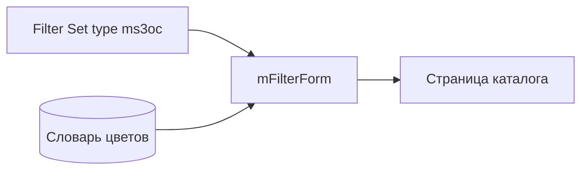

# mFilter

Пакет добавляет тип фильтра **`ms3oc`**. В каталоге покупатель видит квадраты цвета из словаря, а не голый список значений. Встроенный тип mFilter `colors` пакет не меняет.

Нужен установленный [mFilter](/components/mfilter/). Без него событие `OnMFilterInit` не сработает и типа `ms3oc` не будет.



## Настройка Filter Set

1. Создайте **Filter Set** в mFilter и привяжите к странице каталога.
2. В JSON набора добавьте фильтр по опции:

```json
{
  "color": {
    "type": "ms3oc",
    "source": "option",
    "field": "color",
    "label": "Цвет",
    "tpl": "tplMFilterMs3OptionsColor",
    "multiple": true
  }
}
```

| Поле | Назначение |
| --- | --- |
| `type` | Всегда `ms3oc` для свотчей из словаря |
| `source` | Обычно `option` |
| `field` | Ключ опции miniShop3, чаще `color` |
| `label` | Подпись блока на витрине |
| `tpl` | Чанк строки: штатный `tplMFilterMs3OptionsColor` или свой |
| `multiple` | Несколько значений сразу |

Ключ объекта (`"color"` в примере) должен совпадать с тем, что передаёте в `mFilterForm` как `filters`.

## Вызов на странице

Сначала сниппет результатов (`mFilter` / `baseIds`), затем форма:

::: code-group

```fenom
{'!mFilterForm' | snippet : [
  'filters' => 'color',
  'tplItem' => 'tplMFilterMs3OptionsColor'
]}
```

```modx
[[!mFilterForm?
  &filters=`color`
  &tplItem=`tplMFilterMs3OptionsColor`
]]
```

:::

Параметры `mFilter` / `mFilterForm` зависят от вашей сборки. См. [сниппеты mFilter](/components/mfilter/snippets/). Важно для ms3OptionsColor:

- в Filter Set указан `"type": "ms3oc"`;
- `filters` совпадает с ключом в JSON набора;
- `mFilterForm` отдаёт в item `hex` / `pattern` / `ral` (или плоские `$hex`, `$pattern`, `$ral`);
- при необходимости явно задайте `&tplItem=tplMFilterMs3OptionsColor`.


## Чанк `tplMFilterMs3OptionsColor`

Штатный чанк рисует checkbox, свотч и подпись. Два формата данных:

| Источник | Поля |
| --- | --- |
| demo / ручной вызов | `$item.value`, `$item.label`, `$item.hex`, `$item.pattern`, `$item.ral`, `$item.count`, `$item.selected` |
| mFilterForm | плоские `$value`, `$label`, `$hex`, `$pattern`, `$ral`, `$count`, `$active` |

Минимальный свой ряд (Fenom):

```fenom
<label data-ms3oc-filter{if $active?} data-selected{/if}>
  <input type="checkbox" name="{$key}[]" value="{$value | escape}" {if $active?}checked{/if}>
  <span data-ms3oc-swatch data-size="sm"
        {if !$hex && !$pattern}data-empty{/if}
        style="{if $hex}background-color:{$hex};{/if}{if $pattern}background-image:url('{$pattern}');{/if}"></span>
  <span data-ms3oc-filter-label>{$label ?: $value}</span>
  <span data-ms3oc-filter-count>{$count}</span>
</label>
```

CSS витрины (`ms3optionscolor_frontend_css`) должен быть включён, иначе свотч в фильтре часто без размера.

## Типичные ошибки

| Симптом | Что проверить |
| --- | --- |
| Нет свотчей, только текст | В Filter Set стоит `colors`, а не `ms3oc` |
| Тип `ms3oc` не находится | Установлен mFilter, очищен кэш, плагин подписан на `OnMFilterInit` |
| Пустые квадраты | В словаре нет HEX/pattern для значений опции |
| Нет стилей | `ms3optionscolor_frontend_css` или ручной `<link>` на `css/web/main.css` |

Сценарий со скриншотом: [Flow G](interface/flows#flow-g-фильтр-каталога-mfilter). Общая витрина: [Вывод на сайте](frontend).
