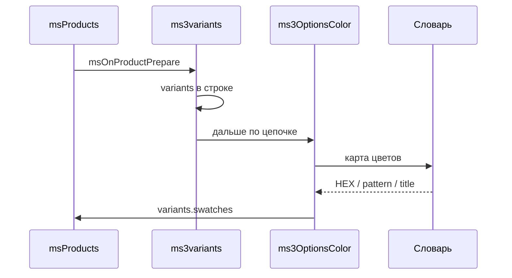

# ms3variants

Если установлен [ms3variants](/components/ms3variants/), ms3OptionsColor может дописать к каждому варианту в каталоге цвет из словаря. Пакет не создаёт варианты и не меняет цену, остаток или `_variant_id`. Он только обогащает уже готовый список.



## Что нужно

1. Установлен ms3variants.
2. В листинге задано `usePackages=ms3Variants`.
3. Настройка `ms3optionscolor_variants_decorate` = Да.
4. У варианта в `options` есть ключ из `ms3optionscolor_default_option_key` (например `color`) с точным совпадением значения со словарём.

Отключить: `ms3optionscolor_variants_decorate` = Нет. Тогда варианты остаются как у ms3variants, без `swatches`.

## Вызов листинга

::: code-group

```fenom
{'!msProducts' | snippet : [
  'parents' => $_modx->resource.id,
  'usePackages' => 'ms3Variants',
  'tpl' => 'tpl.msProducts.row'
]}
```

```modx
[[!msProducts?
  &parents=`[[*id]]`
  &usePackages=`ms3Variants`
  &tpl=`tpl.msProducts.row`
]]
```

:::

После плагинов в строке каталога будут `variants`, `has_variants`, `variants_json`. OptionsColor добавит `variants[].swatches` для ключей из настройки.

## Разметка в чанке строки

Цикл по массиву вариантов удобнее в Fenom-чанке (pdoTools):

```fenom
{if $has_variants?}
  {foreach $variants as $variant}
    {set $sw = $variant.swatches.color ?: []}
    <button type="button" {if !$variant.in_stock}disabled{/if}>
      <span data-ms3oc-swatch
            {if !$sw.color && !$sw.pattern}data-empty{/if}
            {if $sw.pattern}data-has-pattern{/if}
            style="{if $sw.color}background-color:#{$sw.color};{/if}{if $sw.pattern}background-image:url('{$sw.pattern}');{/if}"></span>
      {$variant.options_array.color} / {$variant.options_array.size}
    </button>
  {/foreach}
{/if}
```

Поле `swatches.color` здесь соответствует ключу опции `color`. Если в настройке несколько ключей (`color,material`), смотрите `swatches.material` и т.д.

Структура одной записи swatch:

| Поле | Описание |
| --- | --- |
| `color` | HEX без `#` |
| `pattern` | URL паттерна |
| `title` | Подпись из словаря |
| `value` | Значение опции (есть даже без совпадения со словарём) |

Без точного совпадения `option_key` + `value` со словарём поля `color` / `pattern` / `title` остаются пустыми.

![Каталог с variants[].swatches](/components/ms3optionscolor/screenshots/storefront-variants.png)

## Только цвета товара без SKU

Если обходить варианты не нужно, в том же чанке вызовите сниппет:

::: code-group

```fenom
{'!ms3OptionsColor' | snippet : [
  'product' => $id,
  'options' => 'color',
  'tpl' => 'tplMs3OptionsColor',
  'limit' => 6
]}
```

```modx
[[!ms3OptionsColor?
  &product=`[[+id]]`
  &options=`color`
  &tpl=`tplMs3OptionsColor`
  &limit=`6`
]]
```

:::

## Корзина

Ветка с `options._variant_id` в чанке `tplMs3OptionsColorCart` показывает цвет read-only и ссылку на PDP `?variant=ID`. Смену варианта и цену по-прежнему ведёт ms3variants. Подробнее: [Вывод на сайте](frontend#корзина).

## Типичные ошибки

| Симптом | Что проверить |
| --- | --- |
| Нет `variants[].swatches` | `usePackages=ms3Variants`, настройка decorate = Да |
| Пустой `swatches.color` | Значение опции буквально совпадает со словарём |
| Нет `variants` вообще | ms3variants и параметр листинга |
| Стили свотча нулевые | `ms3optionscolor_frontend_css` |

Как устроено в событиях: [События](events#дополнение-вариантов-ms3variants). Сценарий: [Flow I](interface/flows#flow-i-цвета-вариантов-в-каталоге). Настройка: [Системные настройки](settings#ms3optionscolor_variants_decorate).
