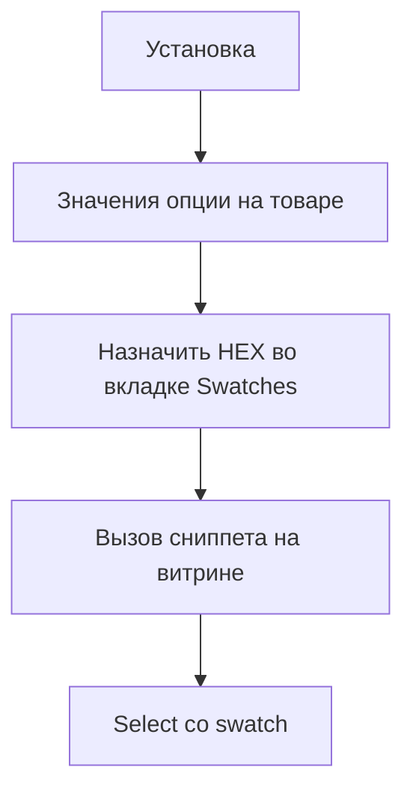

# Быстрый старт

За 15 минут вы поставите пакет, назначите HEX значению опции `color` и выведете свотчи на странице товара.



## Перед стартом

У вас уже стоят MODX 3, miniShop3, VueTools ≥ 1.1.2-pl, pdoTools и PHP 8.2+. Нужен товар с опцией `color` и хотя бы одним значением. Для вкладки Swatches и CMP у роли должно быть право `msproduct_save` (как у сохранения товара miniShop3). Отдельных ACL-ключей пакет не создаёт.

## Установка

1. Установите **ms3OptionsColor** через **Система → Управление пакетами**.
2. Очистите кэш MODX.
3. Откройте **Компоненты → ms3OptionsColor**. Список словаря должен открыться без белого экрана и ошибок VueTools.

При установке пакет сам готовит базу под словарь и RAL Classic, открывает раздел в меню и подключает плагин: вкладка товара, стили витрины, фильтр mFilter.

## Шаг 1. Откройте словарь

Прямая ссылка: `manager/?a=index&namespace=ms3optionscolor`.


Вкладка **Словарь** показывает пары ключ/значение. **RAL** открывает справочник RAL Classic, если включена настройка `ms3optionscolor_ral_enabled`.

## Шаг 2. Назначьте цвет на карточке товара

1. Откройте товар miniShop3.
2. На **Свойства товара** добавьте значения опции `color` и сохраните товар.
3. Перейдите на вкладку **Swatches**.


У значения без свотча статус «не задано». Нажмите **Назначить** / **Изменить**, укажите HEX или RAL, сохраните.

Запись пишется в общий словарь. Тот же `color=Синий` на другом товаре получит тот же свотч. На **Свойства товара** у уже назначенных значений в чипах появится квадрат цвета.


## Шаг 3. Выведите на витрину

CSS (`css/web/main.css`) подключается сам при `ms3optionscolor_frontend_css=Да`. В шаблоне товара достаточно сниппета:

::: code-group

```fenom
{'!ms3OptionsColor' | snippet : [
  'product' => $_modx->resource.id,
  'options' => 'color',
  'tpl' => 'tplMs3OptionsColor'
]}
```

```modx
[[!ms3OptionsColor?
  &product=`[[*id]]`
  &options=`color`
  &tpl=`tplMs3OptionsColor`
]]
```

:::

Если CSS отключён настройкой, добавьте `<link>` вручную:

::: code-group

```fenom
<link rel="stylesheet" href="{'assets_url' | option}components/ms3optionscolor/css/web/main.css">
```

```modx
<link rel="stylesheet" href="[[++assets_url]]components/ms3optionscolor/css/web/main.css">
```

:::


## Шаг 4. Добавьте select

Подключите `select.js` и вызовите чанк:

::: code-group

```fenom
<script src="{'assets_url' | option}components/ms3optionscolor/js/web/select.js"></script>

{$_modx->getChunk('tplMs3OptionsColorSelect', [
  'product' => $_modx->resource.id,
  'option_key' => 'color',
  'caption' => 'Цвет',
  'placeholder' => 'Выберите цвет',
  'native' => 1
])}
```

```modx
<script src="[[++assets_url]]components/ms3optionscolor/js/web/select.js"></script>

[[$tplMs3OptionsColorSelect?
  &product=`[[*id]]`
  &option_key=`color`
  &caption=`Цвет`
  &placeholder=`Выберите цвет`
  &native=`1`
]]
```

:::

С `native=1` остаётся обычный `<select>`. Без флага и при наличии jQuery + Select2 на странице скрипт соберёт dropdown со swatch.


## Дальше

- Ключи настроек: [Системные настройки](settings)
- Корзина: [Вывод на сайте](frontend)
- Параметры сниппета: [Сниппеты](snippets/)
- Фильтр каталога: [mFilter](mfilter)
- Цвета вариантов: [ms3variants](ms3variants)
- CMP и диалоги: [Обзор менеджера](interface/)
- Пошаговые сценарии: [Сценарии](interface/flows)
