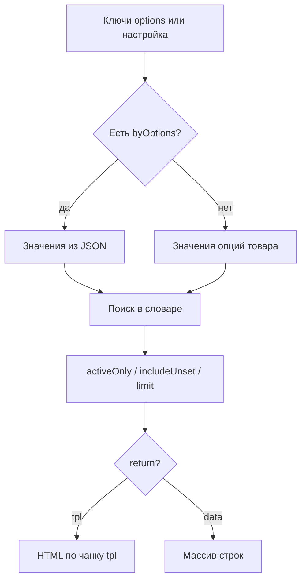

# ms3OptionsColor

Сниппет читает значения опций товара (или готовый JSON), сопоставляет их со словарём цветов и отдаёт HTML по чанку либо массив строк.

Ставьте на страницу товара, в карточку каталога или в чанк корзины. Вызов лучше некэшированный: `[[!ms3OptionsColor]]` / `{'!ms3OptionsColor' | snippet}`.

При каждом вызове сниппет может зарегистрировать CSS витрины, если включён `ms3optionscolor_frontend_css`.

## Как выбираются строки



1. Берётся список ключей опций: параметр `options` или настройка `ms3optionscolor_default_option_key`.
2. Если передан `byOptions`, значения берутся из JSON. Опции товара из БД не читаются.
3. Иначе значения читаются у товара `product` (по умолчанию текущий ресурс).
4. Каждое значение ищется в словаре. При `includeUnset=1` значения без записи тоже попадают в вывод (пустой свотч).
5. При `activeOnly=1` неактивные записи словаря скрываются.
6. `limit` обрезает список сверху.
7. При `return=tpl` каждая строка рендерится чанком `tpl`. При `return=data` возвращается массив.

## Параметры

| Параметр | По умолчанию | Описание |
| --- | --- | --- |
| `product` | id текущего ресурса | ID товара miniShop3. `0` или пусто: текущий ресурс |
| `options` | из настройки / `color` | Ключи опций через запятую, например `color` или `color,material` |
| `byOptions` | - | JSON значений опций. Если задан, товар из БД не читается |
| `tpl` | `tplMs3OptionsColor` | Чанк строки: имя в Elements или `@FILE path/to/file.tpl` |
| `return` | `tpl` | `tpl` — HTML, `data` — массив строк |
| `activeOnly` | `1` | Только активные записи словаря |
| `includeUnset` | авто | Включать значения без записи в словаре. При `byOptions` по умолчанию `1`, иначе `0` |
| `limit` | `0` | Сколько строк максимум. `0` — без ограничения |
| `selectedValue` | - | Пометить поле `selected` у строки с этим `value` (удобно для `<option>`) |
| `toPlaceholder` | - | Имя плейсхолдера. Сниппет ничего не печатает в поток |

Синоним `selected` для `selectedValue` тоже принимается.

## Поля строки

Каждая строка (и в чанке, и в `return=data`) содержит:

| Поле | Описание |
| --- | --- |
| `option_key` | Ключ опции |
| `value` | Значение опции (как в miniShop3) |
| `color` | HEX **без** `#` |
| `pattern` | URL паттерна / фона |
| `ral` | Код RAL |
| `title` | Подпись (если пусто, в чанках часто берут `value`) |
| `description` | Описание |
| `image` | Изображение |
| `active` | Активна ли запись словаря |
| `status` | `active` / `inactive` / `unset` |
| `selected` | `true`, если `value` совпал с `selectedValue` |

В CSS и select используйте `#{$color}` или `data-color="#{$color}"`: в поле лежит код без решётки.

## Примеры

### Страница товара

::: code-group

```fenom
{'!ms3OptionsColor' | snippet : [
  'product' => $_modx->resource.id,
  'options' => 'color',
  'tpl' => 'tplMs3OptionsColor'
]}
```

```modx
[[!ms3OptionsColor?
  &product=`[[*id]]`
  &options=`color`
  &tpl=`tplMs3OptionsColor`
]]
```

:::

Без `&options` сниппет возьмёт ключи из `ms3optionscolor_default_option_key`.

### Несколько ключей опций

::: code-group

```fenom
{'!ms3OptionsColor' | snippet : [
  'product' => $_modx->resource.id,
  'options' => 'color,material',
  'tpl' => 'tplMs3OptionsColor'
]}
```

```modx
[[!ms3OptionsColor?
  &product=`[[*id]]`
  &options=`color,material`
  &tpl=`tplMs3OptionsColor`
]]
```

:::

### Карточка в каталоге

В чанке строки `msProducts` передайте ID товара строки и короткий список:

::: code-group

```fenom
{'!ms3OptionsColor' | snippet : [
  'product' => $id,
  'options' => 'color',
  'tpl' => 'tplMs3OptionsColor',
  'limit' => 6
]}
```

```modx
[[!ms3OptionsColor?
  &product=`[[+id]]`
  &options=`color`
  &tpl=`tplMs3OptionsColor`
  &limit=`6`
]]
```

:::

### Показать значения без цвета в словаре

Пустой свотч (клетчатый фон в штатном CSS) удобен, пока менеджер ещё не назначил HEX:

::: code-group

```fenom
{'!ms3OptionsColor' | snippet : [
  'product' => $_modx->resource.id,
  'options' => 'color',
  'includeUnset' => 1,
  'tpl' => 'tplMs3OptionsColor'
]}
```

```modx
[[!ms3OptionsColor?
  &product=`[[*id]]`
  &options=`color`
  &includeUnset=`1`
  &tpl=`tplMs3OptionsColor`
]]
```

:::

### Скрыть неактивные и обрезать список

::: code-group

```fenom
{'!ms3OptionsColor' | snippet : [
  'product' => $_modx->resource.id,
  'options' => 'color',
  'activeOnly' => 1,
  'limit' => 4,
  'tpl' => 'tplMs3OptionsColor'
]}
```

```modx
[[!ms3OptionsColor?
  &product=`[[*id]]`
  &options=`color`
  &activeOnly=`1`
  &limit=`4`
  &tpl=`tplMs3OptionsColor`
]]
```

:::

### В плейсхолдер

::: code-group

```fenom
{'!ms3OptionsColor' | snippet : [
  'product' => $_modx->resource.id,
  'options' => 'color',
  'toPlaceholder' => 'ms3oc.swatches'
]}
<div class="product-colors">
  {$_modx->getPlaceholder('ms3oc.swatches')}
</div>
```

```modx
[[!ms3OptionsColor?
  &product=`[[*id]]`
  &options=`color`
  &toPlaceholder=`ms3oc.swatches`
]]
<div class="product-colors">
  [[+ms3oc.swatches]]
</div>
```

:::

### return=data (свой цикл)

::: code-group

```fenom
{set $rows = $_modx->runSnippet('!ms3OptionsColor', [
  'product' => $_modx->resource.id,
  'options' => 'color',
  'return' => 'data'
])}
<ul>
{foreach $rows as $row}
  <li>
    <span style="background:#{$row.color}"></span>
    {$row.title ?: $row.value}
    {if $row.ral} (RAL {$row.ral}){/if}
  </li>
{/foreach}
</ul>
```

```modx
[[!ms3OptionsColor?
  &product=`[[*id]]`
  &options=`color`
  &return=`data`
  &toPlaceholder=`ms3oc.rows`
]]
```

:::

В тегах MODX массив удобнее сразу отдать в плейсхолдер и разобрать своим сниппетом или Fenom-чанком. В Fenom цикл по результату `runSnippet` проще.

### byOptions: корзина и готовый JSON

Когда значения уже есть (строка корзины, свой JSON), не читайте опции товара из БД:

::: code-group

```fenom
{set $colors = $_modx->runSnippet('!ms3OptionsColor', [
  'product' => $product.id,
  'byOptions' => json_encode($product.options),
  'return' => 'data',
  'includeUnset' => 1
])}
{foreach $colors as $row}
  {if $row.option_key == 'color'}
    <span data-ms3oc-swatch
          style="{if $row.color}background:#{$row.color}{/if}"></span>
    {$row.value}
  {/if}
{/foreach}
```

```modx
[[!ms3OptionsColor?
  &product=`[[+id]]`
  &byOptions=`{"color":["Синий","Чёрный"]}`
  &return=`data`
  &includeUnset=`1`
]]
```

:::

`byOptions` — JSON-строка. В чанке корзины удобнее Fenom. Готовый пример веток корзины: чанк `tplMs3OptionsColorCart` на [Выводе на сайте](/components/ms3optionscolor/frontend#корзина).

### Select с выбранным значением

Чанк `tplMs3OptionsColorSelect` сам вызывает сниппет. Прямой вызов option-чанка:

::: code-group

```fenom
<select name="options[color]" data-ms3oc-select data-ms3oc-native="1">
  <option value="">Выберите цвет</option>
  {'!ms3OptionsColor' | snippet : [
    'product' => $_modx->resource.id,
    'options' => 'color',
    'tpl' => 'tplMs3OptionsColorSelectOption',
    'selectedValue' => 'Синий',
    'includeUnset' => 1
  ]}
</select>
```

```modx
<select name="options[color]" data-ms3oc-select data-ms3oc-native="1">
  <option value="">Выберите цвет</option>
  [[!ms3OptionsColor?
    &product=`[[*id]]`
    &options=`color`
    &tpl=`tplMs3OptionsColorSelectOption`
    &selectedValue=`Синий`
    &includeUnset=`1`
  ]]
</select>
```

:::

Готовый select с подписью:

::: code-group

```fenom
<script src="{'assets_url' | option}components/ms3optionscolor/js/web/select.js"></script>
{$_modx->getChunk('tplMs3OptionsColorSelect', [
  'product' => $_modx->resource.id,
  'option_key' => 'color',
  'caption' => 'Цвет',
  'placeholder' => 'Выберите цвет',
  'selectedValue' => 'Синий',
  'native' => 1
])}
```

```modx
<script src="[[++assets_url]]components/ms3optionscolor/js/web/select.js"></script>
[[$tplMs3OptionsColorSelect?
  &product=`[[*id]]`
  &option_key=`color`
  &caption=`Цвет`
  &placeholder=`Выберите цвет`
  &selectedValue=`Синий`
  &native=`1`
]]
```

:::

Параметры чанка select: `product`, `option_key`, `caption`, `placeholder`, `native`, `selected` / `selectedValue`, `activeOnly`, `includeUnset`, `multiple`, `required`, `field_id`, `tpl` / `optionTpl`.

### Свой чанк через @FILE

Путь относительно `pdotools_elements_path` (обычно `core/elements/`):

::: code-group

```fenom
{'!ms3OptionsColor' | snippet : [
  'product' => $_modx->resource.id,
  'options' => 'color',
  'tpl' => '@FILE chunk/ms3OptionsColor/tpl.option_row.tpl'
]}
```

```modx
[[!ms3OptionsColor?
  &product=`[[*id]]`
  &options=`color`
  &tpl=`@FILE chunk/ms3OptionsColor/tpl.option_row.tpl`
]]
```

:::

В имени файла допустимы точки и `_`. Сегмент `..` отклоняется. Минимальная разметка строки: [свой чанк свотча](/components/ms3optionscolor/frontend#свой-чанк-свотча).

## Частые ошибки

| Симптом | Что проверить |
| --- | --- |
| Пустой вывод | У товара есть значения опции, ключ совпадает с `options` / настройкой |
| Нет квадратов цвета | Запись в словаре и CSS (`ms3optionscolor_frontend_css`) |
| В select нет option | Чанк `tpl` должен быть `tplMs3OptionsColorSelectOption` или свой с `<option>` |
| `byOptions` ничего не даёт | JSON валидный, ключи совпадают с опциями, при необходимости `includeUnset=1` |

Дальше: [Вывод на сайте](/components/ms3optionscolor/frontend), [mFilter](/components/ms3optionscolor/mfilter), [ms3variants](/components/ms3optionscolor/ms3variants). Обзор чанков: [Сниппеты](index).
