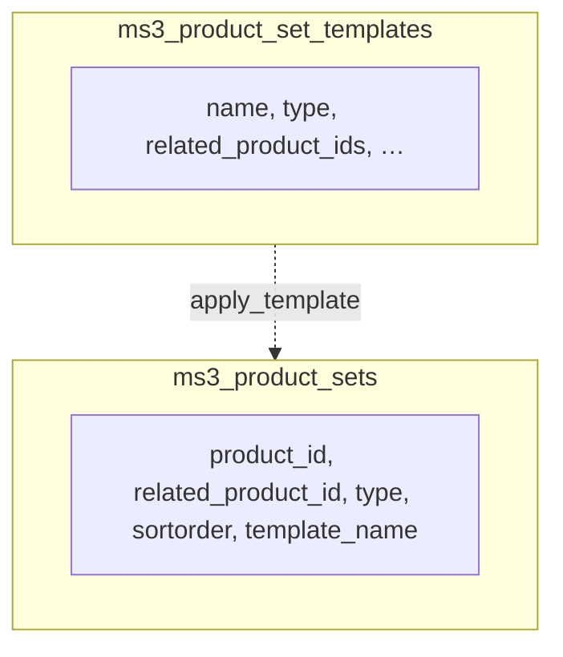

# Архитектура ms3ProductSets

Связанные страницы: [Потоки](flows), [API](api), [Типы подборок](types).

## Обзор компонентов

- **Сниппет вывода**: `ms3ProductSets`
  Формирует список ID по типу подборки и рендерит через `msProducts`.
- **Сниппет лексикона/конфига**: `mspsLexiconScript`
  Экспортирует `window.mspsLexicon` и `window.mspsConfig`.
- **Коннектор**: `assets/components/ms3productsets/connector.php`
  Единая точка для фронта и manager action-ов.
- **Helpers**: `core/components/ms3productsets/include/helpers.php`
  Общая бизнес-логика формирования подборок, шаблонов и служебных операций.
- **Плагины**:
  - `OnDocFormSave` — синхронизация TV в таблицу связей;
  - `OnResourceDelete` — очистка связей удаляемого ресурса.
- **Manager UI**: Vue-приложение в `assets/components/ms3productsets/js/mgr/`.

## Таблицы БД

Связь шаблонов массового применения с строками выдачи (логическая, `template_name` в строках ссылается на имя шаблона):

### `ms3_product_sets`

Связи для выдачи подборок.

- `product_id` — товар, на карточке которого показываем подборку
- `related_product_id` — рекомендуемый товар
- `type` — тип подборки
- `sortorder` — порядок
- `template_name` — имя шаблона, если связь создана массовым применением
- уникальный ключ: (`product_id`, `related_product_id`, `type`)

### `ms3_product_set_templates`

Шаблоны для массового применения к категориям.

- `name`
- `type`
- `related_product_ids` (строка ID через запятую)
- `sortorder`
- `description` (добавляется в upgrade-резолвере)

## Алгоритм подбора (высокоуровнево)

1. Нормализация параметров (`type`, `resource_id`, `max_items`, `exclude_ids`, чанки).
2. Запрос `msps_get_products_by_type(...)`:
  - сначала ручная подборка из `ms3_product_sets`;
  - если пусто — авто-логика по типу.
3. Если ID нет:
  - `hideIfEmpty=true` → `''`;
  - иначе рендер `emptyTpl`.
4. Если `return=ids` → вернуть CSV ID.
5. Иначе рендер через `msProducts` + опционально `tplWrapper`.

## Логика по типам

- `vip`: ручная подборка `type=vip`; fallback на `ms3productsets.vip_set_{set_id}`.
- `auto_sales`: SQL по `ms3_order_product + ms3_order` (статусы `2,4,5`), fallback на `similar`.
- `similar`: товары из той же категории (`parent`), исключая текущий/`exclude_ids`.
- `buy_together`, `cart_suggestion`: авто по категории через `msps_get_auto_recommendations`.
- `popcorn`: авто по категории; если пусто, fallback на случайные товары каталога.
- `auto`, `also-bought`, `cross-sell`, `custom`: авто по категории.

## Поток данных TV -> таблица

1. Админ заполняет TV-поля (`ms3productsets_*`) у товара.
2. `OnDocFormSave` проверяет наличие этих TV на шаблоне ресурса.
3. `msps_sync_product_sets_from_tv`:
   - если TV **заполнен** — удаляются все связи данного типа у товара, затем вставляются новые `related_product_id` с `sortorder` из TV;
   - если TV **пуст** — удаляются только записи **без** `template_name`, чтобы не затереть связи, созданные массовым применением шаблонов к категориям.

## Поток массового применения шаблона

1. Менеджер UI вызывает `apply_template`.
2. Категории разворачиваются рекурсивно до товаров (`msProduct`).
3. Шаблон читается из `ms3_product_set_templates`.
4. В `ms3_product_sets` вставляются связи с `template_name`.
5. При `replace=true` сначала удаляются все связи данного `type` у выбранных товаров.
