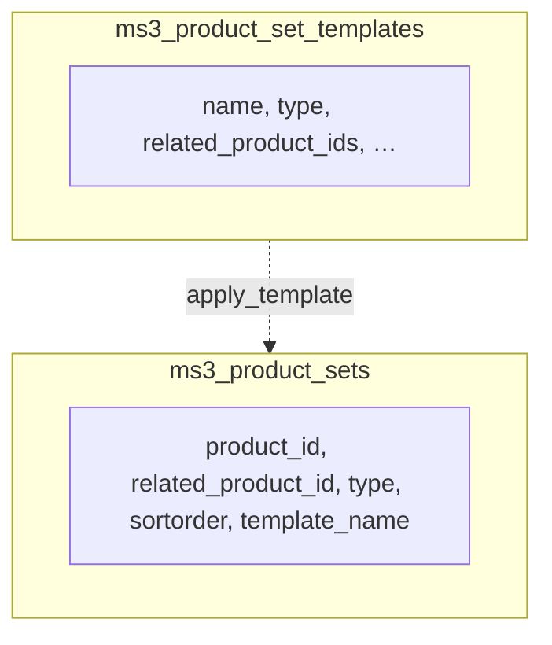

# Архитектура ms3ProductSets

Связанные страницы: [Потоки](flows), [API](api), [Типы подборок](types).

## Обзор компонентов

- **Сниппет вывода**: `ms3ProductSets`
  Формирует список ID по типу подборки и рендерит через `msProducts`.
- **Сниппет лексикона/конфига**: `mspsLexiconScript`
  Экспортирует `window.mspsLexicon` и `window.mspsConfig`.
- **Коннектор**: `assets/components/ms3productsets/connector.php`
  Единая точка для фронта и manager action-ов.
- **Helpers**: `core/components/ms3productsets/include/helpers.php`
  Общая бизнес-логика формирования подборок, шаблонов и служебных операций.
- **Плагины**:
  - `OnDocFormSave` — синхронизация TV в таблицу связей;
  - `OnResourceDelete` — очистка связей удаляемого ресурса.
- **Manager UI**: Vue-приложение в `assets/components/ms3productsets/js/mgr/`.

## Таблицы БД

Связь шаблонов массового применения с строками выдачи (логическая, `template_name` в строках ссылается на имя шаблона):

```mermaid
flowchart TB
  subgraph T["ms3_product_set_templates"]
    t["name, type, related_product_ids, …"]
  end
  subgraph S["ms3_product_sets"]
    r["product_id, related_product_id, type, sortorder, template_name"]
  end
  T -.->|apply_template| S
```

### `ms3_product_sets`

Связи для выдачи подборок.

- `product_id` — товар, на карточке которого показываем подборку
- `related_product_id` — рекомендуемый товар
- `type` — тип подборки
- `sortorder` — порядок
- `template_name` — имя шаблона, если связь создана массовым применением
- уникальный ключ: (`product_id`, `related_product_id`, `type`)

### `ms3_product_set_templates`

Шаблоны для массового применения к категориям.

- `name`
- `type`
- `related_product_ids` (строка ID через запятую)
- `sortorder`
- `description` (добавляется в upgrade-резолвере)

## Алгоритм подбора (высокоуровнево)

1. Нормализация параметров (`type`, `resource_id`, `max_items`, `exclude_ids`, чанки).
2. Запрос `msps_get_products_by_type(...)`:
  - сначала ручная подборка из `ms3_product_sets`;
  - если пусто — авто-логика по типу.
3. Если ID нет:
  - `hideIfEmpty=true` → `''`;
  - иначе рендер `emptyTpl`.
4. Если `return=ids` → вернуть CSV ID.
5. Иначе рендер через `msProducts` + опционально `tplWrapper`.

## Логика по типам

Общий порядок: ручные связи из `ms3_product_sets` → при пустоте авто (если `ms3productsets.auto_recommendation` = 1) → `exclude_ids` и лимит через `msps_apply_set_filters`.

- `vip`: ручная подборка `type=vip`; fallback на `ms3productsets.vip_set_{set_id}`.
- `auto_sales`: таблица, иначе co-purchase из заказов (`msps_get_auto_sales`: товары из тех же заказов, что и текущий; статусы `2,4,5`), иначе `similar`.
- `buy_together`, `also-bought`, `cross-sell`: таблица, иначе `auto_sales`, иначе авто по категории (`msps_get_auto_recommendations`).
- `similar`: таблица, иначе `msps_get_similar_products` (та же категория, shuffle).
- `cart_suggestion`: таблица, иначе авто по категории / `category_id`.
- `popcorn`: таблица, иначе категория текущего товара, иначе авто с `resource_id=0`.
- `auto`, `custom`: таблица с соответствующим `type`, иначе авто по категории.

Ручная подборка из таблицы тоже проходит через `exclude_ids`.

## Кеш подборок

При `ms3productsets.cache_lifetime` > 0 результат `msps_get_products_by_type` кешируется.

Ключ: `ms3productsets/sets/{generation}/{md5(...)}`, где `generation` — счётчик `msps_get_cache_generation()`. Сброс (`msps_bump_cache_generation`) при сохранении/удалении шаблона, apply/unbind, sync TV, cleanup.

Параметры в md5: `type`, `resource_id`, `category_id`, `set_id`, `limit`, отсортированные `exclude_ids`.

## Поток данных TV -> таблица

1. Админ заполняет TV-поля (`ms3productsets_*`) у товара.
2. `OnDocFormSave` проверяет наличие этих TV на шаблоне ресурса.
3. `msps_sync_product_sets_from_tv`:
   - если TV **заполнен** — удаляются TV-записи (пустой `template_name`), вставляются новые `related_product_id` с `sortorder` из TV;
   - если TV **пуст** — удаляются только записи **без** `template_name`, чтобы не затереть связи, созданные массовым применением шаблонов к категориям.

## Поток массового применения шаблона

1. Менеджер UI вызывает `apply_template`.
2. Категории разворачиваются рекурсивно до товаров (`msProduct`).
3. Шаблон читается из `ms3_product_set_templates`.
4. В `ms3_product_sets` вставляются связи с `template_name`.
5. При `replace=true` удаляются связи с тем же `type` и `template_name`, что у применяемого шаблона (не все связи типа и не TV).
