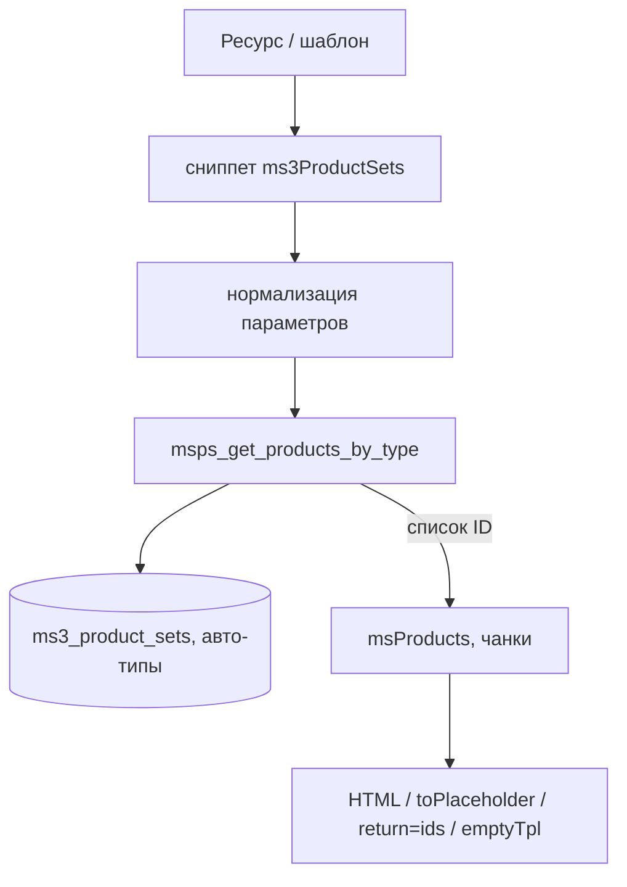
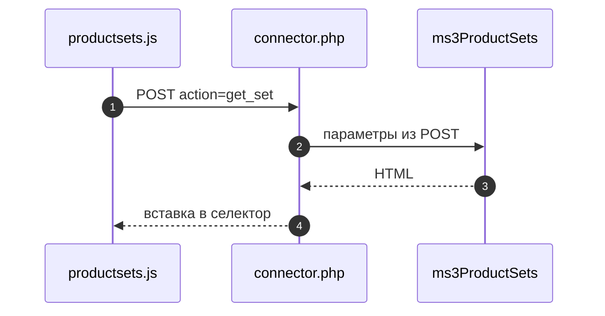

# Потоки (flows)

## Схемы потоков

Серверный вывод сниппетом (обзор):

AJAX-рендер с фронтенда:

## 1. Рендер блока подборки на фронте

1. Шаблон вызывает сниппет: **MODX** — `[[!ms3ProductSets? ... ]]`, **Fenom** — `{'ms3ProductSets' | snippet : [ ... ]}`.
2. Сниппет валидирует и нормализует параметры (`type`, `max_items`, `resource_id`, `category_id`, …).
3. Получает ID товаров через `msps_get_products_by_type`.
4. Если результат пуст:
   - возвращает `''` или `emptyTpl`.
5. Если ID есть:
   - при `return=ids` возвращает CSV ID;
   - иначе вызывает `msProducts` и рендерит карточки.
6. При `tplWrapper` оборачивает итоговый HTML.
7. При `toPlaceholder` складывает результат в placeholder.

## 2. AJAX-рендер через JS API

1. `window.ms3ProductSets.render('#selector', options)`.
2. JS отправляет POST `action=get_set` в `connector.php`.
3. Коннектор запускает сниппет `ms3ProductSets` с параметрами из POST.
4. HTML вставляется в контейнер; пустой ответ скрывает контейнер.

## 3. Добавление в корзину из карточки подборки

1. Клик по элементу с `data-add-to-cart`.
2. JS отправляет POST `action=add_to_cart` с `product_id`, `count`.
3. Коннектор вызывает `msCartAdd` (если miniShop3 доступен).
4. Возвращает JSON `{success,message}`.
5. JS показывает toast и диспатчит `msps:cart:update` при успехе.

## 4. Создание шаблона подборки (админка)

1. UI отправляет `save_template`.
2. Коннектор валидирует `name` и `related_product_ids`.
3. `msps_save_template` делает INSERT/UPDATE в `ms3_product_set_templates`.
4. UI обновляет список шаблонов.

## 5. Применение шаблона к категории

1. UI отправляет `apply_template` (`template_id`, `parent_id/parent_ids`, `replace`).
2. Категория рекурсивно разворачивается до всех `msProduct`.
3. Для каждого товара создаются связи в `ms3_product_sets`.
4. UI получает `applied` (кол-во вставленных связей).

## 6. Отвязка шаблона от категории

1. UI отправляет `unbind_template`.
2. Коннектор определяет `type` и `name` шаблона.
3. Удаляет только записи с совпадающими `type + template_name`.
4. TV-связи и связи других шаблонов не затрагиваются.

## 7. Добавление всего набора в корзину

1. Клик по кнопке с атрибутом `data-add-set` (в tplSetVIP или tplSetWrapper).
2. JS находит контейнер от кнопки (`.msps__vip-set`, `.msps__wrapper` или `[data-set-type]`).
3. Собирает ID товаров из `[data-product-id]` и `[data-add-to-cart]`.
4. Последовательно вызывает `addToCart(productId, 1)` для каждого ID.
5. Показывает toast `set_added` и диспатчит `msps:cart:update` с `product_ids`.

## 8. Синхронизация TV при сохранении товара

1. Срабатывает плагин `OnDocFormSave`.
2. Если у шаблона товара есть TV подборок, запускается синхронизация.
3. **При пустом TV:** удаляются только записи без `template_name` (созданные из TV); связи из шаблонов (с заполненным `template_name`) сохраняются.
4. **При заполненном TV:** удаляются все записи данного типа для товара, вставляются новые связи из значения TV.
