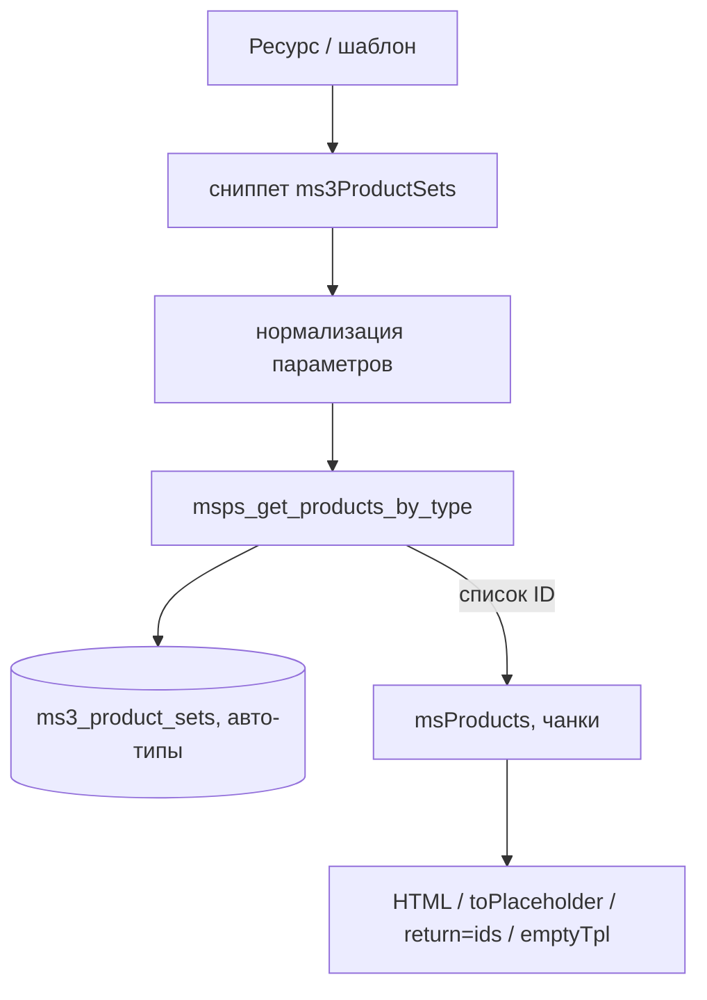
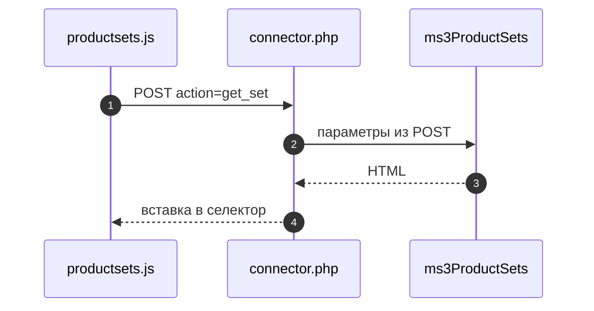

# Потоки (технические)

Пользовательские сценарии в manager: [interface/flows](interface/flows).

## Схемы потоков

Серверный вывод сниппетом (обзор):

```mermaid
flowchart TD
  T[Ресурс / шаблон] --> S[сниппет ms3ProductSets]
  S --> F[нормализация параметров]
  F --> G[msps_get_products_by_type]
  G --> DB[(ms3_product_sets, авто-типы)]
  G -->|список ID| MP[msProducts, чанки]
  MP --> OUT[HTML / toPlaceholder / return=ids / emptyTpl]
```

AJAX-рендер с фронтенда:

```mermaid
sequenceDiagram
  autonumber
  participant P as productsets.js
  participant C as connector.php
  participant SN as ms3ProductSets
  P->>C: POST action=get_set
  C->>SN: параметры из POST
  SN-->>C: HTML
  C-->>P: вставка в селектор
```

## 1. Рендер блока подборки на фронте

1. Шаблон вызывает сниппет: **MODX** — `[[!ms3ProductSets? ... ]]`, **Fenom** — `{'ms3ProductSets' | snippet : [ ... ]}`.
2. Сниппет валидирует и нормализует параметры (`type`, `max_items`, `resource_id`, `category_id`, …).
3. Получает ID товаров через `msps_get_products_by_type`.
4. Если результат пуст:
   - возвращает `''` или `emptyTpl`.
5. Если ID есть:
   - при `return=ids` возвращает CSV ID;
   - иначе вызывает `msProducts` и рендерит карточки.
6. При `tplWrapper` оборачивает итоговый HTML.
7. При `toPlaceholder` складывает результат в placeholder.

## 2. AJAX-рендер через JS API

1. `window.ms3ProductSets.render('#selector', options)`.
2. JS отправляет POST `action=get_set` в `connector.php`.
3. Коннектор запускает сниппет `ms3ProductSets` с параметрами из POST.
4. HTML вставляется в контейнер; пустой ответ скрывает контейнер.

## 3. Добавление в корзину из карточки подборки / «весь набор»

1. Клик по `data-add-to-cart` или «Добавить весь набор» (`data-add-set`).
2. Если на странице есть `window.ms3Config.actionUrl`, запрос идёт в **MiniShop3 Web API**: `POST` на `api.php?route=/api/v1/cart/add` с JSON `{ id, count, options }` и `credentials: 'same-origin'`.
3. Иначе fallback: POST в коннектор `action=add_to_cart` — сервис `ms3`, токен из cookie `ms3_token`, вызов `Cart::add()`.
4. При успехе: уведомление **iziToast** (success/error), `msps:cart:update`, при ответе API — `ms3:cart:updated` с `detail.data` для обновления карточек MS3.

## 4. Создание шаблона подборки (админка)

1. UI отправляет `save_template`.
2. Коннектор проверяет имя, тип (`MSPS_ADMIN_TEMPLATE_TYPES`), непустой список существующих `msProduct`.
3. `msps_save_template` — INSERT/UPDATE в `ms3_product_set_templates`. При переименовании шаблона обновляет `template_name` и `type` в уже применённых связях.
4. `msps_bump_cache_generation`, UI перезагружает список.

## 5. Применение шаблона к категории

1. UI отправляет `apply_template` (`template_id`, `parent_id/parent_ids`, `replace`).
2. Категория рекурсивно разворачивается до всех `msProduct`.
3. Для каждого товара создаются связи в `ms3_product_sets`.
4. UI получает `applied` — число строк, реально добавленных через `INSERT IGNORE` (без учёта дублей и self-link).

## 6. Отвязка шаблона от категории

1. UI отправляет `unbind_template`.
2. Коннектор определяет `type` и `name` шаблона.
3. Удаляет только записи с совпадающими `type + template_name`.
4. TV-связи и связи других шаблонов не затрагиваются.

## 7. Добавление всего набора в корзину

1. Клик по кнопке с атрибутом `data-add-set` (в tplSetVIP или tplSetWrapper).
2. JS находит контейнер от кнопки (`.msps__vip-set`, `.msps__wrapper` или `[data-set-type]`).
3. Собирает ID товаров из `[data-product-id]` и `[data-add-to-cart]`.
4. Последовательно вызывает `addToCart(productId, 1)` для каждого ID.
5. Показывает iziToast `set_added` / ошибку и диспатчит `msps:cart:update` с `product_ids`.

## 8. Синхронизация TV при сохранении товара

1. Срабатывает плагин `OnDocFormSave`.
2. Если у шаблона товара есть TV подборок, запускается синхронизация.
3. Синхронизация только для `msProduct`.
4. **При пустом TV:** удаляются записи с пустым `template_name` для этого типа. Связи из шаблонов сохраняются.
5. **При заполненном TV:** удаляются TV-записи (пустой `template_name`), вставляются новые ID из TV (с валидацией `msProduct`).
6. После sync — `msps_bump_cache_generation`.
