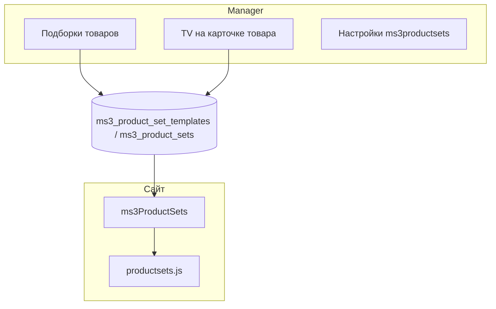

# Сценарии работы

Краткий справочник действий в ms3ProductSets. Скриншоты — [screenshots/README.md](../screenshots/README.md).

## Карта

---

## Flow A — Первый шаблон

1. Откройте **Компоненты → Подборки товаров**.
2. Нажмите **Новая подборка**.
3. Заполните **Название**, **Тип**, выберите товары в **ID товаров**.
4. Нажмите **Сохранить**.

Подробнее: [Руководство по админке](../admin).

---

## Flow B — Редактирование шаблона

1. В таблице **Список подборок** нажмите **Изменить** у строки.
2. Обновите название, тип или список товаров.
3. Сохраните.

Уже применённые связи в `ms3_product_sets` сами не обновятся. Чтобы перезаписать категорию, снова выполните **Применить** с опцией **Заменить**.

---

## Flow C — Применение к категории

1. В блоке **Применить подборку к категории** выберите шаблон.
2. Укажите **ID категории (родителя)** в дереве.
3. При необходимости включите **Заменить существующие подборки этого типа**.
4. Нажмите **Применить**.

Toast покажет число созданных связей.

---

## Flow D — Отвязка шаблона

1. Выберите тот же шаблон и категорию.
2. Нажмите **Отвязать**.

Удалятся только строки с совпадающими `type` и `template_name`. TV и другие шаблоны не затронуты.

---

## Flow E — Удаление шаблона

1. В таблице нажмите **Удалить**.
2. Подтвердите в диалоге.

Запись шаблона исчезнет из списка. Связи в `ms3_product_sets` останутся, пока вы их не отвяжете.

---

## Flow F — TV на карточке товара

1. Откройте товар `msProduct` в manager.
2. Заполните TV категории **ms3ProductSets** (`ms3productsets_buy_together`, `similar`, `popcorn`, `cart_suggestion`, `vip`).
3. Сохраните ресурс.

Плагин **ms3ProductSets SyncTV** (`OnDocFormSave`) синхронизирует значения в `ms3_product_sets`.

---

## Flow G — Вывод на сайте

1. Подключите `mspsLexiconScript`, CSS и JS — [интеграция](../integration).
2. Вызовите `ms3ProductSets` с нужным `type` на карточке, в корзине или на главной.
3. Для AJAX используйте `window.ms3ProductSets.render()`.

Технические схемы: [Потоки (разработчик)](../flows), [API](../api).

---

## Flow H — Настройки и авто-режим

1. **Настройки → Системные настройки** → namespace **ms3productsets**.
2. Задайте `max_items`, `cache_lifetime`, `auto_recommendation`, `vip_set_1`.

При `auto_recommendation=0` на витрине останутся только ручные связи и VIP из настроек.
