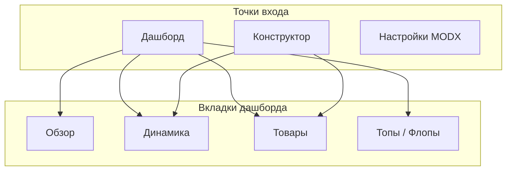

# Пользовательские сценарии

Справочник действий в ms3Pulse.

## Карта приложения

| Раздел | Доступ | Действия |
|--------|--------|----------|
| Дашборд | **Компоненты → ms3Pulse** | Фильтры, метрики, графики, таблицы |
| Конструктор | **ms3Pulse → Конструктор** | Добавление кастомных графиков |
| Настройки | **ms3Pulse → Настройки** | Системные настройки `ms3pulse` |

---

## Flow A — Первый запуск

1. Установите MiniShop3, VueTools 1.1.1, ms3Pulse.
2. Откройте **Компоненты → ms3Pulse**.
3. Раскройте **Фильтры**, выберите пресет **30** дней.
4. Нажмите **Обновить**.

Подробнее: [Быстрый старт](../quick-start).

---

## Flow B — Фильтр по статусам и группировка

1. Раскройте **Фильтры**.
2. Задайте период **От** / **До** или пресет.
3. Выберите статусы MS3 (пусто = все).
4. Выберите **группировку**: день, неделя или месяц.
5. Нажмите **Обновить**.

Подробнее: [Фильтры и период](../metrics-and-charts/filters).

---

## Flow C — Обзор метрик

1. Вкладка **Обзор**.
2. Прочитайте шесть карточек: выручка, заказы, средний чек, товары, доставка, оплата.
3. Сравните % с предыдущим периодом (Tag зелёный/красный).
4. Прокрутите к мини-графику выручки.

Подробнее: [Метрики и показатели](../metrics-and-charts/metrics).

---

## Flow D — Графики на «Динамике» и «Товарах»

1. Вкладка **Динамика** — выручка, заказы, средний чек по времени и кастомные графики (area, bar, scatter, line).
2. Вкладка **Товары** — топ товаров, заказы по статусам и кастомные (pie, donut, barHorizontal, funnel, treemap).
3. Меню карточки (иконка загрузки): ширина, **экспорт PNG**, удаление кастомных.
4. Перетащите карточку для смены порядка.

Подробнее: [Дашборд](dashboard).

---

## Flow E — Кастомный график

1. **ms3Pulse → Конструктор** или **В конструктор** на вкладке.
2. Раскройте **Добавить график**.
3. Тип + источник + размер + вкладка + лимит данных.
4. **Добавить** → перейдите на вкладку дашборда.

Подробнее: [Конструктор графиков](builder).

---

## Flow F — Таблицы «Топы / Флопы»

1. Вкладка **Топы / Флопы**.
2. **Добавить таблицу** → тип, название, ширина, лимит.
3. Сортируйте по клику на заголовок.
4. **CSV** у таблицы для выгрузки.

Подробнее: [Топы и флопы](topflops), [Экспорт](../export).

---

## Flow G — Отчёт по расписанию

1. **Системные настройки** → `ms3pulse`: включить export, email, период, token.
2. **Scheduler** → задача `Dashboard/SendScheduledReport`.
3. Задайте cron или расписание в Scheduler.
4. Опционально: curl по URL с token.

Подробнее: [Отчёты по расписанию](../scheduled-reports).

---

## Flow H — Права доступа

1. **Управление → Права доступа**.
2. Политика **ms3PulseUserPolicy**.
3. Включите **ms3pulse_view** для роли менеджера.

Подробнее: [Права доступа](../permissions).
