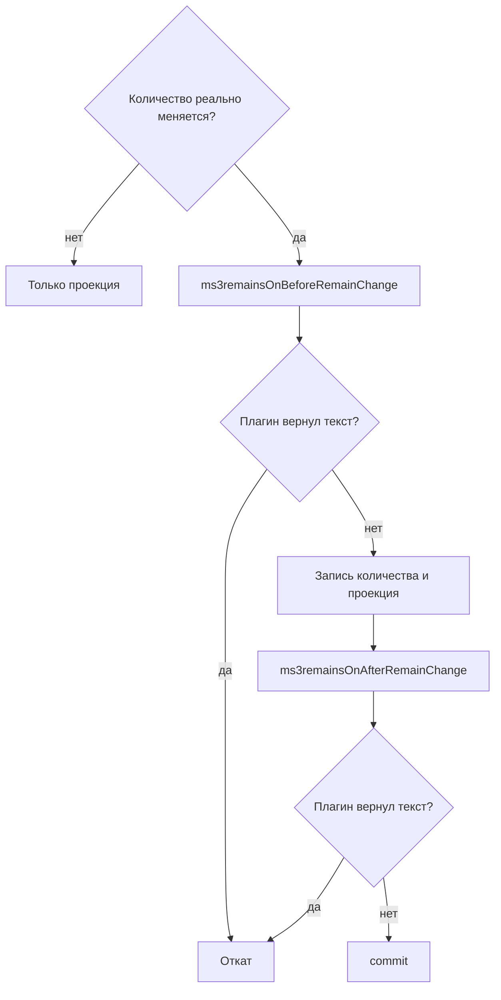
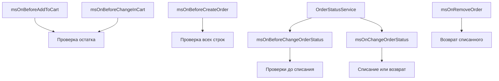

# События

При каждом реальном изменении количества `RemainService` вызывает два события MODX: `ms3remainsOnBeforeRemainChange` и `ms3remainsOnAfterRemainChange`.

Они срабатывают при ручной правке в manager, CSV-импорте, списании и возврате по заказу, вызове сервисного API. Если `setQuantity` получает то же число, что уже лежит в строке (`|old - target| < 0.0005`), события не вызываются. Пересчитывается только проекция.

Отмена: плагин возвращает непустую строку из обработчика. `StockEventDispatcher` бросает `DomainException` с кодом `event_listener_failed` и этим текстом. Правило одно для Before и After. Если сервис владеет транзакцией, изменение откатывается.

События компонента регистрируются при установке пакета. Создайте свой плагин и повесьте его на нужные события.



## `ms3remainsOnBeforeRemainChange`

До записи количества и до проекции.

| Параметр | Тип | Описание |
| --- | --- | --- |
| `identity` | `StockIdentity` | `productId`, `variantId`, `options`, `optionsHash` |
| `old_quantity` | float | текущее значение |
| `new_quantity` | float | новое значение |
| `delta` | float | `new_quantity - old_quantity` |
| `comment` | string | комментарий из UI, CSV или API |
| `user_id` | int | id пользователя manager. `0` для системных изменений (списание заказа) |

Верните непустую строку, чтобы запретить запись.

## `ms3remainsOnAfterRemainChange`

После записи количества и проекции, до commit (если транзакцию открыл сервис).

| Параметр | Тип | Описание |
| --- | --- | --- |
| `result` | `RemainChangeResult` | публичные поля: `remainId`, `oldQuantity`, `newQuantity`, `delta` |
| `identity` | `StockIdentity` | тот же объект, что в Before |
| `comment` | string | комментарий |
| `user_id` | int | id пользователя |

Здесь удобно писать журнал аудита или проверять низкий остаток. Не отправляйте email и webhook до commit. При откате транзакции письмо уже уйдёт. Непустая строка из After тоже откатывает операцию.

## Примеры плагинов

Все примеры ниже: тело плагина. Создайте элемент Plugin, привяжите к событиям из `switch`.

### Лимит количества при ручной правке

```php
<?php
/** @var modX $modx */

switch ($modx->event->name) {
    case 'ms3remainsOnBeforeRemainChange':
        $userId = (int) ($modx->event->params['user_id'] ?? 0);
        $new = (float) ($modx->event->params['new_quantity'] ?? 0);

        // Списание заказа (user_id = 0) не трогаем.
        if ($userId > 0 && $new > 10000) {
            return 'Количество слишком большое для ручной правки';
        }
        break;
}
```

### Запрет уменьшения из manager

Списание по заказу (`user_id = 0`) проходит. Ручное уменьшение из UI или CSV не проходит.

```php
<?php
/** @var modX $modx */

switch ($modx->event->name) {
    case 'ms3remainsOnBeforeRemainChange':
        $userId = (int) ($modx->event->params['user_id'] ?? 0);
        $delta = (float) ($modx->event->params['delta'] ?? 0);

        if ($userId > 0 && $delta < 0) {
            return 'Уменьшать остаток вручную нельзя. Используйте списание по статусу заказа';
        }
        break;
}
```

### Обязательный комментарий при правке из UI

```php
<?php
/** @var modX $modx */

switch ($modx->event->name) {
    case 'ms3remainsOnBeforeRemainChange':
        $userId = (int) ($modx->event->params['user_id'] ?? 0);
        $comment = trim((string) ($modx->event->params['comment'] ?? ''));

        if ($userId > 0 && $comment === '') {
            return 'Укажите комментарий к изменению остатка';
        }
        break;
}
```

### Чтение товара, варианта и опций

`StockIdentity`: readonly-объект с публичными полями.

```php
<?php
/** @var modX $modx */

use Ms3Remains\ValueObject\StockIdentity;

switch ($modx->event->name) {
    case 'ms3remainsOnBeforeRemainChange':
        $identity = $modx->event->params['identity'] ?? null;
        if (!$identity instanceof StockIdentity) {
            break;
        }

        $productId = $identity->productId;
        $variantId = $identity->variantId; // null, если не вариант
        $options = $identity->options;     // ['color' => 'красный', 'size' => 'M']
        $hash = $identity->optionsHash;

        // Пример: отдельный лимит для конкретного товара.
        if ($productId === 42 && (float) $modx->event->params['new_quantity'] > 50) {
            return 'Для этого товара максимум 50 единиц на комбинацию';
        }
        break;
}
```

### Журнал в error log MODX

Пишет каждое реальное изменение: кто, что, на сколько.

```php
<?php
/** @var modX $modx */

use Ms3Remains\ValueObject\RemainChangeResult;
use Ms3Remains\ValueObject\StockIdentity;

switch ($modx->event->name) {
    case 'ms3remainsOnAfterRemainChange':
        $result = $modx->event->params['result'] ?? null;
        $identity = $modx->event->params['identity'] ?? null;
        $comment = (string) ($modx->event->params['comment'] ?? '');
        $userId = (int) ($modx->event->params['user_id'] ?? 0);

        if (
            !$result instanceof RemainChangeResult
            || !$identity instanceof StockIdentity
        ) {
            break;
        }

        $modx->log(
            modX::LOG_LEVEL_INFO,
            sprintf(
                '[ms3Remains] remain=%d product=%d variant=%s delta=%s → %s user=%d comment=%s options=%s',
                $result->remainId,
                $identity->productId,
                $identity->variantId === null ? '-' : (string) $identity->variantId,
                $result->delta,
                $result->newQuantity,
                $userId,
                $comment,
                json_encode($identity->options, JSON_UNESCAPED_UNICODE),
            ),
        );
        break;
}
```

### Низкий остаток после изменения

```php
<?php
/** @var modX $modx */

use Ms3Remains\ValueObject\RemainChangeResult;
use Ms3Remains\ValueObject\StockIdentity;

switch ($modx->event->name) {
    case 'ms3remainsOnAfterRemainChange':
        $result = $modx->event->params['result'] ?? null;
        $identity = $modx->event->params['identity'] ?? null;

        if (
            !$result instanceof RemainChangeResult
            || !$identity instanceof StockIdentity
        ) {
            break;
        }

        if ($result->newQuantity > 0 && $result->newQuantity <= 3) {
            $modx->log(
                modX::LOG_LEVEL_WARN,
                sprintf(
                    '[ms3Remains] низкий остаток: product=%d remain=%d qty=%s',
                    $identity->productId,
                    $result->remainId,
                    $result->newQuantity,
                ),
            );
        }

        if ($result->newQuantity <= 0) {
            $modx->log(
                modX::LOG_LEVEL_INFO,
                'Остаток закончился: remain ' . $result->remainId,
            );
        }
        break;
}
```

### Несколько проверок в одном плагине

```php
<?php
/** @var modX $modx */

use Ms3Remains\ValueObject\RemainChangeResult;
use Ms3Remains\ValueObject\StockIdentity;

switch ($modx->event->name) {
    case 'ms3remainsOnBeforeRemainChange':
        $userId = (int) ($modx->event->params['user_id'] ?? 0);
        $new = (float) ($modx->event->params['new_quantity'] ?? 0);
        $identity = $modx->event->params['identity'] ?? null;

        if ($userId > 0 && $new > 10000) {
            return 'Количество слишком большое для ручной правки';
        }

        if (
            $identity instanceof StockIdentity
            && $identity->variantId !== null
            && $new < 0
        ) {
            return 'Отрицательный остаток варианта запрещён';
        }
        break;

    case 'ms3remainsOnAfterRemainChange':
        $result = $modx->event->params['result'] ?? null;
        if (
            $result instanceof RemainChangeResult
            && $result->newQuantity <= 0
        ) {
            $modx->log(
                modX::LOG_LEVEL_INFO,
                'Остаток закончился: remain ' . $result->remainId,
            );
        }
        break;
}
```

Остаток в БД хранится как `DECIMAL(12,3)`. Перед записью через API нежелательные значения можно отсечь в Before, как в примере выше.

## События MiniShop3, которые слушает компонент



| Событие | Реакция |
| --- | --- |
| `msOnManagerCustomCssJs` | вкладка **Остатки** на странице товара |
| `msOnBeforeChangeOrderStatus` | проверка до списания: конфликт ms3Variants, нехватка остатка, битая комбинация. Статус ещё не сохранён |
| `msOnChangeOrderStatus` | списание или возврат по спискам статусов |
| `msOnRemoveOrder` | возврат списанного |
| `msOnBeforeAddToCart` | проверка остатка |
| `msOnBeforeChangeInCart` | проверка остатка |
| `msOnBeforeCreateOrder` | проверка всех строк заказа |

Смену статуса запускайте через OrderStatusService MiniShop3. Прямой `$order->set('status_id')->save()` эти события не вызывает, остаток не спишется.

Подробнее про списание: [Заказы](orders).

## События проекции

После записи `msProductData.stock` и `ms3Variants.count` вызываются `ms3remainsOnProductStockProjected` и `ms3remainsOnVariantStockProjected`. Пакет их не создаёт при установке. Чтобы повесить плагин, добавьте события вручную: **Система → События**.

| Событие | Когда | Параметры |
| --- | --- | --- |
| `ms3remainsOnProductStockProjected` | после записи `stock` | `product_id`, `old_stock`, `new_stock` |
| `ms3remainsOnVariantStockProjected` | после записи `count` | `product_id`, `variant_id`, `old_count`, `new_count` |

Событие варианта срабатывает, только если поле `count` действительно изменилось.
