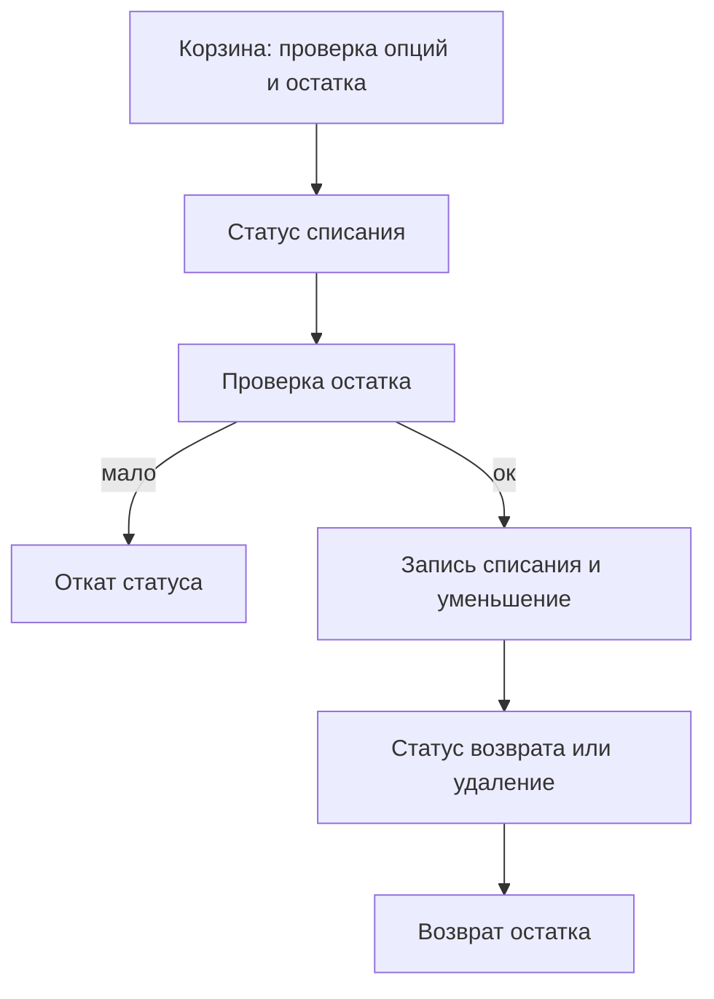

# ms3Remains

**ms3Remains** дополняет [MODX Revolution 3](https://modx.com/) и [MiniShop3](/components/minishop3/): остатки товаров по комбинациям опций. Одна строка отвечает, сколько единиц с таким набором опций лежит на остатке.

Пример. У футболки есть опции `color` и `size`. Укажите их в `ms3remains_option_keys`. Компонент ведёт отдельный остаток для каждой пары: «красная / M», «красная / L», «синяя / M». Товар без опций работает с одной базовой строкой. Пустой `ms3remains_option_keys` не отключает опции в корзине: в расчёт остатка войдут все опции, которые покупатель передал с товаром.

С чего начать: [Быстрый старт](quick-start).

## Минимальный путь

1. Установить **MiniShop3**, **VueTools**, **pdoTools** и **ms3Remains**.
2. Выключить встроенный inventory: `ms3_inventory_enabled = 0`.
3. Включить `ms3remains_enabled`, задать `ms3remains_option_keys` и статусы списания/возврата.
4. Заполнить остатки на вкладке товара или через CSV.
5. На витрине вывести сниппет `ms3Remains` (некэшируемый) или проекцию `[[+stock]]`.

## Быстрые ссылки

| Нужно | Документ |
| --- | --- |
| Включить и проверить списание | [Быстрый старт](quick-start) |
| Все ключи `ms3remains_*` | [Системные настройки](settings) |
| Вкладка, список, рецепты витрины | [Остатки](stocks) |
| Списание и проверки корзины | [Заказы](orders) |
| Параметры сниппета | [ms3Remains](snippets/ms3Remains) |
| Варианты и двойное списание | [ms3Variants](ms3variants) |
| `msProductData.stock` и `count` | [Проекция](projections) |
| Фильтр «в наличии» в каталоге | [mFilter](mfilter) |
| CSV и PHP API | [Обмен с внешними системами](external-sync) |
| Плагины на изменение остатка | [События](events) |
| Типовые ошибки | [FAQ](faq) |

## Возможности

- Остаток на товар без опций, на комбинацию опций и на вариант [ms3Variants](/components/ms3variants/)
- Вкладка остатков на странице товара и раздел «Остатки» со списком, фильтрами и CSV
- Списание при смене статуса заказа и возврат при отмене или удалении
- Проверка доступности в корзине и перед оформлением заказа
- Проекция суммы в `msProductData.stock` и остатка варианта в `ms3Variants.count`
- Фильтр каталога «только в наличии» через [mFilter](mfilter) по полю `stock`
- Сниппет `ms3Remains`: число, «В наличии / Нет в наличии», порог «Много», JSON и остатки по значениям опций

## Чего в компоненте нет

Складов, резервов, перемещений, инвентаризаций и журнала движений. Если нужен полноценный WMS, этот компонент не подходит.

## Модель

- Остаток: число `DECIMAL(12,3)` в таблице `ms3remains_remains`. Дробные значения подходят для весовых и мерных товаров.
- Комбинация опций кодируется полем `options_hash`. Одинаковые наборы дают один и тот же код независимо от порядка ключей и типа значения.
- Товар отслеживается, если у него есть хотя бы одна строка остатка. Без строк проверки корзины и заказа его пропускают.
- Истории изменений нет. Остаток меняется через manager UI, CSV-импорт или сервисный API. Кто и когда менял: смотрите `updatedon` строки и лог событий MODX, если пишете их в плагине на [события](events) компонента.

## Что происходит с заказами

1. Покупатель добавляет товар в корзину. Компонент проверяет выбранные опции и достаточность остатка.
2. Заказ переходит в статус из `ms3remains_deduct_statuses`. Компонент проверяет остаток, пишет строку списания и уменьшает количество. Повтор в тот же статус не списывает снова. Если остатка уже меньше количества строки, проверка до записи списания откатит статус.
3. Заказ переходит в статус из `ms3remains_refund_statuses` или удаляется. Компонент возвращает списанное.

## Системные требования

| Требование | Версия |
| --- | --- |
| MODX Revolution | 3.0.0 и новее |
| PHP | 8.2 и новее |
| MiniShop3 | 1.13.0 и новее |
| VueTools | 1.2.0 и новее (`vuetools/theme` в Import Map) |
| pdoTools | 3.0.0 и новее |
| СУБД | как у MODX 3. Ориентир: MySQL 5.7+ или MariaDB 10.3+. Пакет версию СУБД не проверяет |

### Зависимости

- **[MiniShop3](/components/minishop3/)**: товары, заказы, статусы
- **VueTools**: manager UI (тема `vuetools.theme`: `aura` или `modx`)
- **pdoTools**: обязателен (`>=3.0.0`). Нужен для примеров Fenom и вызова сниппета на витрине

### Опционально

| Компонент | Роль |
| --- | --- |
| [ms3Variants](/components/ms3variants/) | варианты с отдельным `count` |
| CommerceBridge1C | обнаруживается по ключу `cb1c_enabled`. Как он пишет `stock`, в этом пакете не видно |

### Inventory MiniShop3

Пока работает ms3Remains, держите `ms3_inventory_enabled = 0`. Встроенный inventory резервирует суммарный `ms3_products.stock` и конфликтует с остатками по комбинациям опций.

### Права файловой системы

Пакет пишет:

- `core/components/ms3remains/`
- `assets/components/ms3remains/`
- `core/config/ms3.services.d/50-ms3remains.php`
- `core/config/ms3.routes.d/manager/50-ms3remains.php`

Каталог `core/config/` должен быть доступен на запись при установке.

ms3Remains не меняет файлы MiniShop3, ms3Variants и CommerceBridge1C. Интеграция идёт через фрагменты MiniShop3, события и таблицы с префиксом `ms3remains_`.

## Установка

<!-- MEDIA: screenshot-admin | must | Extras → Installer: установка пакета ms3Remains на тестовом стенде | MODX 3, синтетический стенд, пакет ms3Remains в списке Extras -->

1. [Подключите репозиторий ModStore](https://modstore.pro/info/connection). Для зашифрованного transport нужен провайдер `modstore.pro`, иначе установка падает с `Package provider not found`.
2. Установите **MiniShop3**, **VueTools** и **pdoTools**.
3. **Extras → Installer**: установите **ms3Remains**.
4. **Настройки → Очистить кэш**.

Установка создаёт:

- namespace `ms3remains`
- меню и controller manager
- plugin и события
- system settings
- policy template и policy
- таблицы `ms3remains_remains` и `ms3remains_order_deductions`
- фрагменты MiniShop3 для сервиса статуса заказа и manager API

Компонент ставится выключенным: `ms3remains_enabled = false`. Таблицы пустые.

### Проверка после установки

1. В manager откройте меню ms3Remains: доступны разделы «Остатки» и «Настройки».
2. В `core/config/ms3.services.d/` есть файл `50-ms3remains.php`.
3. В `core/config/ms3.routes.d/manager/` есть файл `50-ms3remains.php`.
4. В БД есть две таблицы с префиксом сайта и именем `ms3remains_*`.

### Типичные ошибки установки

| Симптом | Причина | Действие |
| --- | --- | --- |
| Меню есть, страницы пустые | нет VueTools или пустой `vue-dist` | проверьте VueTools |
| Вкладка товара без стилей | нет CSS из `vue-dist` | плагин подключает первый существующий файл: `ms3remains-manager.css`, затем `ms3remains-product-tab.css` |
| Таблиц нет | resolver миграций упал | смотрите error log MODX, переустановите пакет. Повтор из репозитория пакета: `composer migrate` или `php core/components/ms3remains/bin/migrate.php`. Это не замена resolver при установке с ModStore |
| API 404 | нет route fragment | проверьте `core/config/ms3.routes.d/manager/50-ms3remains.php` и кэш |
| Статус заказа не списывает | нет service fragment или компонент выключен | проверьте `50-ms3remains.php` и `ms3remains_enabled` |

## Термины

| Термин | Значение |
| --- | --- |
| Комбинация / строка остатка | товар плюс набор опций или вариант, по которому хранится количество |
| Отслеживаемый товар | товар с хотя бы одной сохранённой строкой в `ms3remains_remains` |
| Проекция | запись суммы остатков в поле `stock` товара и/или `count` варианта |
| Проверки корзины | блокировка добавления и оформления, если опций не хватает или остаток меньше нужного |
