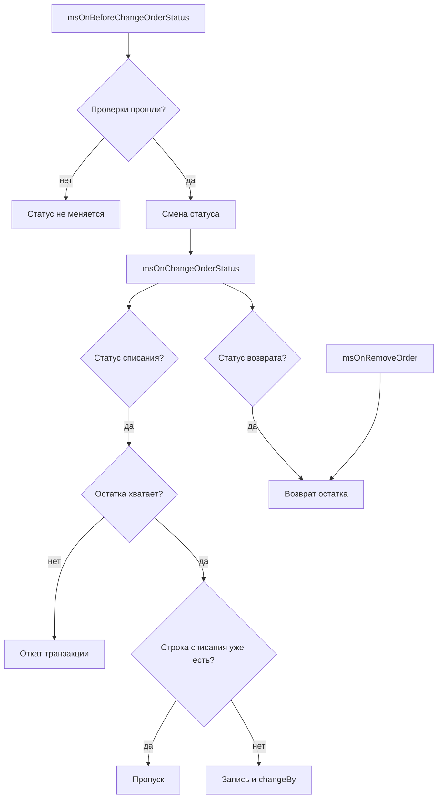

# Заказы

## Списание по статусу

Перед сохранением нового статуса (`msOnBeforeChangeOrderStatus`) компонент проверяет, что списание возможно. Нужны: нет конфликта с ms3Variants, хватает остатка, для строк заказа удаётся подобрать комбинацию. Если проверка не проходит, статус не меняется.

После смены статуса (`msOnChangeOrderStatus`), когда заказ попадает в `ms3remains_deduct_statuses`, по каждой отслеживаемой строке:

1. Проверяется остаток. Если его меньше количества строки, ошибка откатывает транзакцию и статус.
2. В `ms3remains_order_deductions` пишется `(order_id, order_product_id, status_id)`. Если такая строка уже есть, эта позиция пропускается.
3. Остаток уменьшается через `changeBy(-qty)`.

Повтор в тот же статус не списывает снова. Проверка до сохранения статуса уже списанные строки пропускает. Шаг списания проверяет остаток до записи в `ms3remains_order_deductions`. Если после первого списания остатка меньше, чем количество строки, повторный переход откатит статус.

Смена статуса идёт в транзакции БД (обёртка OrderStatusService). Если списание падает после сохранения статуса, транзакция откатывает и статус, и остатки.

Опции строки заказа читаются из `msOrderProduct.options`. Комбинация считается так же, как на вкладке остатков, поэтому списывается именно та строка, которую видит менеджер.

## Изменение строки заказа после списания

Количество и опции строки меняйте **до** перевода заказа в статус списания. Компонент не корректирует остаток при правке уже списанной строки (`msOnBeforeUpdateOrderProduct` не слушается).

Если заказ уже списан, сначала переведите его в статус возврата, поправьте строки, затем снова спишите. Так остаток не разъедется, и не появляется второй путь записи рядом со сменой статуса.

## Возврат

Когда заказ попадает в статус из `ms3remains_refund_statuses`, списанное по этому заказу возвращается: строки списаний помечаются `refundedon`, остаток увеличивается обратно. Удаление заказа (`msOnRemoveOrder`) работает так же.

Возврат идемпотентен: уже возвращённые строки не возвращаются повторно.

## Проверки в корзине

Три переключателя управляют проверками до заказа:

| Настройка | Событие | Что проверяет |
| --- | --- | --- |
| `ms3remains_check_before_cart` | добавление и изменение в корзине | остаток комбинации |
| `ms3remains_check_before_order` | оформление заказа | остаток всех строк |
| `ms3remains_check_options` | оба события | что выбраны все отслеживаемые опции (кроме строк с `_variant_id`) |

Поведение проверок:

- товар без строк остатка: неотслеживаемый, проверки пропускаются
- не выбраны опции из `ms3remains_option_keys` (и нет `_variant_id`): ошибка «Выберите опции» (`ms3remains_choose_options`)
- выбран вариант ms3Variants (`_variant_id`): проверка `check_options` не требует ключей из `option_keys`, строку остатка задаёт вариант
- остатка не хватает: «Недостаточно остатка для этого товара. Доступно: [[+available]].» (`ms3remains_err_insufficient_stock`)
- комбинацию подобрать нельзя (чужой вариант, битые опции): ошибка `ms3remains_err_invalid_stock_identity`

`check_options` действует только когда включён сам компонент и хотя бы одна из проверок корзины/заказа.

## Неотслеживаемые товары

Товар без строк в `ms3remains_remains` продаётся без ограничений: проверки корзины его пропускают, списание по заказу его пропускает. Чтобы начать отслеживать товар, задайте ему остаток во вкладке «Остатки» или через CSV.

Чтобы перестать отслеживать, удалите строки напрямую в БД. В UI и CSV удаления нет. Пустое `quantity` в CSV: ошибка строки. `0` обнуляет количество. Нулевой остаток значит «нет в наличии», а не «не отслеживается».
