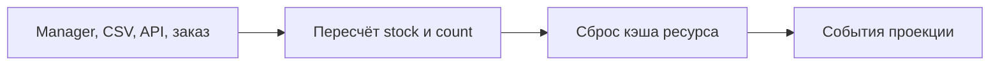

# Проекция остатков

Источник правды: таблица `ms3remains_remains`. Чтобы витрина и стандартные сниппеты MiniShop3 видели остаток без лишних запросов, компонент проецирует его в привычные поля.

## Что куда пишется

| Проекция | Поле | Значение | Переключатель |
| --- | --- | --- | --- |
| Товар | `msProductData.stock` | сумма всех строк остатка товара | `ms3remains_sync_product_stock` |
| Вариант | `ms3Variants.count` | остаток конкретного варианта | `ms3remains_sync_variant_count` |

Проекция односторонняя: ms3Remains пишет в эти поля, но не читает их. Ручная правка `stock` в карточке товара не меняет остатки компонента и будет перезаписана при следующем изменении остатка.

## Когда срабатывает

- после каждого изменения остатка через manager UI, CSV-импорт или сервисный API
- после списания и возврата по заказу
- если `setQuantity` получает то же число, что уже лежит в строке. Сумма в поле `stock` товара всё равно пересчитывается (например после первого сохранения нуля)

После записи проекции компонент сбрасывает кэш ресурса товара, чтобы витрина сразу показала новое значение. Затем вызываются события `ms3remainsOnProductStockProjected` и `ms3remainsOnVariantStockProjected`. Их нет в установке пакета. Как повесить плагин: [События](events#события-проекции).

## Массовое перестроение

Кнопка **Перестроить** в карточке «Проекция в каталог» раздела **Настройки** пересчитывает проекции для всех товаров с остатками. Используйте после:

- первого заполнения остатков
- массового импорта вне компонента
- смены состава отслеживаемых опций

Тот же пересчёт делает маршрут `POST /api/mgr/ms3remains/sync/rebuild` и сервисный метод `rebuildBatch(array $productIds)`.

## Зачем это витрине

В списках товаров выводите `[[+stock]]` из msProductData вместо некэшируемого сниппета на каждую карточку. Точный остаток комбинации показывайте на странице товара через `[[!ms3Remains]]`. Рецепты: [Остатки](stocks). Фильтр «в наличии» в каталоге: [mFilter](mfilter).
