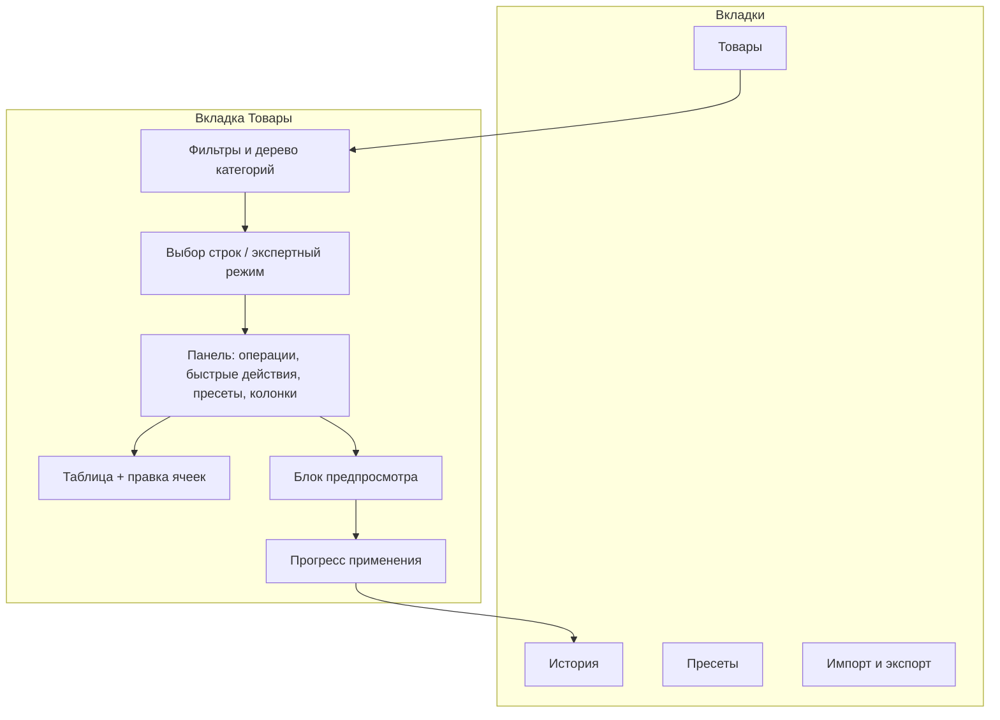
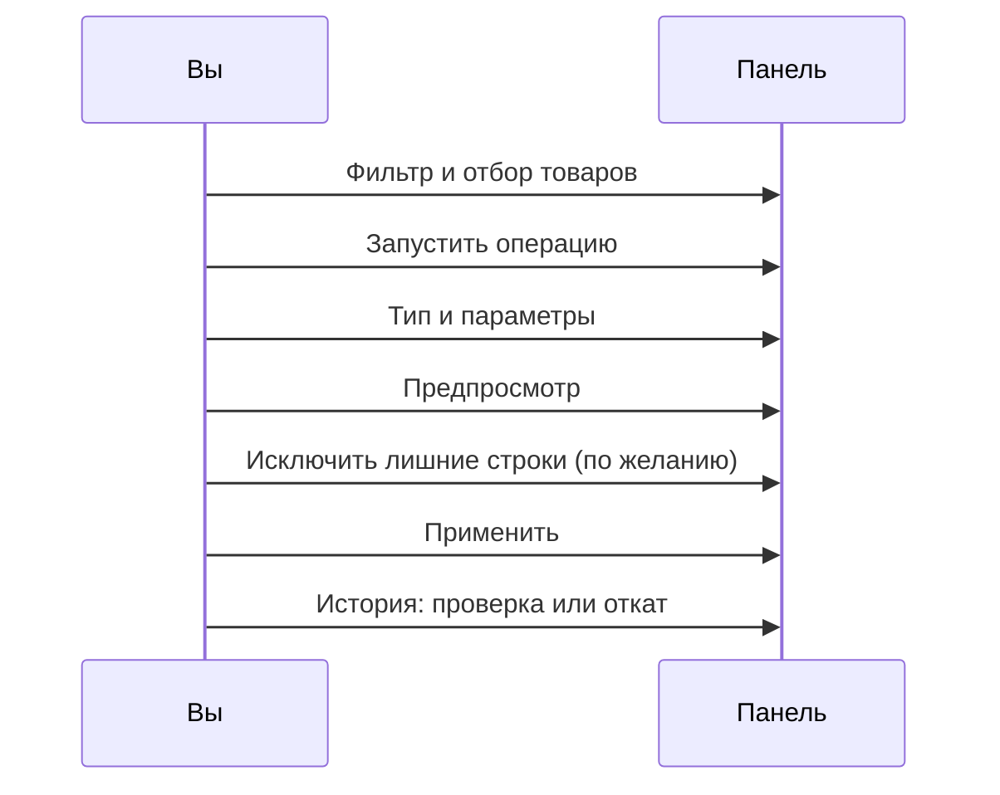

# Пошаговые сценарии

Здесь собраны сценарии A–J со скриншотами. Читайте по задаче: скидка, Excel, откат, пресет. Краткий обзор вкладок: [Интерфейс](./).

| Сценарий | Задача |
| --- | --- |
| [A](#flow-a--массовая-операция-полный-цикл) | Полный цикл: отбор → предпросмотр → применение |
| [B](#flow-b--быстрые-действия) | Быстрые действия с панели |
| [C](#flow-c--пресет) | Сохранить и повторить операцию |
| [D](#flow-d--inline-редактирование-одной-ячейки) | Правка одной ячейки |
| [E](#flow-e--настройка-колонок) | Настроить колонки таблицы |
| [F](#flow-f--фильтрация-каталога) | Отфильтровать каталог |
| [G](#flow-g--экспорт) | Выгрузить в CSV/XLSX |
| [H](#flow-h--импорт-round-trip) | Загрузить цену / остаток / артикул |
| [I](#flow-i--история-и-откат) | Откатить операцию |
| [J](#flow-j--мастер-привязки-tv--опция) | Привязать TV или опцию |

---

## Карта приложения

| Вкладка | Право | Что делать |
| --- | --- | --- |
| Товары | `msbulkeditor_view` | Фильтр, выбор, операции, предпросмотр, правка ячеек |
| История | `msbulkeditor_view` | Журнал и откат |
| Пресеты | `msbulkeditor_presets` | Сохранённые операции |
| Импорт и экспорт | `msbulkeditor_import_export` | CSV и XLSX |

Вкладки без права скрыты. Прямой переход без права вернёт на **Товары**.

---

## На какие товары сработает операция

Перед массовой операцией, экспортом или запуском пресета нужна **область применения**.

| Режим | Как включить | Что попадёт в операцию |
| --- | --- | --- |
| **Выбранные строки** | Галочки в таблице (строка или «все на странице») | Только отмеченные |
| **Все по фильтру** | **Экспертный режим** + фильтры | Все товары по фильтру (лимит по умолчанию 5000) |

Счётчики **По фильтру** и **Выбрано** показывают размер. Подпись рядом с экспертным режимом поясняет область.

Без отмеченных строк и без экспертного режима неактивны **Запустить операцию**, **Быстрые действия** и меню **Пресеты**.

В экспертном режиме колонка `⋯` даёт **Выбрать только эту строку** (прицел). Подробнее: [сетка товаров](products-grid#прицел-только-эта-строка).

---

## Flow A — Массовая операция (полный цикл)

Подходит для цены, остатка, TV, опций и остальных типов из диалога **Запустить операцию**.

### Шаги

1. На вкладке **Товары** настройте [фильтры](products-grid#поиск-и-фильтры) или дерево категорий.
2. Отметьте строки **или** включите **экспертный режим** и проверьте счётчик **По фильтру**.
3. Нажмите **Запустить операцию** и выберите тип (см. [таблицу типов](#справочник-типов-операций)).
4. Заполните форму.
5. Нажмите **Предпросмотр**. Под таблицей появится блок «было / станет».
6. Снимите галочки со строк, которые трогать не нужно. См. [предпросмотр](preview-and-apply).
7. Нажмите **Применить** и дождитесь прогресса «X из Y».
8. Откройте **Историю**. При ошибке нажмите **Откат**.

Подробнее: [предпросмотр и применение](preview-and-apply).

---

## Flow B — Быстрые действия

Короткий путь для частых операций: тип уже выбран пунктом меню.

1. Отберите товары (строки или экспертный режим).
2. Нажмите **Быстрые действия** (молния).
3. Выберите пункт. Откроется диалог с уже выбранным типом.
4. Параметры → **Предпросмотр** → **Применить**.

Перед мягким удалением, очисткой кэша и регенерацией URI панель попросит подтверждение.

| Пункт меню | Задача |
| --- | --- |
| Изменить шаблон | Новый шаблон ресурса |
| Изменить родителя | Другая категория-родитель |
| Изменить производителя | Vendor MiniShop3 |
| Установить текст | Название или другое текстовое поле |
| Регенерация превью галереи | Пересобрать превью фото |
| Очистить кэш ресурса | Сброс кэша страниц |
| Перегенерировать URI | Пересчёт alias и URI |
| Мягкое удаление | Пометить удалённым |
| Изменить источник файлов | Media source |
| Изменить тип контента | Content type |
| Назначить группу ресурсов | Группа доступа |
| Изменить даты | Даты публикации и др. |
| Изменить пользователя | Автор / редактор |

Подробнее: [быстрые действия](quick-actions).

---

## Flow C — Пресет

1. На **Товарах** один раз настройте операцию и проверьте предпросмотр (или возьмите готовый JSON из [пресетов](presets)).
2. Вкладка **Пресеты** → имя + JSON → **Сохранить**.
3. Переименование: загрузите пресет → новое имя → **Сохранить** (старое имя удалится).
4. Повторный запуск:
   - **Пресеты** → **Применить**, или
   - **Товары** → меню **Пресеты** на панели → имя пресета.

Подробнее: [пресеты](presets).

---

## Flow D — Inline-редактирование одной ячейки

Без диалога массовой операции.

1. Кликните ячейку: название, цена, остаток, публикация, артикул, вес, текстовый TV или опция с одним значением.
2. Для image TV сделайте двойной клик. Откроется медиабраузер MODX.
3. Сохраните: Enter, клик мимо ячейки, переключатель или выбор файла.

Подробнее: [редактирование в списке](inline-editing).

---

## Flow E — Настройка колонок

1. **Товары** → **Настройка таблицы**.
2. Перенесите поля между **Доступные** и **Выбранные**, выставьте порядок.
3. Ширину задайте в диалоге или потяните границу заголовка в таблице.
4. **Сохранить**. Набор пишется на вашу учётку (если администратор разрешил).
5. **Восстановить** вернёт снимок из браузера, не «заводской» набор пакета.

Подробнее: [настройка колонок](column-settings).

---

## Flow F — Фильтрация каталога

1. Задайте **поиск**, **категорию**, **публикацию** → **Применить фильтры**.
2. В **Ещё фильтры** при необходимости: шаблон, производитель, доп. категория, изображение, метки, удалённые, дубликаты URI.
3. Дерево категорий слева синхронизировано с фильтром **Категория**.
4. **Сброс** возвращает фильтры к значениям по умолчанию.

Подробнее: [сетка товаров](products-grid).

---

## Flow G — Экспорт

1. На **Товарах** отфильтруйте каталог и отметьте товары (или экспертный режим).
2. Вкладка **Импорт и экспорт** → блок **Экспорт**.
3. Формат CSV или XLSX, список колонок → **Запустить экспорт**. Файл скачается в браузере.

Подробнее: [импорт и экспорт](import-export).

---

## Flow H — Импорт (round-trip)

1. Экспортируйте файл (удобно с колонками `id` и `price` / `stock` / `article`).
2. Поправьте значения в Excel. ID не меняйте.
3. **Импорт и экспорт** → **Выбрать файл**.
4. Сопоставьте колонки → **Предпросмотр импорта** → **Применить импорт**.
5. При необходимости нажмите **Очистить предпросмотр**.

Без файла можно вставить JSON в блоке **Расширенно**. См. [импорт и экспорт](import-export).

---

## Flow I — История и откат

### Полный откат операции

1. **История** → строка со статусом **Завершена**.
2. **Откат** → подтверждение. Панель вернёт прежние значения.

### Выборочный откат

1. В строке операции нажмите **Изменения**.
2. Отметьте нужные товары (доступны уже применённые).
3. **Откат выбранных**.
4. Клик по ID в панели копирует номер операции.

### Массовый откат

Отметьте несколько завершённых операций → **Отменить выбранные**.

Подробнее: [история](history). Нужно право `msbulkeditor_rollback`.

---

## Flow J — Мастер привязки TV / опция

Перед предпросмотром операций **TV** или **Опция**:

1. Заполните имя TV или ключ опции → **Предпросмотр**.
2. Если привязок не хватает, откроется мастер.
3. Проверьте список шаблонов или категорий без связи.
4. При смешанных шаблонах при желании включите «только основной шаблон / категорию».
5. **Применить и продолжить** создаёт связи и сразу идёт в предпросмотр.
6. **Отмена** прерывает операцию.

Подробнее: [мастер привязки](binding-wizard).

---

## Справочник типов операций

Типы в диалоге **Запустить операцию**:

| В форме | Страница |
| --- | --- |
| Цена | [Товар и цены](product-and-prices) |
| Остаток | [Товар и цены](product-and-prices) |
| Булево переключение | [Поля ресурса](resource-fields) |
| Категории | [Товар и цены](product-and-prices) |
| Опция | [Опции](options) |
| TV-параметр | [TV](tv-parameters) |
| Производитель | [Товар и цены](product-and-prices) |
| Шаблон | [Быстрые действия](quick-actions) |
| Источник файлов | [Быстрые действия](quick-actions) |
| Тип контента | [Быстрые действия](quick-actions) |
| Пользователь | [Быстрые действия](quick-actions) |
| Текстовое поле | [Товар и цены](product-and-prices) |
| Замена текста | [Поля ресурса](resource-fields) |
| SEO | [Поля ресурса](resource-fields) |
| Связь товаров | [Поля ресурса](resource-fields) |
| Даты | [Поля ресурса](resource-fields) |
| Группа ресурсов | [Поля ресурса](resource-fields) |
| Вариант (ms3Variants) | [Товар и цены](product-and-prices) |

Только через **Быстрые действия** (не в общем списке типов): регенерация превью галереи, очистка кэша, регенерация URI, мягкое удаление.

Коды для JSON-пресетов: [Возможности](../features#справочник-кодов-fieldtype).

### Скриншоты диалогов

| Тип | Скриншот |
| --- | --- |
| Цена |  |
| Цена (перенос) |  |
| Остаток |  |
| Булево |  |
| Категории |  |
| Категории (снять все доп.) |  |
| Опция |  |
| Опция (теги) |  |
| TV |  |
| Производитель |  |
| Шаблон |  |
| Источник файлов |  |
| Тип содержимого |  |
| Пользователь |  |
| Группа ресурсов |  |
| Текстовое поле |  |
| Даты |  |
| Замена текста |  |
| SEO |  |
| Связь товаров |  |
| Вариант |  |
| Предпросмотр TV |  |
| Предпросмотр опции |  |
| Дерево категорий |  |

---

## Типовые задачи магазина

### Скидка −10 % на категорию

1. Дерево категорий → нужная ветка → **Включая подкатегории**.
2. Экспертный режим → проверьте **По фильтру**.
3. **Запустить операцию** → **Цена** → проценты, «−», `10`, округление.
4. При необходимости включите **Копировать текущую цену в old_price**.
5. Предпросмотр → применить.

### Массовая смена шаблона

1. В **Ещё фильтры** укажите старый шаблон.
2. Экспертный режим или галочки на странице.
3. **Быстрые действия** → **Изменить шаблон** → новый шаблон → предпросмотр → применить.

### Обновление остатков из Excel

1. Экспорт колонок `id,stock` (или `id,count`).
2. Правка в Excel → импорт → целевое поле **Остаток** → маппинг → предпросмотр → применить.

### Исправление ошибочной акции

1. **История** → операция → **Откат** (целиком) или **Изменения** → выборочный откат.

### Повторяемая операция каждую неделю

1. Один раз настройте и сохраните **пресет**.
2. Далее: фильтр → отбор → **Применить** пресет.

---

## Права (кратко)

| Право | Что открывает |
| --- | --- |
| `msbulkeditor_view` | Панель, предпросмотр, история |
| `msbulkeditor_edit` | Применить, правка ячеек, импорт |
| `msbulkeditor_rollback` | Откат |
| `msbulkeditor_presets` | Пресеты |
| `msbulkeditor_import_export` | Импорт и экспорт |

Лимиты (`expert_limit`, размер чанка, строк импорта): [Системные настройки](../settings).

---

## См. также

- [Обзор интерфейса](./)
- [Быстрый старт](../quick-start)
- [Возможности](../features)
- [Мастер привязки](binding-wizard)
- [Поля ресурса](resource-fields)
